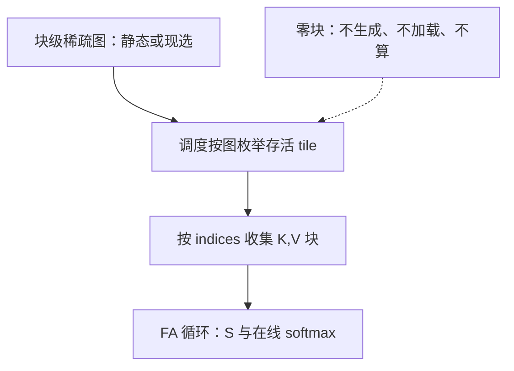
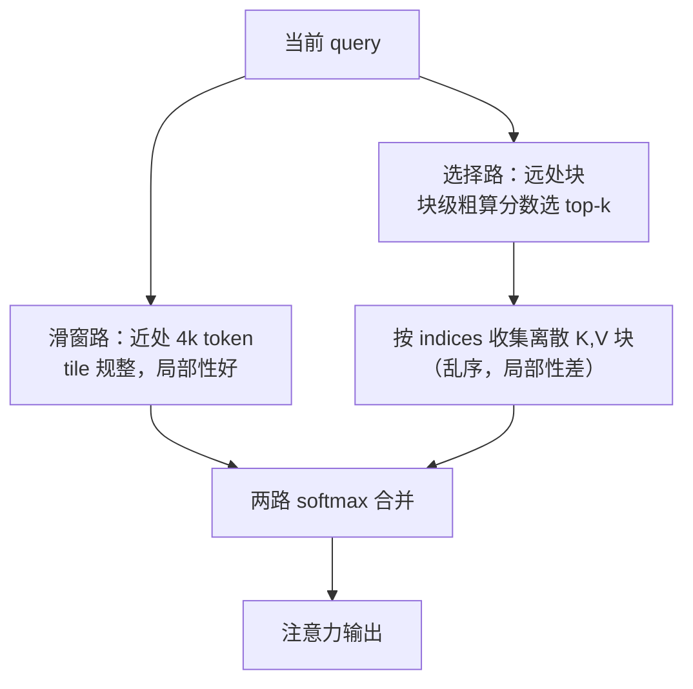

# 稀疏注意力的内核策略

稀疏要成为速度，图必须先对齐 tile；元素级掩码写进 dense 内核，一个 FLOP 也省不下来。

<footer>—— 据 Child et al., 2019；Beltagy et al., 2020；DeepSeek NSA（2025）整理</footer>

[上一课](/llm/ak-paged-kv-kernel)把地址翻译放进接口，页表决定「住在哪」。本课第三个变体动的是图：哪些查询-键块根本不用算。[BigBird / Longformer 稀疏模式](/llm/sparse-attention-patterns)与 [Native Sparse Attention](/llm/native-sparse-attention) 定过模式与质量；本课只问内核这一侧：一张稀疏图靠什么变成省下的字节与 FLOPs，而不是变成一份被白白算完的掩码。

## 问题

术语翻译：tile（瓦片）就是把大矩阵切成固定大小的小方块（如 $64\times64$）来调度的计算单元，GPU 内核一次算一块。稀疏加速的本质，是让「整块都该是零」的 tile 从任务清单里直接消失——而不是照常算完、再把结果归零扔掉。把元素级掩码塞进 dense 内核：tile 照常载入，GEMM 照常执行，被掩掉的位置在 softmax 里归零——计算一个没省，只是结果一样。真正省，必须让调度与循环知道「这个 tile 整块跳过」，从枚举里就不生成它。而稀疏图分两类，对内核的要求不同：静态图（滑窗、条带、块对角）编译期就定死，可以直接展开；动态图（按分数现选若干块）运行期才知道，需要先粗算再收集。缺口是把两类图都翻译成「枚举哪些 tile、加载哪些块」的循环结构。

### 图的三种形态

滑窗是每行一个连续区间，tile 枚举天然规整；分块选择是每行若干离散块，需要索引数组；混合（压缩目录加选择加滑窗）是多路并行，每路各有图。三者的公共分母都是块级布尔图，差别只在图是谁、在什么时候算出来的。

## 方法

块级化三步。第一步，把图按块定义：记录形式是 CSR 式的 `indptr` 与 `indices`，或 [FlexAttention](/llm/flex-attention) 的块级 `BlockMask`——元素级掩码在这一层就已经不存在。第二步，调度按图枚举：静态图编译期展开循环，动态图先跑一遍块级粗算（块内池化分数）选出 indices，再按 indices 收集 K、V 块进 FlashAttention 循环。第三步，收集粒度等于块：一次地址计算搬一整块，页内或块内连续，上一课的译址循环与加载合并原样接住。

## 机制

为什么块必须大而正交：收集一块的成本是地址计算与可能的非连续访问，块对齐 tile（64、128）时这块成本是每次一次基址更新；块碎到元素级，译址与收集的开销把省下的算全吃回去。为什么动态图要单算粗算这一笔：选块的池化分数是新增 FLOPs 与新增一遍低精度扫，选出的块若顺序乱，KV 加载失去局部性，带宽回升——所以工程上选择路与滑窗路常并行走，近处交给滑窗保住局部性，远处交给选择省量，NSA 的三路（压缩、选择、滑窗）正是这个策略的完整版。直觉类比：近处滑窗像「顺路自己走两步」——地址连续，硬件预取器都帮得上忙；远处选择像「快递按单拣货」——只送被点名的几个包裹，省路费但包裹零散。两路合并，近的保质量、远的省开销，各干各擅长的事。账可以很大：$n=128\mathrm{k}$、$w=4096$ 的滑窗，因果 tile 数从约两百万降到约两千，三个数量级——前提是枚举真的按图走。

错法有三。元素级掩码进 dense 核，前文已判死刑。块开得太小，比如逐元素 top-k 后再试图「内核内筛选」，筛选本身是全量扫描，省的没有花的多。常见误区：初学者容易以为块切得越细、跳过的位置越多就越省。实际上每块都要付一次译址与合并访问的固定开销，块碎到元素级，光地址计算就把省下的算力全吃回去——省下的是乘法，多花的是搬运，而搬运往往更贵。图在运行期变（每层每头不同）却按编译期特化写死，缓存键里没有图这一项，轻则慢、重则拿错掩码，见后面 autotuning 一课的键设计。

128k 序列、$64\times64$ tile：全注意力因果 tile 约 200 万个；4096 滑窗只剩约 2000 个。差三个数量级——但只在调度按图枚举时成立，掩码版内核仍是 200 万个。

## 边界

跳过的块不再贡献 softmax 分母：稀疏注意力的数值与「dense 加掩码」不同，长程信息确实丢了，质量上是否可接受是模式课与评测的题目，内核只负责把声明的图忠实执行。动态选块在训练期的不可导与不稳定是训练课题目。线性注意力不跳块，而是把 $n\times n$ 换成状态矩阵，是另一条路，下一课讲。本课的图是一维序列上的图；跨文档、跨模态的图不在此列。

## 小结

- 元素级掩码不省任何计算；稀疏要省，图必须块级化并进入调度与枚举。
- 静态图编译期展开，动态图先粗算选块再收集，两者共用 CSR 式块图。
- 收集粒度等于块、对齐 tile，译址与合并访问的成本才能摊薄。
- 动态稀疏有新增账：池化粗算与乱序收集，工程上用滑窗路保局部性对冲。
- 滑窗在 128k 上省三个数量级的 tile，前提是枚举按图走。
- 出处：Child et al., 2019；Beltagy et al., 2020（Longformer）；据 DeepSeek NSA, 2025 整理。
