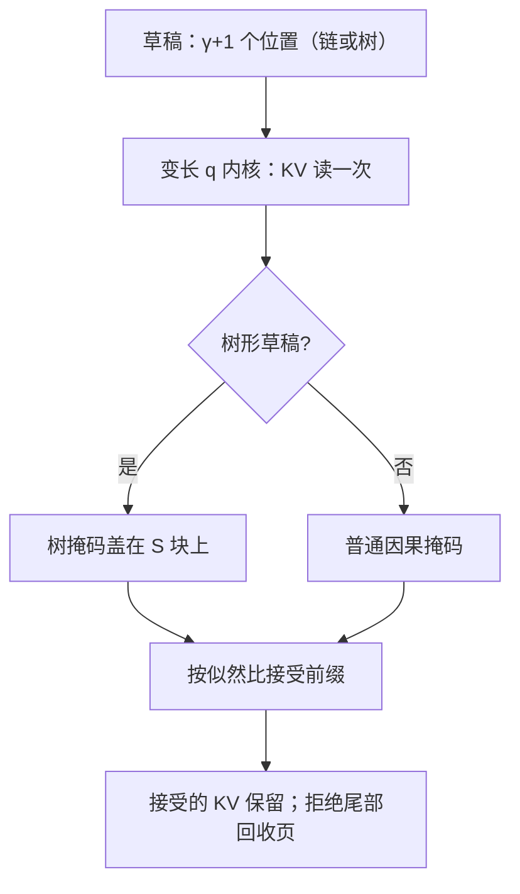
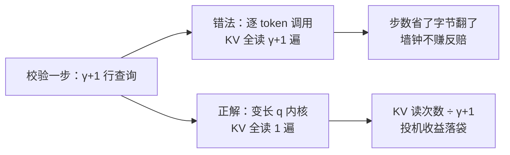

# 投机解码与注意力内核的交互

投机解码把 decode 的查询行数从 1 变成 γ+1；内核若还是那个 q=1 的内核，草稿赚到的步数会被一遍遍重复读 KV 全数退还。

<footer>—— 据 Leviathan et al., 2023；vLLM / FlashInfer 实现口径整理</footer>

[上一课](/llm/ak-quantized-attention-kernel)收掉变体单元，工程化单元从系统交互开始。[投机解码原理](/llm/speculative-decoding)在算法侧定过提议、校验与接受规则；本课只看它与注意力内核的四个接触面：查询行数、掩码形状、KV 写回、批内变长。投机在算法上保分布，内核要保的是不把保真的算法跑成失真、不把省下的步数赔在带宽上。

## 问题

术语翻译：投机解码就是「小快模型先替大模型猜 $\gamma$ 个词，大模型一次并行批改」——对的留下，错的从错处重来。算法上输出分布不变，赚的是把串行的逐 token 生成压成一次大批改；本课讲的是这笔账怎么别在内核上亏回去。校验一步要对 $\gamma+1$ 个位置各算注意力：$n_q$ 从 1 变成 $\gamma+1$。内核的形状、算术强度与最优配置随之全变。最直接的错法是拿现成的 q=1 解码内核逐 token 调用：同一份 KV 被读 $\gamma+1$ 遍，而投机赚的恰是「一次 KV 读服务多个 token」这笔带宽账——步数省了，字节翻了，墙钟不赚反赔。反过来把它当成普通前填也不对：网格按长序列的 tile 划分，γ+1 行的小查询填不满流水。缺口是一个专属于「短而宽」形状的内核路径。

### 树形草稿改的不是算法是掩码

链式草稿的 $\gamma+1$ 个位置是普通因果链；[树状验证](/llm/speculative-tree)的草稿是树：兄弟分支互不可见。这在数学上只是换一张布尔掩码，在内核上是把「因果掩码」换成「树掩码」传进同一个循环——前提是内核的掩码通道本来就是块级、可换的。

## 方法

内核侧三件事。第一，变长 $q$ 接口：接受 $n_q=\gamma+1$ 的小批查询，网格按行块展开，KV 载入一次、被所有行块复用——骨架就是第一单元的 tiling，只是形状换了。第二，掩码通道参数化：因果掩码与树掩码都作为块级布尔图传入，落在 $S$ 上；接受率统计与位置对齐由外层做，内核只认图。第三，KV 写回与回滚：草稿位置的 KV 在校验时已经算出，被拒绝的尾部要回收——按第 5 课的页表接口就是页引用减一，或者标记惰性失效；接受前缀的 KV 原样保留，下一步直接续用。直觉类比：KV 回滚像用铅笔打草稿——草稿的痕迹（页引用）先记上账，批改后没被采纳的尾部用橡皮擦掉（页引用减一），被采纳的前缀描深定稿、下一步接着写。怕的不是擦，是擦不干净留下的脏数据。

## 机制

带宽账要算细：设平均每次接受 $\tau$ 个 token，链式草稿下产出 $\tau$ 个 token 的 KV 全读从 $\tau$ 次降到约 $\tau/(\gamma+1)$ 次——内核一次调用读 KV、服务 $\gamma+1$ 行，这是投机在系统层赚钱的物理来源；逐 token 调用的实现把这笔账清零。树掩码错成因果掩码的后果比慢更糟：兄弟分支互相可见，草稿间「达成共识」，校验通过率虚高，输出分布已不再等于目标分布——这不是近似误差，是正确性错误，而且静默。为什么重要：树掩码错成因果掩码不会报错也不会变慢，只是兄弟分支互相看见、草稿间「串通」，接受率虚高而输出分布悄然偏离目标——像多位考生互相抄了答案再一起交卷。这种静默正确性事故上线后极难察觉。批内各请求 $\gamma$ 不同、树形各异时，形状是真正的变长批次，第 5 课的块表加长度表接口原样接住，掩码图按请求传。

$\gamma=4$ 时校验一步 $n_q=5$：KV 读一遍替代至多五遍；平均接受约 2–3 个 token 时净赚仍在。把五次校验拆成五次 $n_q=1$ 调用的实现，一分钱也赚不到——这是投机解码「无效化」的头号工程原因。

## 边界

接受规则保分布是算法课已证的命题，本课不重证；内核侧的责任是掩码语义与接受前缀一致。草稿模型的 KV 是否入页、占多少配额，是 KV 管理的题目。$\gamma$ 的动态调整（按接受率伸缩）会改变 $n_q$ 的取值集合，本课只指出后果：形状桶变宽，配置缓存键必须把 $n_q$ 记进去，后面调优一课兑现。多草稿模型与自推测是草稿供给侧的变体，与内核接口无关。

## 小结

- 投机把 decode 变成「短而宽」：变长 $q$ 内核一次读 KV、服务 $\gamma+1$ 行。
- 带宽账是投机的物理来源：KV 全读次数从 $\tau$ 降到 $\tau/(\gamma+1)$；逐 token 调用清零收益。
- 树掩码是块级布尔图，与因果掩码共用通道；错成因果掩码是正确性事故。
- KV 写回按页表回收拒绝尾部，接受前缀原样续用。
- 批内变长由块表加长度表接口接住，$n_q$ 必须进配置缓存键。
- 出处：Leviathan et al., *Fast Inference via Speculative Decoding*, 2023；据 vLLM 与 FlashInfer 实现整理。
