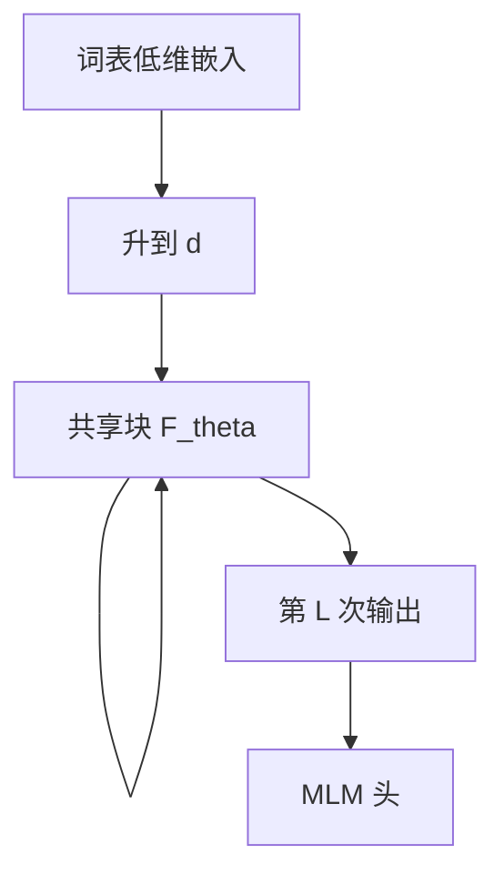

# ALBERT 参数共享

跨层共享注意力与前馈权重，再把词表嵌入分解成低维再投影，参数量从层数和词表两端一起降下来。

<footer>—— Lan et al., ALBERT: A Lite BERT for Self-supervised Learning of Language Representations, ICLR 2020</footer>

[上一课](/llm/early-exit-adaptive)按例少算层，参数量不变。[循环 Transformer](/llm/looped-transformer) 为算法任务共享块。本课把共享放回[BERT 编码器](/llm/bert-encoder)的预训练设定：目标仍是双向 MLM，深度仍有 $L$ 次前向，但 $L$ 层共用一套注意力与 FFN。Lan 等人的 ALBERT 还加了嵌入因式分解。注意力续这一单元到此结束；下一单元从 HiPPO 接状态空间，不再把层共享当主线。

## 问题

BERT-large 的参数大部分在层重复与词表矩阵 $V\times d$ 上。加层立刻加参数，词表一涨嵌入先行爆炸。缺口不是再写一遍 MLM，而是：**在保持双向深度（多次交互）的同时切断参数与 $L$、$V$ 的线性绑定**。Universal Transformer 为此引入 ACT；ALBERT 更保守——固定 $L$ 次应用，训练目标与 BERT 同族，只改参数布局。

跨层共享与「层是功能特化的」紧张：上一课功能分化说深层头与浅层头不同。共享后分化只能沿迭代发生，表达力通常下降，换来的是可训更大等效深度或更小模型。

共享的是块内权重，不是把所有层的激活绑成同一个张量。每层仍有自己的隐状态；只是 $W$ 的指针相同。

## 方法

三种共享：只共享注意力、只共享 FFN、全部共享。ALBERT 默认全部共享。嵌入写成 $E_{\mathrm{vocab}}\in\mathbb{R}^{V\times e}$，$e\ll d$，再乘 $W_e\in\mathbb{R}^{e\times d}$ 升到模型维，参数从 $Vd$ 降到 $Ve+ed$。位置嵌入仍可学习、仍截断长度，与 BERT 同类，不自动继承 T5 相对偏置。

训练目标上 ALBERT 用 MLM 加句序预测（SOP），替换 BERT 的 NSP。本课不把 SOP 展开：共享策略与句级任务正交，后课不要把 ALBERT 简化成「换了 NSP」。

### 和 looped 的差别

Looped 强调测试时改变 $T$，常留 prelude/coda。ALBERT 的 $L$ 训练与推理相同，所有层共享，更像「为了塞进内存而去掉层间特化」。编码器分类、句向量池化都可以接在共享栈的最后一次输出上，与[嵌入池化](/llm/embedding-pooling)兼容。

## 机制

$L$ 次同一 $F_\theta$ 迫使电路可复用，MLM 仍提供双向信号。经验上 ALBERT 在同等参数下可以更深，从而补回一部分共享损失；同等计算下不一定赢不共享的 BERT。嵌入分解假设词表身份可以先活在低维流形再展开到注意力空间，对大词表最划算，对很小的词表几乎无意义。

优化上共享参数的更新是各层梯度之和，浅层与深层的梯度会互相干扰。学习率与预热往往要重新扫，不能照抄 BERT-large。这与循环块的 RNN 式梯度是同一类现象，只是 $L$ 固定、没有测试时加循环的承诺。

推理 FLOPs 仍按 $L$ 层计，不因共享变便宜。共享只瘦存储与通信（分布式里一份权重）。要省计算看早退或稀疏，不看 ALBERT。

## 边界

不要指望共享栈在头功能上仍呈现「第 3 层句法、第 11 层语义」那种层特化叙事；探针应改沿迭代。生成式纯解码器较少直接套 ALBERT——词表矩阵与层宽的压力仍在，但今日更常用 GQA、MoE 去切另一维。本课结束编码器/注意力续里「深度怎么花钱」的讨论：下一课钱花在状态矩阵 $A$ 上，而不是再共享一层 Transformer。

## 小结

- ALBERT 用跨层共享切断参数与深度的绑定，用嵌入分解切断参数与词表的绑定。
- 深度（交互次数）仍在，层特化减弱；同等参数可更深，同等 FLOPs 不自动更快。
- 梯度是各层之和，优化比不共享更脆。
- 与 looped 的测试时 $T$、早退的按例深度不是同一旋钮。
- 出处：Lan et al., ICLR 2020。
