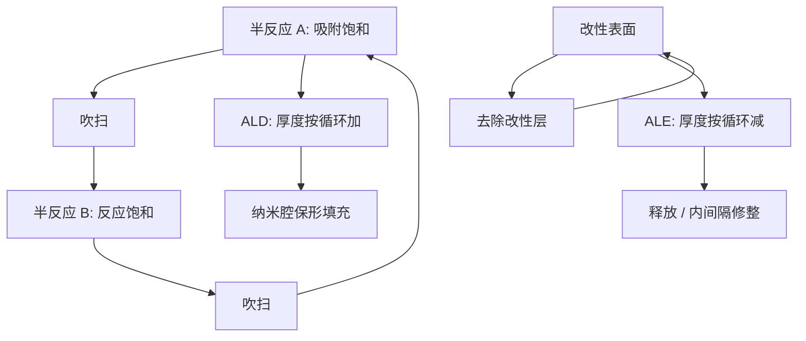

# 原子层沉积 ALD 与原子层刻蚀

当空腔的宽高比让连续流沉积和溅射刻蚀都失去选择比时，只能把生长与去除收成自限制的半反应循环：每圈一层，或每圈一个原子级薄层。

<footer>—— 对照薄膜与刻蚀的自限制化学，以及 GAA 空腔填充的公开工艺约束</footer>

高介电栅氧、功函数金属、侧墙、阻挡层，在平面时代可以用 CVD 或 PVD 对付。 [GAA 纳米片](/llm/finfet-gaa) 把这些膜塞进片间距只有数纳米的环绕空腔：先到的表面必须均匀长满，不能在入口封口留下空洞；去掉牺牲 SiGe 时又不能啃掉作为沟道的硅。原子层沉积（ALD）用交替的自限制半反应，生长量由表面位点而不是通量梯度决定。原子层刻蚀（ALE）把「改性 + 去除」收成循环，争取每个循环固定减薄，并给出相对连续等离子体更宽的选择比窗口。两者是同一哲学的正反面，在先进节点里成对出现。

## 问题

非自限制沉积在深孔里呈现入口厚、底部薄：前驱体在口部耗尽。PVD 更有方向性，侧壁覆盖差。纳米片的栅金属必须从四面等厚包住每一片，厚度差几个埃就会让阈值分裂。连续等离子体刻蚀靠离子能量与化学，能量一大就损伤沟道，能量一小就停在难以挥发的产物上，工艺窗口窄。

需要的是：厚度以循环计而不是以秒计；覆盖由化学吸附饱和保证；刻蚀深度与损伤解耦。问题是吞吐——循环天然慢——以及材料表：不是每一种金属或介质都有干净的 ALD/ALE 化学。产线要在「够保形」和「每小时晶圆」之间找能交货的循环。

### 自限制不是无限保形

ALD 的饱和依赖于前驱体扩散进空腔、副产物扩散出来、以及表面位点真正饱和。高深宽比下，若半反应时间不够，底部仍欠饱和，保形性神话破产。ALE 的改性步若打进沟道，或去除步有物理溅射分量，循环就不再自限制。把 ALD/ALE 写成「原子精度开关」会忽略时间与损伤这两条轴。

生长/循环（GPC）是平均值。成核延迟、衬底依赖和岛状生长会让前几十圈的厚度不可外推。GAA 片上的功函数金属往往就在这个成核区里工作，校准必须用真实空腔计量，而不是平面监控片。

## 方法

ALD 经典图像是两个半反应：例如含金属前驱体饱和吸附，惰性吹扫，再与氧源或氮源反应，再吹扫。每循环生长通常是一埃量级的分数到一层。温度窗口要落在：够反应、又不够热解成 CVD。先进逻辑用它做高 K、TiN/TiAlC 一类功函数叠层、侧墙、衬垫；三维结构里还做选择性 ALD（只在介质或只在金属上长）以减少对准。

ALE 分等离子体辅助与热 ALE。前者常用卤化或氟化改性表面，再用低能离子或配体交换把改性层剥掉；后者完全靠热化学，损伤更低、速率更慢。与 ALD 对偶的材料对（如某些氧化物的氟化再配体去除）最干净。GAA 释放与内间隔，常是选择性蚀刻 + ALE 修整的组合：大块去掉用高选择化学，界面用循环修到目标内间隔厚度。

### 选择比窗口与协同

ALE 文献里的「协同」指：只有改性加上去除都发生时才有可观速率，缺一步则几乎停。这给出对掩模或沟道的选择比。窗口随离子能量、剂量和温度移动。量产要把窗口做宽到能覆盖晶圆内与批次间漂移，否则原子级循环会变成原子级不稳定。ALD 同样有窗口：前驱体热解或刻蚀性氧源会把 ALD 拖成 CVD 或把已长的膜啃掉。

## 机制

自限制把厚度从「通量 × 时间」改成「位点密度 × 循环数」。深宽比进入的是循环时间（要饱和），而不是最终厚度剖面——只要真饱和。这解释了为什么 ALD 能填纳米腔：入口饱和后不再继续长（该半反应内），前驱体能继续往里走。若某一半反应有 CVD 分量，入口会封口，后面全是空洞，GAA 栅电阻和阈值一起坏。

ALE 把损伤限制在改性层厚度。离子用来协助脱附而不是用来砸体材料，沟道迁移率才保得住。代价是速率：每循环埃级，去掉十纳米要很多循环。与 [光刻胶](/llm/euv-resist) 的薄胶高选择转移类似：纵向预算变薄之后，转移与修整必须改成循环工艺，否则一次过刻就把纳米片削断。

ALD 与 ALE 不是「更高级的 CVD/RIE」。有 CVD 分量的所谓 ALD、有溅射分量的所谓 ALE，只是借用了循环的名字。判断标准是饱和曲线：剂量加大一截，厚度或去除是否停住。

### 与设备产能的耦合

循环慢，就要多腔、多片、集群。前驱体贵且有毒性或腐蚀性，尾气与腔体涂层成为运行成本。GAA 量产等于同时买通 ALD/ALE 化学、计量（光学与电学）和腔体颗粒控制。设备产能会像 EUV 一样成为节点节奏的隐藏约束：晶体管架构图纸画得出，薄膜循环排不出。

## 边界与工程取舍

不是所有层都值得 ALD/ALE。厚的层间介质、大开口的金属，CVD/PVD 的吞吐更好。滥用循环工艺会把成本与颗粒风险抬到收益以上。选择性 ALD 的缺陷模式是漏选与过选，电学上表现为短路或开路，检测比厚度更难。前驱体供应链与出口管制会限制化学选择，工艺集成不能假设「文献里那个配体一定能买到」。

与光刻的关系：节距仍由 EUV 与 [OPC](/llm/opc) 定，ALD/ALE 决定在这个节距里薄膜能不能均匀存在。两者一起失败时，问题会表现为「GAA 良率」，根因可能在空腔填充，也可能在孔的随机缺失。

报告 ALD 厚度时写清：平面还是结构内、是否过了成核区、用什么计量。把平面 XRR 的数字当成纳米片上的功函数厚度，是常见的乐观偏差。

## 小结

- ALD 用自限制半反应在高深宽比里做保形生长，厚度以循环计。
- ALE 用改性—去除循环做低损伤减薄，并争取协同带来的选择比。
- GAA 的释放、内间隔和环绕栅填充把二者从可选项变成必要步骤。
- 真自限制看饱和曲线；带 CVD/溅射分量的循环只是名义原子层。
- 吞吐、前驱体与颗粒控制决定能否量产，不只看截面 TEM 好看。
- 薄膜循环不替代光刻节距，但会决定该节距下器件变差。
- 出处：ALD/ALE 自限制化学；先进逻辑 GAA 集成公开论述。
