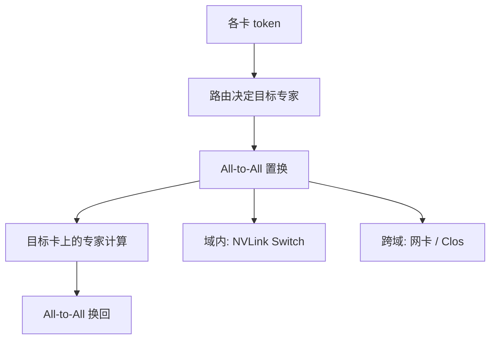

# all-to-all 实现

归约可以在中途把多份合成一份；置换必须让每对端点的字节真的到达对端。All-to-All 的体积因此按「每卡发给其余每卡」计，层次化帮不上加法。

<footer>—— 对照 MPI Alltoall 与专家并行里的 token 置换；拓扑对照见机内全互连 vs Clos</footer>

[上一课](/llm/reduce-scatter-allgather) 的一对原语都还带「可加」或「只拼接已切好的片」。本课换成 **置换**：每张卡有 $N$ 块，第 $j$ 块要送到卡 $j$。专家并行把 token 按路由结果重排，走的就是这条原语；序列并行的某些切分也会用。缺口是实现： pairwise 交换、Bruck 一类指数调度、以及为何跨节点 EP 会把 [预训练通信](/llm/pretrain-comm) 里闲置的 NVLink 变成旁观者。

## 问题

记每卡发给每个对端 $m$ 字节（对角给自己，通常只本地拷贝）。完全交换的总量是每卡 $(N-1)m$，集群合计 $\Theta(N^2 m)$。MoE 里 $m$ 随本步被路由到该专家的 token 数而变，负载不均时热专家所在节点既是计算热点也是网络热点。All-Reduce 可以先加后传，跨节点只走每节点一份；All-to-All 没有可加中间结果，节点内 [NVLink](/llm/nvlink) 再快，也替不了「发给另一柜那张 GPU」的那一段。

实现还要在两种坏里选：一次把 $N-1$ 个对端的消息同时打出去，网卡队列爆炸；或打成 $N-1$ 轮两两交换，延迟线性涨。小 $N$、大 $m$ 与大 $N$、小 $m$ 的最优调度不同。问题是：**调度如何让链路满而不让交换机缓冲区先满**。

NCCL 的 Alltoall 对训练暴露为一条集体调用；底层可能拆成并行的 Send/Recv。框架若自己用点对点拼 All-to-All 而不注册通信组，会丢掉拓扑感知与 chunk 流水，MoE 一步的尾延迟立刻可见。

## 方法

 pairwise 交换：第 $k$ 步，卡 $i$ 与 $i\oplus k$ 交换（或环上与 $i+k$）。$N-1$ 步覆盖所有对；每步每卡只处理一个对端，注入带宽可控。适合大消息、小进程组。

Bruck / 指数调度：每步把已持有的块倍增式转发出去，步数 $O(\log N)$，适合小消息、大 $N$。代价是中间缓冲区更大，实现更绕。NCCL 按消息大小与拓扑在这些族里选，与 All-Reduce 的环/树切换是同一思想，对象换成置换。

层次化只能做「先节点内重排，再跨节点交换节点级块，再节点内分发」。它减少的是**小消息条数**（把许多 GPU 对聚合成节点对），不减少跨节点净荷——token 该去别的节点，字节仍要过网卡。EP 组尽量缩在 NVLink 域内，是因为域内置换走 Switch，域外置换走 Clos，屋顶线差一档，见 [全互连 vs Clos](/llm/all-to-all-vs-clos)。

负载不均时，集体语义仍是「所有 rank 等到最慢那对」。热专家的 $m$ 变大，整步被它绑住。容量因子、drop、或对专家再切并行，是模型侧减压；网络侧只能保证调度别雪上加霜。

## 机制

All-to-All 的 $\alpha$–$\beta$ 模型与 All-Reduce 不同：没有 $\frac{N-1}{N}$ 那种「加完变少」的系数，数据项往往是 $(N-1)m\beta$ 量级，再乘算法效率。小 $m$ 时 $N$ 个对端各付一次 $\alpha$，延迟区比同等体积的 All-Reduce 更惨——这是 MoE 微批太小时 EP 墙的来源之一。

拓扑上，rail-optimized 脂肪树希望「同号 GPU 走同一轨」。All-to-All 却几乎是均匀随机对，轨对齐帮不上「任意到任意」，反而可能把流量打进同一叶子的上行。后课 rail 与拥塞会回到这一点：集合算法选对了，流量模式仍可能与拓扑的设计假设冲突。

Decode 推理的 EP All-to-All 更苛刻：batch 小，$m$ 更小，更容易掉进延迟区。训练微批掩盖的问题，服务上会变成尾巴。不要用训练的 EP 度直接当推理拓扑。

## 边界与工程取舍

不要把 All-to-All 画成「就是 N 次 All-Gather」。语义不同，优化不同。不要假设 NVLink SHARP 一类网内计算能加速置换——归约才能卸载加法，置换没有加法。不要在以太网 Clos 上用 128 路 EP 去模拟 NVLink 域内宽专家；测的是 hop 与拥塞，不是算力。

实现若允许变长（每对 $m_{ij}$ 不同），还要先交换元数据。路由极度倾斜时，元数据本身不是墙，净荷倾斜才是。对不齐的切分（专家数不能整除 EP 度）制造空洞消息，仍占一轮 $\alpha$。

## 小结

- All-to-All 是置换，跨节点体积不能靠先加后传来减。
- 大消息用 pairwise 交换，小消息用对数步调度；NCCL 按 size 选。
- 层次化减的是消息条数，不是 MoE 跨柜净荷。
- EP 组应优先落在 NVLink 域；跨域 All-to-All 是训练与推理的常见墙。
- 出处：MPI Alltoall 调度族；NCCL；MoE 系统对 EP 通信的实践。
