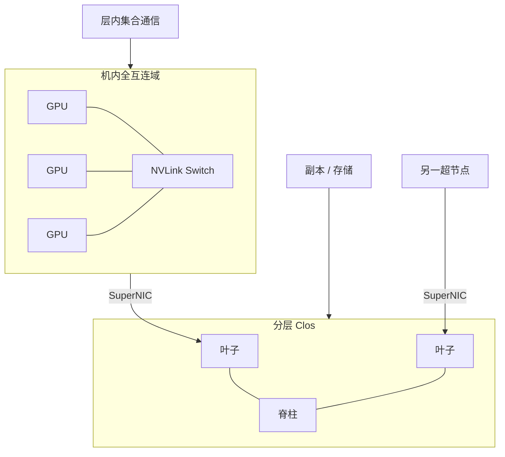

# 机内全互连 vs 分层 Clos

    
全互连把任意两点的通信收成固定跳数；Clos 用分层交换机换可扩展的端口数。两者都可以非阻塞，代价花在完全不同的地方。

    <footer>—— 对照 NVLink Switch 的机柜域与数据中心脂肪树；Clos 原论文见 Bell System Technical Journal, 1953</footer>

同一条 All-to-All，在超节点里走 NVLink Switch，在集群里走叶子–脊柱。程序员看见的都是 NCCL 进程组，图的直径、阻塞行为、拥塞控制却不是同一套。NVIDIA 公开的 NVL72 用 9 个交换托盘把 72 张 GPU 收成一个域，产品叙事是域内 GPU 通信聚合 130 TB/s、每 GPU 1.8 TB/s；柜外则是 InfiniBand 或以太网的分层网络，GB300 产品页给出每 GPU 800 Gb/s 量级的 SuperNIC。本篇把「机内全互连」和「分层 Clos」写成两种交换，说明何时必须待在第一张图里。不编造未公开的超分比、单级交叉带宽或未出现在厂商文档里的 hop 延迟微秒数。

介质分层见 [铜缆 spine 与光模块](/llm/copper-spine-vs-optics)；产品封装见 [NVL72](/llm/gb200-nvl72)。

## 问题

$N$ 个端点若两两直连，边数是 $N(N-1)/2$，72 张 GPU 已经不可能在封装上做完全图。交换的意义是：用中间级把边数换成端口数。全互连交换（经 NVSwitch 一类芯片）的目标是：域内任意一对 GPU 看到的带宽与跳数尽量均匀，像一块大交叉矩阵。Clos（脂肪树是其在数据中心的常见实现）的目标是：用可复制的叶子与脊柱模块，把端口数做到几千上万，代价是路径变长、拥塞与超分成为一等公民。

若用 Clos 的预期去跑域内 TP——以为多跳、等价多路径、ECMP 哈希都是正常的——会把本应均匀的 All-Reduce 变成少数链路上的热点。若用全互连的预期去跑万卡训练——以为任意两柜之间也是一跳 NVLink——会在叶子层被打满。问题是：集合通信的进程组画在哪一张图上，以及图允许什么阻塞。

### 非阻塞不是「永远不排队」

Charles Clos 在 1953 年给出的三极交换，讨论的是电路交换下如何用较少交叉点实现无阻塞。数据中心的 Clos / 脂肪树把这一思想用到分组交换：只要上下行带宽规划匹配，任意流量模式在容量上可被路由。实际仍会排队——哈希极化、PFC / 拥塞控制、集体算法的同步波，都会在端口上制造瞬时过载。NVLink 域的「全互连」同样不是零队列：交换芯片有内部共享与调度，只是厂商把它做成加速器互连，而不是通用数据中心网络。

因此比较两种拓扑，不要比「谁永不丢包」，要比：**最坏一对端点的带宽是否与最好一对同档、跳数是否随规模增长、超分发生在哪一级**。NVL72 公开材料强调 72 GPU 一域、低延迟 GPU 通信；它没有把柜外 Clos 的 hop 写成同一档数字。规划时把两档分开，比争论「NVSwitch 是不是 Clos」更有用——柜内交换芯片内部也可以是多级交叉，但对软件暴露的是一个平坦域。

「全互连」在本文指软件可见的域：任意 GPU 对经 NVLink Switch 可达、带宽按官方每 GPU 1.8 TB/s 量级对称。不声称交换芯片内部是单级 crossbar，也不填写未公开的芯片内带宽。

## 方法

把并行维钉在拓扑上。域内：TP、需要低延迟的上下文并行切片、宽 EP 的 All-to-All，进程组包含的 rank 必须落在同一 NVLink 域。域的大小是 72，不是 8，于是 TP 度可以超过经典 HGX 口诀，只要不跨柜。域间：DP、检查点、跨超节点 PP，走 Clos。EP 若切出超节点，All-to-All 的那一维就进入脂肪树，decode 延迟会换档，见 [DeepSeek 部署](/llm/deepseek-serving) 对跨机 EP 的讨论。

轨对齐（rail-aligned）是 Clos 侧的纪律：同一数据并行组的网卡应落在等价的叶子–脊柱路径上，避免 All-Reduce 被哈希到过载轨。NVLink 域内通常不需要软件再做一次「轨」抽象——交换托盘已经把 GPU 端口收成域。把域内流量再绕到网卡上做一次 Clos，是最常见的配置错误。

### 跳数、同步波与算法选择

全互连域里，ring / tree / 层次 All-Reduce 的选择仍在，但物理跳数被压在加速器互连里。消息很小时，延迟项压过带宽项，树或层次算法更常见；消息大时，环的满带宽更好用。这些是 NCCL 的既有逻辑，见 [预训练通信](/llm/pretrain-comm)。换到 Clos，同一算法还要叠加：跨叶子的路径长度、是否 rail 对齐、是否与存储争用。集体操作的「算法效率」在两张图上不能用同一条 busbw 曲线去读。

All-to-All 对拓扑更苛刻。全互连域上，72 路专家并行是「域内交叉」；Clos 上，它是多对多，最容易打满上行。所以宽 EP 优先吃超节点，而不是先画一张巨大的以太网进程组再希望交换机自己消化。Clos 的扩展性用来增加**副本数与超节点数**，不是用来增加**单副本内部的延迟敏感维**。

## 机制

全互连域能对称，是因为每个 GPU 的 NVLink 端口都接到交换系统，而不是接到邻居 GPU 的直连环。直连环在 8 卡时代也能工作，但直径随 N 增长，最远一对会拖住同步。NVSwitch 把直径收成「经交换」，官方用域级聚合带宽来描述能力。72 × 1.8 TB/s 与 130 TB/s 是同一规格的两种读法：前者是每端点，后者是域。不要把它们加总成第三种「更大的全柜带宽」。

Clos 能扩展，是因为叶子与脊柱可以堆叠。端口数近似随交换机台数增长，代价是：路径变多跳、需要路由与拥塞控制、超分比成为设计参数。厂商参考架构会给出 SuperPOD 一类的柜间网络；具体超分以那份参考为准，本文不编造「上行 1:2」之类未引用数字。软件侧能做的是：让最密的通信不要进入这张图。

脂肪树是 Clos 的一种规则化：每层提供足够的上行，使无阻塞在容量上成立。实际 AI 集群常在存储、管理网或成本上做超分。超分发生在哪一层，决定哪一类集合通信先饱和。

### 阻塞发生在哪

域内阻塞：交换托盘故障或背板降级，表现为整域带宽下降，所有 GPU 对一起受伤。域间阻塞：某条叶子–脊柱链路拥塞，表现为部分 rank 慢、straggler 拉长一步时间。前者像 SMP 的总线；后者像分布式系统的热点。调优时不要用同一套 NCCL 环境变量同时「修复」两张图——域内先确认进程组没有漏到 Socket / 网卡；域间先确认轨对齐与消息大小。

## 边界与工程取舍

不要称 Clos「不能做 All-to-All」。万卡训练天天在 Clos 上做 DP 的 All-Reduce 与跨节点 EP；只是工作点不同：消息更大、可重叠、副本数换来的是统计复用。不要称 NVLink 域「没有拥塞」：同步波仍会在交换里排队。不要把 8 卡 NVLink 全互连与 72 卡域当成不同数学对象——对软件都是平坦加速器域，只是 N 从 8 变成 72。

也不要在论文或设计评审里画「72 卡完全图」却在机房里只部署 Clos。图必须对应物理。昇腾超节点若提供柜级全互连，软件故事类似，托盘与交换以华为文档为准。以太网增强（RoCE、Spectrum-X 一类）改善的是 Clos 的有效带宽与隔离，不把 Clos 变成 NVLink 域。

出处：NVIDIA NVL72 产品页的域规格；Clos, *A study of non-blocking switching networks*, BSTJ 1953；NCCL 拓扑行为见 NVIDIA NCCL 文档。不引用未公开超分比。

## 小结

- 机内全互连：软件可见的平坦 NVLink 域，任意 GPU 对称，适合 TP 与域内 EP；NVL72 的公开对照是 72 卡、每 GPU 1.8 TB/s、域 130 TB/s。
- 分层 Clos：用叶子 / 脊柱扩展端口，适合超节点之间的 DP、存储与跨柜流量；柜外网卡按产品页的 800 Gb/s 量级规划，不按 NVLink 规划。
- 非阻塞是容量陈述，不是零队列；两张图的拥塞与故障单元不同。
- 最密的通信维画在全互连域；规模画在 Clos。不要用 Clos 模拟 NVL72 的层内 All-Reduce。
- 出处：NVIDIA 公开产品规格；Clos 1953；集合通信见 [预训练通信](/llm/pretrain-comm)。
