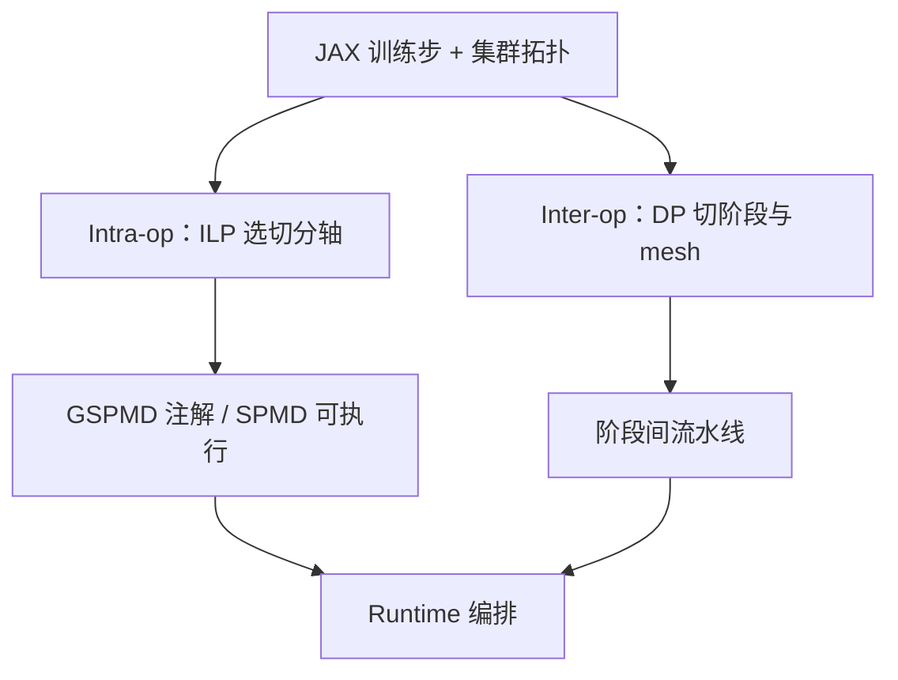

# Alpa

    
把并行分成算子内切分与算子间流水线两层，分别用整数规划与动态规划搜，编译器就能在给定集群上吐出一份执行计划。

    <footer>—— Zheng 等，Alpa，arXiv:2201.12023，OSDI 2022</footer>

UC Berkeley、Google、Amazon、上交等合作的 **Alpa**（Lianmin Zheng、Zhuohan Li、Hao Zhang、Yonghao Zhuang 等）把「手写 3D 网格」换成 **编译自动并行**。它不发明一种新的切法，而是统一数据并行、算子（张量）并行与流水线并行，在 JAX/XLA 上生成计划，运行时用 SPMD（[GSPMD](/llm/gspmd)）执行算子内切分、用 MPMD 编排阶段。论文主张：在 Megatron 一类专门系统已经调过的 Transformer 上，自动计划能打平或超过手工；在异构模型、MoE、以及 GPU/TPU 拓扑不同时，手工网格更痛，编译器更有价值。代码在 `alpa-projects/alpa`。

## 问题

训练计划要同时回答：多少数据并行副本、每个算子沿哪一轴切、图怎么切成流水线阶段、阶段怎么映射到哪些设备。搜索空间随层数与设备数指数膨胀。只搜流水线（阶段数、切点）会漏掉层内切分；只做算子并行（Mesh-TensorFlow / GSPMD 手工注解）会漏掉跨机该用点对点而不是每步 All-Reduce。手工系统还假设模型规整：全是一样的 Transformer 块。MoE 的专家轴、卷积与注意力混排，会让「全图一个 TP 度」失效。

集群本身是分层的：节点内高带宽、机架间低带宽。好的计划应当把 **算子内**（通信频繁）放进高带宽 mesh，把 **算子间**（阶段边界通信量小）放进跨 mesh 流水线。Alpa 的关键观察是：把并行重新分成这两层，就和集群的带宽层次对齐，搜索可以分层做，而不在一个扁平组合里穷举。

### 算子内 vs 算子间

**算子内（intra-op）**：把单个张量算子沿 batch 或非 batch 轴切开，分到 mesh 上的设备，split/merge 时集体通信。这覆盖数据并行与 [张量并行](/llm/tensor-parallel)。**算子间（inter-op）**：把图切成不相交阶段，阶段间流水线，通信只在边界。这覆盖 [GPipe](/llm/gpipe) / [PipeDream](/llm/pipedream) 一类。一份完整计划 = 如何分阶段、每阶段分到哪块 mesh、该阶段内每个算子怎么切。

用户 API 是 JAX 上的 `alpa.parallelize`（及可选的 pipeline 标记），不是在 PyTorch 里插 `f`/`g` 算子。Alpa 吃的是 JAX 计算图与集群描述。把 Alpa 理解成「Megatron 的 Python 封装」会找错代码路径。

## 方法

编译分三趟：

1. **算子内 pass**：在给定设备 mesh 上，用 **整数线性规划（ILP）** 为算子选切分轴，目标近似最小化该 mesh 上的延迟（计算 + 通信）。结果变成 GSPMD 注解。
2. **算子间 pass**：用 **动态规划** 把算子聚类成阶段、把集群切成若干 mesh、做阶段–mesh 分配，目标是流水线吞吐（含气泡、负载均衡）。
3. **运行时编排**：按阶段–mesh 对生成可执行文件；阶段内走 GSPMD 的 SPMD 运行时，阶段间走 Alpa 的流水线 runtime。

因为层间 pass 依赖层内代价模型，实现上会先估或先跑层内再搜层间。异构模型上，不同阶段可以有不同的 intra-op 策略——这是手工「全局 TP=8」做不到的。论文评测包括 Transformer、异构结构与跨 GPU/TPU 设定，称自动计划匹配或超过专门手工系统。

### 代价模型与「编译多久」

ILP 不能对真实逐步模拟每一个 kernel，只能用分析式的计算/通信估计。估计偏差会选出局部最优：例如低估 All-Reduce 延迟就会切得过碎。动态规划的阶段数与切点若限制在「沿层堆的切缝」，搜索可解；若允许任意算子重排，空间再次爆炸。因此 Alpa 仍假设训练步主要是层叠的前向–反向图，不是任意动态控制流。编译本身有开销，适合步数极多的预训练，不适合每次改两行超参就重编译的交互式调试——那是相对 Megatron 手写网格的另一笔账。

## 机制

分层优化能收敛到好计划，是因为两层的通信形貌几乎不重叠：intra-op 的集体通信延迟对 NVLink/TPU mesh 敏感，inter-op 的激活体积是 $b\times s\times d$ 一次边界传输。先固定 mesh 内的切分，再决定哪些层共用一个 mesh，相当于先解决高带宽子问题，再解决低带宽管道。这与人手写「TP 节点内、PP 跨节点」同构，但切点、每阶段 TP 度、是否对某层沿 batch 而非隐藏维切，都可以变。

MoE 上，专家轴是合法的 intra-op 轴；不同拓扑上最优轴不同（论文用 MoE Transformer 在 TPU vs GPU 上需要不同切分与不同流水线来说明自动化动机）。Alpa 并不保证搜到全局最优，ILP 有超时与启发式；它保证的是搜索空间覆盖三种经典并行，而不是覆盖全部并行研究（例如当时未把专家并行写成独立于张量的第五维产品名）。

OSDI 2022 的对照系统是当时的 Megatron 等手工栈。2024 年后 PyTorch FSDP、Megatron Core、torch.distributed 的设备 mesh 缩小了「必须用 JAX 才能自动切」的差距。Alpa 的贡献仍是分层空间 + ILP/DP，不是永久的吞吐冠军。

### 和 Megatron-DeepSpeed、GSPMD 单独用

[Megatron-DeepSpeed](/llm/megatron-deepspeed) 给的是一份已验证的 8×35×DP 配方。Alpa 给的是「换模型、换集群时重新搜」。只用 GSPMD 仍要人标轴；Alpa 在 XLA 里自动标。训练生产若模型极规整、集群极固定，手工网格可能更易调试；若每周改结构，编译器更值。

## 边界与工程取舍

JAX 生态与 PyTorch 预训练主流分叉：迁移成本是真实的。动态 shape、数据相关控制流、自定义算子会让 ILP 图不完整。流水线仍有气泡与权重版本问题，Alpa 没有取消 [PipeDream](/llm/pipedream) 里那些物理约束，只是自动选阶段。代价模型过时（新的 FlashAttention、新的 NVLink 带宽）需要重新标定，否则计划停留在旧硬件画像上。

不要把 Alpa 写成「零标注永远最优」。pipeline mark 仍可能需要。论文编号 2201.12023 与 MT-NLG 的 2201.11990 相邻，不要抄串。

真实编号：Zheng、Li、Zhang 等 *Alpa: Automating Inter- and Intra-Operator Parallelism for Distributed Deep Learning*，arXiv:2201.12023，OSDI 2022。GSPMD 是 Xu 等的工作，另文。禁止给 Alpa 再编一个「PyTorch 官方移植」假论文号。

## 小结

- Alpa 用 intra-op（ILP）与 inter-op（动态规划）分层自动生成数据/张量/流水线计划。
- 实现于 JAX/XLA，阶段内 SPMD、阶段间流水线运行时。
- 目标是换模型与换集群时少手写网格，而非取代所有手工 3D 配方。
- 出处：Zheng 等，arXiv:2201.12023，2022。
