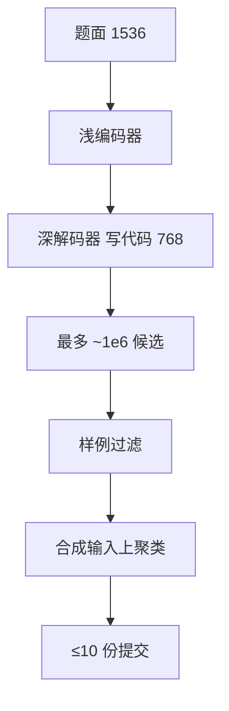

# AlphaCode

竞赛级代码生成靠的不是一条神程序：先为每题生成最多百万份候选，用题面样例滤掉约 99%，再按在合成输入上的行为聚类，最后在 10 次提交限额里每个簇交一份。

<footer>—— Li 等，Competition-Level Code Generation with AlphaCode，Science 2022，arXiv:2203.07814</footer>

DeepMind 的 **AlphaCode** 把编程竞赛当作生成系统的评测，而不是把 HumanEval 再刷高一点。模拟参加 Codeforces 近期比赛（每场五千人以上），平均排在前 **54.3%**，大约中位选手；估计 rating 约 **1238**，落在赛前六个月打过比赛的用户的前 28% 叙事里。架构是**非对称编码器–解码器 Transformer**，不是 GPT 式纯解码器。本篇按 arXiv:2203.07814 / *Science* 写采样管线与结构表；不把 AlphaCode 2 的 Gemini 叙事写进 41B。

## 问题

[Codex](/llm/chen-codex) 已经证明：单测可验证时，多采样能把「偶尔对」变成「k 次里有一对」。竞赛题更硬：题面长、算法新、样例只有几组，隐藏测例会罚错解与超时。选手每题大约 **10 次**提交，不能把百万份都交上去。系统问题因此是三个：如何表示「题面→程序」；如何在可承受的训练成本下把采样做便宜；如何在 10 次限额内挑选彼此不同的算法，而不是交 10 份同一错误。

公开 GitHub 预训练给句法与库知识，不给竞赛分布。需要 **CodeContests** 一类带官方测例的竞赛数据做微调，并防止评测比赛泄漏进训练。

### 编码器读题，解码器写代码

题面平均比题解长约一倍。他们用编码器长度 **1536**、解码器 **768** 的非对称序列；浅编码器、深解码器，训练更省、解题率不掉。表 3：300M 到 **41.1B**。41B：$d_{\mathrm{model}}=6144$，查询头 48，KV 头 16，编码器 8 块、解码器 56 块，批 2048，约 205k 步、**967B** token。9B 及以下 KV 头更少。多查询 / 分组 KV 是为了**采样时**减小缓存与更新成本，从而撑起百万级候选，不是为了 HumanEval pass@1。词表 SentencePiece **8000**，GitHub + CodeContests 混合。实现 JAX / Haiku，TPU v4，bfloat16。

41B 与 9B 都用模型并行，每分片 1 个 KV 头。不要把 41B 写成 48 层解码器 GPT。300M 的 4 层编码 / 24 层解码已经显示「浅编码深解码」是家族设计，不是 41B 才有的花招。

## 方法

预训练：公开 GitHub 代码，下一 token / 翻译式目标把题面与题解当成序列到序列。微调：CodeContests，混合语言（Python、C++ 等）。推理三步：（1）高温、多样化解码，每题最多约 **10^6** 程序；（2）用题面**样例**编译运行，滤掉失败的约 99%；（3）对剩余程序用模型生成的随机输入跑行为，按输出聚类，从不同簇各取代表，最多交 10 份。GOLD 一类目标与温度调节用来避免微调后模式崩塌、采样多样性不够。

### 提交限额下的 solve 率

论文报 $k@n$ 式解题率：在 $n$ 次采样预算下交 10 份的通过比例。41B 加聚类相对不加聚类有可见提升（例如他们表中 10@100k 一档，聚类后更高）。聚类的假设是：样例都过仍可能在隐藏测例上同错；行为不同的簇更可能覆盖不同算法。这把验证器从「官方隐藏测例」（比赛中不可用）换成「样例 + 合成输入上的等价类」。

## 机制

双向编码器让题面末尾的约束（时间限制、输出格式）能被开头的题意读到，这是纯因果解码器用长前缀硬吃题面时缺的归纳偏置。深解码器承担生成；采样阶段的瓶颈是 KV 缓存，MQA/GQA 把每步写缓存的宽度打下去，百万候选才买得起。过滤是执行语义：编译失败与样例失败的程序在隐藏测例上几乎无价值。聚类是在**不可见测例**出现前，用行为哈希近似「算法多样性」——同一簇交两份往往浪费限额。

54.3% 百分位是**整场比赛规则**下的平均排名，不是 HumanEval pass@1。中位选手叙事成立的前提是：对手是当时那些场次的人类，提交次数被限制，评分含罚时。把它说成「已经达到专家」与原文不符；原文写的是第一次在竞赛平台上有竞争力。

### 和 Codex、和后来的 RL 代码模型

Codex 的验证器是 HumanEval 单测，预算是 pass@100。AlphaCode 的验证器是竞赛样例，预算是百万级再压到 10。后来用编译器反馈做 RL 的代码模型把「过滤」部分搬进训练，推理不必真的采样百万；那是另一条成本曲线。不要把 54.3% 换算成 HumanEval 分数，也不要把 41B 与 GPT-4 的聊天代码混评。

Science 摘要强调「数百万程序再过滤聚类到最多 10 次提交」。工程复述应保留三个数字：百万、99% 滤掉、10 次限额。只写「大模型会做竞赛题」会丢掉这篇真正的系统贡献。

## 边界与工程取舍

百万采样的碳与钱不是 IDE 补全可接受的；产品化必须降 $n$ 或把过滤提前到训练。样例弱、或样例与隐藏测例分布差时，过滤过的程序仍会集体错。合成输入若覆盖不到边界，聚类会合并本应分开的算法。Codeforces 模拟场次与训练集时间切割要以论文为准，事后用新场次评会泄漏或分布漂移。编码器–解码器服务栈与纯解码器生态不兼容，复现成本高。

不要声称「无需搜索的 41B 已经中位」。消融表明规模、采样量、过滤、聚类都在动针。语言以 Python/C++ 为主，不要外推到任意语言竞赛。隐藏测例上的超时、内存与特判，论文用比赛规则处理，本地复现若换评测器会改排名。

出处：Li 等，*Competition-Level Code Generation with AlphaCode*，arXiv:2203.07814，*Science* 378, 2022。交互示例见 alphacode.deepmind.com。结构数字以论文 Table 3 为准：41.1B、6144 维、8/56 层、967B token。

## 小结

- AlphaCode 用浅编码深解码的 300M–41B 序列到序列模型做竞赛题，Codeforces 模拟平均前 54.3%。
- 推理是百万采样、样例过滤、行为聚类、最多 10 次提交；MQA 为采样服务。
- 与 Codex/HumanEval 的 $k\le 100$ 函数合成不是同一评测。
- 中位选手 ≠ 专家；系统贡献在搜索与选择，不单在参数量。
- 出处：Li 等，arXiv:2203.07814。
