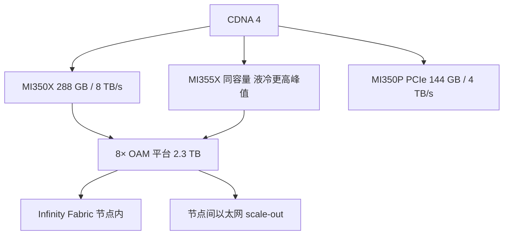

# AMD MI350

    
CDNA 4 把 288 GB HBM3E 与 8 TB/s 做成这一代 Instinct 的内存合同，并把 MXFP6 / MXFP4 收进矩阵峰值表；MI350X 风冷、MI355X 液冷，是同一架构的两条功耗档。

    <footer>—— AMD Instinct MI350 系列产品页与 2025-06 CDNA 4 发布材料</footer>

MI300 一代把芯片做成多芯粒 + 大 HBM 的内存墙突破；MI350 系列（2025 年 6 月产品线上市）在 **第 4 代 CDNA** 上把容量再推到单 GPU **288 GB HBM3E**、带宽 **8 TB/s**，并让微缩放浮点（MXFP6 / MXFP4）成为表头精度。本篇按 AMD 公开规格写 MI350X / MI355X / 8 卡平台以及后来的 MI350P PCIe 卡，对照的是产品页峰值，不是第三方墙钟。不把 MI400 的 HBM4 数字提前写进这一代。

## 问题

大模型推理同时撞两堵墙：权重与 KV 的**容量**，decode 扫权重的**带宽**。MI300X 的 192 GB 已经能放下不少 70B–100B 级量化模型；再往上，更长上下文、更大 MoE、更高并发会先打满 HBM，再打满 5–6 TB/s 量级的带宽。AMD 要在同一类 OAM / 8 卡平台形态里加容量、加带宽、加窄精度，而不把软件栈从 ROCm 换成另一套 ABI。

第二问是机房约束。同一硅可以风冷也可以液冷；峰值时钟与矩阵吞吐随 TDP 档变化。把液冷 SKU 的 PFLOPS 填进风冷机架的电费模型，会得到一张从不存在的集群。

### 系列怎么分

**MI350X**：OAM，CDNA 4，256 CU，288 GB HBM3E，8 TB/s，面向 8 卡平台的风冷 / 标准机架路径。产品博文峰值表：FP64 约 72.1 TFLOPS，FP16 矩阵约 2.3 PFLOPS，MXFP8/OCP-FP8 约 4.6 PFLOPS，MXFP6 与 MXFP4 约 9.2 PFLOPS。

**MI355X**：同容量同带宽，更高功耗的液冷档。同表：FP64 约 78.6 TFLOPS，FP16 矩阵约 2.5 PFLOPS，MXFP8 约 5 PFLOPS，MXFP6/MXFP4 约 10.1 PFLOPS。AMD 产品页拿它与当时公开的 B200 SXM 峰值对拍（内存 288 vs 180 GB，带宽 8.0 vs 7.7 TB/s，以及稀疏 FP8 / MXFP6 等列）。对拍是厂商理论峰值，不是 MLPerf。

**MI350P**：PCIe 卡，面向「不换机架」的企业部署。公开要点：128 CU，144 GB HBM3E，峰值带宽约 4 TB/s。不要用 8 卡 OAM 平台的 2.3 TB 总容量去估一张 PCIe 卡。

工艺产品页写成 **TSMC 3nm | 6nm FinFET**：计算芯粒与 I/O 芯粒分节点，是这一代 chiplet 的常规拆法。末级缓存 **256 MB**。8 卡平台：8× OAM 经第 4 代 Infinity Fabric 全互连，合计约 **2.3 TB** HBM3E、聚合带宽按每卡 8 TB/s 计为 64 TB/s 量级的理论加总——加总不是一张统一内存的实测 $B$。

AMD 发布材料还有「相对上一代最多约 4× AI 算力、推理最多约 35×」一类代际倍数。那是选定工作负载与精度的营销对比，必须带回脚注条件。容量规划用 288 GB 与 8 TB/s；吞吐规划用你自己的模型 + ROCm 版本。

## 方法

部署单位优先想 8 卡节点，而不是单卡。Infinity Fabric 把节点内做成全互连，张量并行与节点内专家并行走这里；节点间仍是以太网 / Ultra Ethernet 一类 scale-out（MI350 世代的机架尚未把 Helios 的 UALoE 当成默认）。ROCm 7 与 Day-0 框架支持（PyTorch、vLLM、SGLang 等）是软件合同：内核能否吃到 MXFP4，取决于量化配方与是否走官方融合，而不是 GPU 表头印了 MXFP4 就自动 9.2 PFLOPS。

选型：要最大单卡上下文与 MoE 专家驻留，选 288 GB 的 X 档；电与冷却允许则 MI355X 换峰值；只能插 PCIe、功耗墙在现有服务器，才是 MI350P。不要用 MI355X 的矩阵峰值去除以 MI350P 的 144 GB 来「折算一张卡能跑多大模型」——带宽与 CU 数都不是线性折半。

### 精度列怎么用

MXFP8 / MXFP6 / MXFP4 是 OCP 微缩放格式在 CDNA 4 矩阵单元上的峰值。FP16 矩阵仍在 2.3–2.5 PFLOPS 档；窄格式把同一阵列的乘加吞吐抬高，前提是权重、激活真的走这条流水线。KV 若仍是 BF16，decode 会先撞 [HBM3E](/llm/hbm3e) 带宽墙，矩阵峰值再高也只在 prefill 的大 GEMM 上可见。稀疏列（产品对拍图里的 sparsity）与稠密训练不是同一合同——与 NVIDIA 产品表一样，稀疏需要权重满足模式。

HPC 列：MI355X 的 FP64 约 78.6 TFLOPS，产品页用来对比 B200 的 FP64 张量/向量口径。AI 工厂若只跑 LLM，FP64 不是选型主因；科学计算与混合精度求解器才是。

## 机制

288 GB 改变的是「一张卡能驻留多少参数 + 多大 KV」。粗算：FP16 权重下约 140B 稠密参数量级可单卡放下（另留 KV 与激活）；FP8 则更宽。8 卡 2.3 TB 把「单节点一张逻辑加速器」推到万亿参数稀疏模型的驻留区，但仍受节点内互连与 ROCm 集合实现约束。带宽 8 TB/s 与当时 Blackwell 公开带宽同一量级，decode 的时间下界仍是字节 / $B$；MI350 的差异更常出现在容量（少切几路张量并行）而不是神奇地取消带宽墙。

Chiplet 使 256 CU 与双 I/O die 成为可能：计算走较新节点，HBM 控制器与 Infinity Fabric 走 I/O 片。对程序员，可见的是一张 HIP 设备、一份 288 GB 指针空间；对性能，跨 IOD 的亲和性、L2/LLC 命中、以及 8 卡全互连上的集合算法，都会让「单卡 kernel 很快、8 卡 All-Reduce 很慢」同时成立。排障时不要只用单卡 MFU 验收节点。

与 CUDA 生态的真实摩擦在内核与图编译器，不在 HBM 容量。Day-0 支持表示官方仓库能跑，不表示每一颗社区 FlashAttention 变体都已 HIP 化。迁移应以融合注意力、通信重叠、以及 MX 量化路径是否接通为验收，而不是对照峰值表算理论加速比。

### 8 卡平台与液冷

UBB 风冷与 DLC 液冷是同一 8× OAM 逻辑上的两种机械/热包络。MI355X 走 DLC 才能吃到更高时钟档。机架供电、CDU、以及节点内 2.3 TB 内存的故障半径（一卡 ECC 风暴是否拖垮整节点作业）要按平台手册，而不是按单卡规格外推。安全特性（固件度量、多租户、链路加密）是产品页上的企业合同，与算力无关，但多租云上会决定你能不能把 288 GB 切给两个客户。

## 边界与工程取舍

不要把 MI350 的 8 TB/s 写成 HBM4。不要把 35× 推理倍数写进容量规划。不要假设 PCIe 卡与 OAM 平台共享同一 Infinity Fabric 域。节点间仍是 scale-out；若你的 MoE All-to-All 比节点内还宽，瓶颈在网卡，不在 CU。下一代 [MI400 / Helios](/llm/mi400-helios) 才把机架级 UALoE 与 HBM4 做成默认故事。

对拍 NVIDIA 时只用当时双方产品页的峰值列，并写明稀疏/稠密。墙钟、tokens/$、以及 ROCm 版本必须另测。AMD 脚注里的对照对象包含 H200 与 B200 不同 SKU，抄表时核对内存容量那一行。

出处：AMD Instinct MI350 系列产品页；《AMD Instinct MI350 Series and Beyond》规格表；HBM 背景见 [HBM3E](/llm/hbm3e)。未在产品页出现的单通道 Infinity Fabric GB/s 不填。

## 小结

- MI350 系列：CDNA 4，旗舰 OAM 288 GB HBM3E @ 8 TB/s，MXFP6/MXFP4 进入峰值表。
- MI350X 与 MI355X 是风冷/液冷功耗档；MI350P 是 144 GB 的 PCIe 企业卡。
- 8 卡平台约 2.3 TB 容量，节点内 Infinity Fabric，节点间仍走以太网 scale-out。
- 规划用容量与带宽；代际 4×/35× 与对 B200 的峰值对拍都带厂商脚注。
- 不要把 MI400 的 HBM4 / Helios 机架写进这一代。
- 出处：AMD 2025-06 公开产品规格；软件栈以当时 ROCm 发行说明为准。
