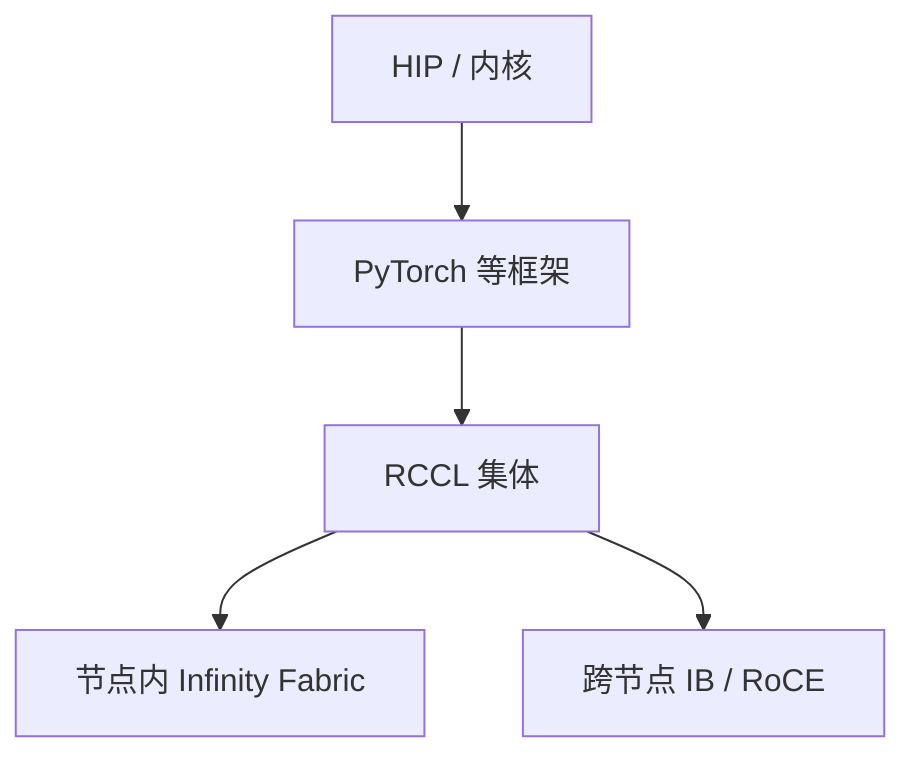

# AMD ROCm 栈

硬件近 GPU，软件要另建一层：HIP、RCCL、MIOpen、编译器与驱动。NCCL 的算法课在这里变成「RCCL 是否同构、差在哪条路径」。

<footer>—— AMD ROCm 公开文档；集体库 RCCL 对照 NCCL</footer>

[上一课](/llm/tenstorrent)把多核、本地 SRAM 与 NoC 写成数据搬运显式的架构；灵活性介于 GPU 与 LPU 之间，软件栈决定能否服务 LLM。前几课离开了 NVIDIA 生态。本课回来一条近路：AMD Instinct 一类 GPU + ROCm。缺口不是再讲脉动阵列，而是软件栈：CUDA 源码经 HIP 翻译、集体走 RCCL、拓扑走 Infinity Fabric 而不是 [NVLink](/llm/nvlink)。[预训练通信](/llm/pretrain-comm) 的三层图仍可用，组件换名；NCCL 算法课的决策表不能原样粘贴。后课国产加速器默认已经知道「有 HIP」不等于集群就绪。

## 问题

算子能编译不等于训练能扩展。墙常在：RCCL 在某拓扑上的 busbw、GPU Direct 类路径是否启用、PyTorch / Megatron 分支是否把 RCCL 当一等后端、以及内核库对 FP8 / 稀疏是否对齐 NVIDIA 的一代。把「有 HIP」写成「集群就绪」会在 All-Reduce 上失败。

节点内互连是 Infinity Fabric / xGMI，档位以该代数据手册为准，不要把 NVLink 的 900 GB/s 或 1.8 TB/s 抄过去。节点间仍是 IB/RoCE，拥塞课仍成立。问题是 **对齐语义、重测 $\beta$**，不是假设 NCCL_ALGO 环境变量还在。

ROCm 版本与 PyTorch 版本的组合矩阵是运维输入。半套栈（驱动新、RCCL 旧）会出现只在集体上挂的作业。发布检查要包含 nccl-tests 的 RCCL 等价物。

## 方法

把栈按层验收：驱动与设备可见 → HIP 单卡核 → RCCL 单节点 → RCCL 跨节点 → 框架并行网格。每层用微基准，不要一上来跑 70B。拓扑：`rocm-smi` 一类工具看 Fabric 连接，对应 `nvidia-smi topo`。并行网格同样：密通信放节点内 Fabric，DP 放网卡。

内核与编译：有的核仍是 OpenCL/HIP 手写，有的走编译器。缺核时会 silent fallback 到慢路径。对比 NVIDIA 要列「哪些层有快核」，不能只列峰值 FLOPS。

## 机制

RCCL 源自 NCCL 思路，算法族类似（环、树），但探测图与协议实现不同。同一消息大小的拐点要重测。Fabric 的对称性若不如 NVSwitch 平坦域，环可能周期性踩慢边——[ring-tree](/llm/ring-tree-allreduce) 课的警告在此重复，只是链路名变了。

软件差异造成的「正确但慢」比「不能跑」更危险：作业能完成，MFU 低，被当成模型问题。微基准分层是为了把锅放到栈的正确一层。

多框架（Megatron-LM、DeepSpeed、vLLM）对 ROCm 的支持深度不同。推理栈与训练栈要分开验收。

## 边界与工程取舍

不要用 CUDA 占用率工具直接解释 AMD 计数器。不要假设 SHARP / NVLS 在 RCCL 里有同名同能的对应。不要把未支持的精度当成「开个 flag」。下一课国产加速器谱系更异构，连 HIP 这层近路都未必有。

## 小结

- ROCm = HIP + 库 + RCCL + 驱动；验收必须分层到跨节点集体。
- Infinity Fabric 不是 NVLink，带宽与对称性要按该代手册 + 微基准。
- RCCL 与 NCCL 语义近、决策表不同，拐点重测。
- 缺核与半套版本造成正确但慢。
- 出处：AMD ROCm / RCCL 公开文档。
