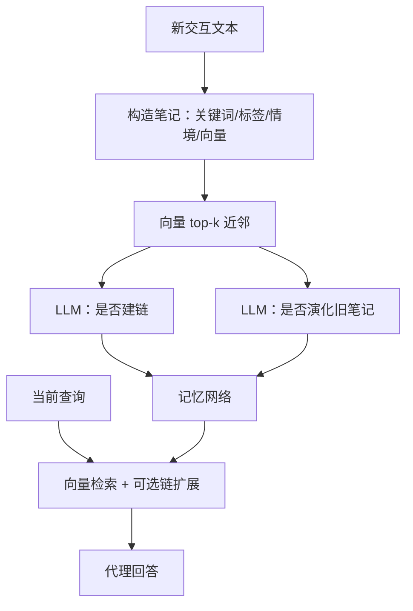

# A-MEM 代理记忆

    
新记忆写成带关键词、标签与情境描述的原子笔记，再与相近历史笔记建链；旧笔记的属性可随新经验被改写，网络自己演化，而不是死守一张预设表。

    <footer>—— Xu 等，A-Mem: Agentic Memory for LLM Agents，NeurIPS 2025（arXiv:2502.12110）</footer>

Wujiang Xu、Zujie Liang、Kai Mei、Hang Gao、Juntao Tan、Yongfeng Zhang 提出 **A-Mem**：给 LLM 代理一套可演化的记忆组织，灵感来自 Zettelkasten（卢曼式卡片盒）的原子笔记与灵活链接。现有系统能存能取，但存储结构、写入时机、检索时机往往写死在工作流里；Mem0 一类用图数据库的方案则受预设 schema 约束。A-Mem 让每次新交互生成结构化笔记，用向量近邻召回候选，再用 LLM 决定是否建链、是否更新旧笔记的情境与标签。评测在 LoCoMo 超长对话问答上对照 LoCoMo 原法、ReadAgent、MemoryBank、MemGPT。本篇写笔记构造、链接与演化，不把「agentic」当成营销词。

## 问题

代理要跨会话用历史，但不能把全部对话塞进窗口。MemGPT 用工作记忆便签 + 档案检索，读写函数是固定菜单。图存储把实体关系类型预先声明，新出现的「解题策略」如果没有对应边类型，就只能塞进旧抽屉。A-Mem 认为：长期、开放任务需要记忆**结构本身**随内容生长——新笔记可以同时属于多个「盒子」（以相似情境描述为盒），盒子不是管理员事先建的分类树。

LoCoMo（Maharana 等）把对话拉到约 9K token、最多约 35 个会话，题型含单跳、多跳、时间推理、开放知识、对抗不可答。这比只有四五轮的闲聊集更能打穿「摘要后丢失时间线」。A-Mem 用 F1 与 BLEU-1 为主，并报平均答题 token；附录补充 ROUGE、METEOR、SBERT，以及更多骨干。生产实现与论文复现代码分开：`WujiangXu/A-mem` 对表，`A-mem-sys` 对集成。

### 笔记是原子单位

一条记忆 $m_i=\{c_i,t_i,K_i,G_i,X_i,e_i,L_i\}$：原文 $c_i$、时间戳 $t_i$、LLM 生成的关键词 $K_i$、标签 $G_i$、情境描述 $X_i$、链接集合 $L_i$，以及把文本字段拼起来后经编码器得到的 $e_i$。原子性：一张卡只装一个可独立理解的知识点，靠链接表达复合。编码器在论文实验里用 `all-MiniLM-L6-v2`；换嵌入必须整库重算，否则近邻与链接候选一起漂。

作者区分 agentic RAG 与 agentic memory：前者代理决定何时检索，知识库仍静态；后者连存储结构与旧笔记属性都会因新经验改写。不要把「会调用检索工具」写成 A-Mem。

## 方法

写入：对交互文本提示 LLM 生成 $K,G,X$，编码 $e_n$，与库中笔记算余弦相似度，取 top-$k$ 为 $\mathcal{M}_{\text{near}}$。再提示 LLM 根据共同属性决定 $L_n$。演化：对每个近邻 $m_j$，提示 LLM 是否更新其情境、关键词、标签，得到 $m_j^*$ 写回。检索：查询同样编码，取 top-$k$ 笔记；实现上 `search_agentic` 还可带出链上邻居，使召回沿网络走一步。论文主实验检索 $k$ 默认 10，部分题型另调，附录给出配置。

对照在六种骨干（含 GPT-4o-mini、GPT-4o、Qwen2.5 1.5B 等）上跑五类 LoCoMo 题。以 GPT-4o-mini 为例：A-Mem 多跳 F1 27.02、时间 45.85、开放 12.14、单跳 44.65、对抗 50.03；MemGPT 对应 26.65、25.52、9.15、41.04、43.29；完整对话当上下文的 LoCoMo 基线对抗项更高（69.23）但平均 token 约 1.7 万，A-Mem 约 2520。时间类上 A-Mem 相对 MemGPT 的跳升是主结果之一：链接与情境更新有助于跨会话对齐日期，而不是只靠 FIFO。对抗题上「把全文塞进窗口」仍更会拒答或识别不可答——说明压缩记忆会丢「我不知道」的证据，评测要分列，不能只报平均。

### 演化是写放大

每条新笔记触发对 $k$ 个近邻的 LLM 更新，写入成本随库增长。这是方法的核心，也是工程税。不做演化，系统退化成「带 LLM 元数据的向量库」。只建链不改旧笔记，则旧情境描述会逐渐与网络不一致。论文用 t-SNE 展示组织后的结构，定性说明「盒子」涌现；定量仍以 QA 为准。DialSim（影视多角色长对话）作为补充集，本篇以 LoCoMo 主表为引用锚。

## 机制

建链分两段：嵌入做廉价候选，LLM 做关系判断。仅靠余弦会把词面相似、事件无关的卡片连上；仅靠 LLM 对全库做边是平方级。演化允许更高阶模式：多条数学题笔记被新题触发后，旧标签从「作业」改成「配方法」，后续检索分布跟着变。这与 MemGPT 的 `working_context.replace` 不同：MemGPT 改的是一小块常驻前缀；A-Mem 改的是库里许多笔记的元数据，影响的是检索分布而不是每步必读的 RAM。

检索仍是向量 top-$k$，不是图算法保证连通分量全召回。链扩展是启发式一步邻居，深度过大易引入主题漂移。对抗与不可答题需要「没有笔记」时的拒答策略；若演化把猜测写成情境，错误会固化。写入提示必须禁止把系统指令、跨租户内容写进 $c_i$。

GPT-4o 上单跳 F1：LoCoMo 全文 61.56，A-Mem 48.43——局部事实有时仍是「把原文放进窗口」赢。A-Mem 的卖点是长时间题与 token 预算，不是所有切片都优于全文。

## 边界与工程取舍

### 论文复现器与生产库

NeurIPS 2025 论文配套评测仓与 `A-mem-sys` 生产仓分离。集成应以后者为准，数字以前者脚本为准。$k$、嵌入模型、演化是否异步，都是会改变 F1 的超参。大规模时应对演化做节流：只对相似度超过阈值的近邻调用 LLM，或批量离线演化，以免每条聊天消息打 $k$ 次生成。

与 GraphRAG 的图不同：GraphRAG 在索引期用 LLM 抽实体关系、Leiden 社区、预生成社区摘要，服务全局主题问题；A-Mem 的图是笔记级语义链，服务个人长期对话。不要混引用 Edge 等人的综合率赢面。与 [MemGPT](/llm/memgpt) 叠用时，A-Mem 可当 archival 的组织层，MemGPT 仍管窗口放置——那是系统工程，不是任何一篇论文的默认实现。

出处：Xu, Liang, Mei, Gao, Tan, Zhang，*A-Mem: Agentic Memory for LLM Agents*，NeurIPS 2025，arXiv:2502.12110。LoCoMo 数据集见 Maharana 等。基线含 Packer 等 MemGPT、Zhong 等 MemoryBank、Lee 等 ReadAgent。

## 小结

- A-Mem 按 Zettelkasten 把交互写成原子笔记，动态建链并演化旧笔记属性。
- 近邻用嵌入，链与演化用 LLM；检索可带一层链接扩展。
- LoCoMo 上时间推理与 token 效率是相对 MemGPT / 全文基线的主对照；单跳与对抗不是全面胜利。
- 演化带来写放大，需要阈值与异步，否则费用随库线性恶化。
- 出处：Xu et al.，arXiv:2502.12110 / NeurIPS 2025。
