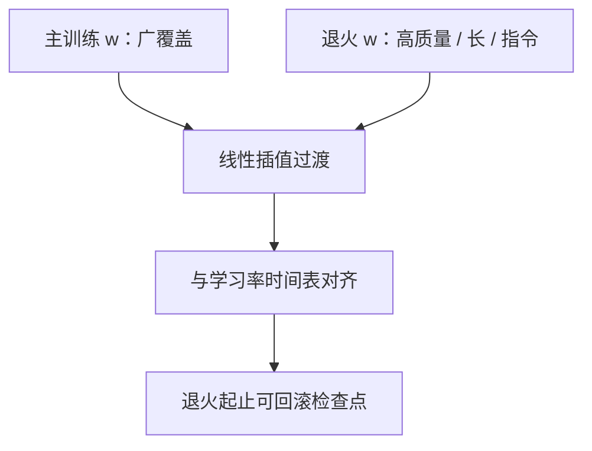

# 退火阶段的配比

主训练用广覆盖的脏一点的混合物把世界撑开，最后一小段 token 改喂更高质量、更长、更指令化的数据，让损失在目标分布上收口。

<footer>—— 据 Llama 3 报告、MiniCPM 与 OLMo 2 等配方中的退火 / 后期配比整理</footer>

[上一课](/llm/data-ordering-curriculum)把「同样 $w$ 下谁先出现」收成弱于配比的顺序问题。工业界更常动的是另一条时间轴：主训练的 $w_{\mathrm{main}}$ 与最后 $T_{\mathrm{anneal}}$ token 的 $w_{\mathrm{anneal}}$ 不同。本课不重讲由易到难。缺口是退火混合物怎么设计、如何与学习率衰减对齐、以及它如何吃进本单元已经准备好的长文档、指令、合成与去污染约束。下一单元并行调度默认数据侧已经有一张可执行的时间表。

## 问题

全程使用最干净、最指令化的数据，覆盖不够，费用也高。全程使用网页，上线风格差，协议 token 弱。Llama 3 一类报告把后期切换到高质量数据写成标准动作；MiniCPM、OLMo 2 也讨论在衰减阶段改变数据。工程缺口是：$T_{\mathrm{anneal}}$ 占预算多少、哪些桶允许跃迁（代码↑、网页↓、合成是否只在退火出现）、以及切换是硬切还是若干步线性插值，以免损失尖峰被误当成优化事故。

退火不是新的 DoReMi。时间太短，DRO 来不及重估；通常用人工 $w_{\mathrm{anneal}}$ 加少量小模型扫描。RegMix 的面若只在主训练分布上拟合，不能直接当退火解。

### 学习率与数据同时衰减

学习率已进入尾部时再突然换分布，参数移动能力有限，退火变成「用小步去拟合新分布」，可能只改风格不改知识。因此要么退火段仍给足够大的 LR（与主训练衔接的 cosine 重启要谨慎），要么把 $T_{\mathrm{anneal}}$ 留得够长。两者必须写在同一张表，课程课已经警告过这种耦合。

退火数据更要去污染。后期记忆更强，评测泄漏会集中发生在这一段。

## 方法

主训练：$w$ 偏覆盖（网页、多语言 α、仓库代码），长文档中等上采样，指令与合成低上限。退火：提高过滤后的高质量网页/书、长切片、指令桶，合成仍设硬上限或只在此段打开；代码保持仓库级排布以免后期只会刷题。切换用线性插值若干亿 token，而不是一个 step 换加载器。保留一小份主训练分布作「锚」，降低灾难性遗忘。

检查点策略：退火开始与结束都留可回滚点。产品若发现退火伤害某探针，应能回到主训练终点再配一条更窄的 $w_{\mathrm{anneal}}$，而不是整场重跑。这与后课异步检查点衔接。

### 与词表、FIM 的兼容

退火不换词表。FIM 比例可以略升以服务编辑产品，但续写探针要守门。特殊 token 模板必须与上线一致，否则退火专门拟合一套即将废弃的标记。

按 token 计的 $w_{\mathrm{anneal}}$ 仍受 fertility 扭曲。多语言产品应在退火里显式保住尾部语种的字符预算，而不是只加英语高质量书。

## 机制

优化后期，模型对训练分布的瞬时拟合变强、探索变弱。把分布挪到更接近产品与评测的区域（在去污染约束内），等于用剩余梯度预算做一次受控的领域适应。它不是 SFT：仍是下一 token，掩码规则可与指令进预训练相同。知识来源仍是主训练；退火改变的是格式、风格、长依赖与干净程度上的边际。

## 边界

退火救不了主训练缺数据或缺词表覆盖。它也不能替代对齐阶段的偏好优化。把全部合成预算塞进退火，风格会像教材。数据单元到此结束：选什么、按什么比、何时换比，已经接得上加载器。下一单元从 1F1B 开始，问这些 token 在万卡上如何按调度跑完，而不把数据配方再写一遍。

## 小结

- 本课不重讲样本排序；只补后期更换配比这一工业旋钮。
- $w_{\mathrm{anneal}}$ 提高质量与长上下文、守住去污染与语种字符预算，用插值衔接。
- 必须与学习率、检查点同表；短退火只改风格。
- 不换词表，不替代 SFT。
- 出处：Grattafiori et al., *The Llama 3 Herd of Models*；Hu et al., MiniCPM；OLMo 2 配方中的后期数据；对照 Xie et al. DoReMi 的静态 $w$。
