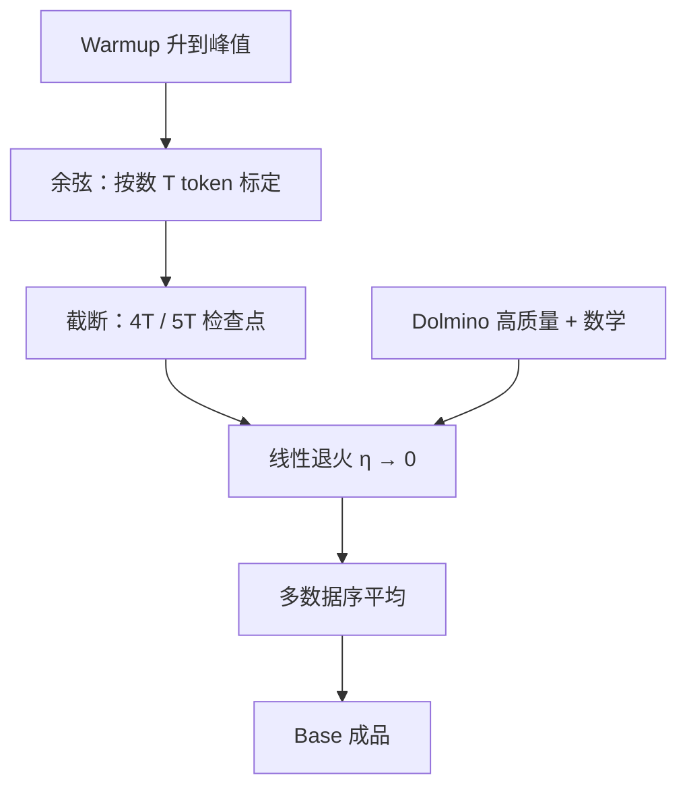

# Annealing 退火阶段

预训练最长的那段吃掉九成以上 FLOPs；更短的第二段里，我们把学习率线性降到零，同时换上专门混合去补能力。

<footer>—— OLMo Team，*2 OLMo 2 Furious*，arXiv:2501.00656</footer>

预训练日程里的「退火」不是模拟退火那种随机搜索，而是**学习率从峰值落到接近零的那一段**，常常和数据课程叠在一起。余弦日程把衰减摊进全程；[WSD](/llm/lr-schedule) 把衰减压到收尾。OLMo 2 走第三条：余弦先按数万亿 token 走完大半，再**截断余弦、改线性落到零**，并在这段里换成 Dolmino Mix。本篇只写这一阶段在公开配方里做什么，不把 SGDR 的周期重启、也不把后训练 SFT 叫成退火。

## 问题

余弦绑定了总步数 $T$。开训时写死 $T$，中间检查点已经在降温；想加数据、改配比，曲线对不上。OLMo-0424 的经验是：余弦尾巴可以砍掉，换成线性落到零，下游分数几乎不掉。于是 2 代把「还剩 5%–10% FLOPs」单独做成阶段：学习率从当前值线性到 0，数据从网页主混合换成高质量 + STEM 补丁。问题变成两件可以分开问的事——**降学习率本身值多少分**，以及**同时换数据又值多少分**。

若只降学习率、数据仍是预训练混合，损失会再掉一截，像 cooldown；数学等没学够的技能不会凭空出现。若只换数据、学习率仍停在峰值，权重在高步长上抖动，专门混合的信噪比被冲掉。退火阶段要同时交付这两件事，又不能为试一种数学源去重跑 5T。

### 截断余弦再线性落到零

7B 的峰值学习率 $3\times 10^{-4}$，2000 步 warmup，余弦按 5T 标定；实际在约 4T 处停余弦，转入中训。13B 峰值更高，余弦走到约 5T 再转。线性段的自变量是**这一段的剩余长度**，不是从头重算一条新余弦。检查点带着余弦中段的学习率进来，再沿直线到 0。这与「整段都是余弦、评测点落在 10% 峰值」不是同一超参点。

报告里的对照句：更高峰值在预训练前期损失更好，后期会被更低峰值追上；但无论峰值取 $3\times 10^{-4}$ 还是数倍，**线性退火到零之后训练损失几乎落到同一处**。民间智慧「曲线下面积越大越好」在这段不成立。

## 方法

记预训练结束时的学习率为 $\eta_{\mathrm{cut}}$（余弦尚未到 $\eta_{\min}$），退火段共 $D$ 步，则

$$
\eta(t)=\eta_{\mathrm{cut}}\cdot\bigl(1-t/D\bigr),\qquad t\in[0,D].
$$

$D$ 由 token 预算决定：7B 用 50B；13B/32B 为对齐更大 batch 的步数，用 100B，并另跑一条 300B。同一预算上换数据顺序重复多次，再 [souping](/llm/olmo2-midtrain-recipe) 平均权重。数据侧见 [Dolmino](/llm/olmo2-midtrain-recipe)；本篇只强调日程：退火是**短、陡、到零**，不是把剩余 10% 再画一条浅余弦。

单独把预训练混合再退火一次（报告里的 PT Mix），OLMES 多选平均会升、MMLU 升得更明显，**GSM\* 不升甚至略降**。说明「降温」主要在整理已有表示，补数学要靠域内数据。高质量网页 + 指令 + 数学同时进混合，GSM\* 才出现十几分的跳变。两条杠杆要拆开读：学习率负责收敛，配比负责补洞。

### 用短退火回答「峰值是不是太高」

报告在 300B token 的中间点上，对 $3$、$6$、$9$、$12\times 10^{-4}$ 各做 50B 或 100B 线性到零。预训练损失差一截的几条跑，**退火后损失对齐**；OLMES 九项多选平均相差不到两分。把同样对照拉到 2T 再加 100B 高质量混合，OLMES 仍几乎持平，GSM8K 上高峰值略好 2.8 分。结论不是「峰值随便取」，而是：**在 QK-Norm 与 Z-loss 护栏下，峰值在一个平台里，退火会把平台收成相近的终点**；$30\times 10^{-4}$ 那种在 warmup 就炸的设定仍被丢掉。

## 机制

学习率下降减小随机梯度的有效步长，权重不再在极小值附近大步抖动，损失曲线变光滑——这是任何 cooldown 都有的优化故事。OLMo 2 要多说的是：这一段被故意做成**可复用的干预接口**。预训练可以在损失还没走完余弦时停；只要留下一个「还在中高学习率」的检查点，就可以接不同 $D$、不同混合、不同数据序。WSD 的稳定段是同一接口的另一种实现：峰值上一直走，临停再衰。余弦若不截断，接口不存在，因为每个中间点的 $\eta$ 都已经绑定了旧的 $T$。

数据与学习率耦合的机制是课程而不是新损失。下一词预测没变；变的是 token 分布的熵与域。数学合成、FLAN 式指令、过滤后的 DCLM 子集，在高学习率上容易把网页先验冲掉；线性到零相当于给新分布一个越来越紧的局部拟合，同时旧知识靠混合里仍占约一半的网页来锚住。这就是为什么 PT Mix 单独退火抬 MMLU、不抬 GSM\*：降温放大了「已经在网页里见过的学业题」，没有引入解题图。

micro-annealing 把同一线性到零的日程缩到不到 10B token、数学与网页各半，用来给单源打分。它测的是「这锅数据在退火动力学下有没有用」，不是「这锅数据在峰值学习率上训 5T 会怎样」。二者不可互换。

### 和余弦全程退火、和后训练不是一事

SGDR / 余弦退火作为**优化器日程**，贯穿预训练；这里的 annealing phase 是**训练流水线里的命名阶段**，发生在底座成形之后、Instruct 之前。SFT / DPO / RLVR 改的是条件分布与奖励，损失不再是纯语言模型。不要把 Tulu 3 后训练写成「又一次退火」。也不要把 MiniCPM 等报告里的 WSD cooldown 自动等同于 Dolmino：WSD 可以仍用同一网页混合，只改 $\eta(t)$；OLMo 2 的退火默认**同时换混合**。

## 边界与工程取舍

线性到零假设你愿意把这一检查点当成品。若还想从退火中段分叉续训，学习率已经很低，和余弦截尾一样别扭。需要多成品时，应在截断点复制检查点，各跑一条独立的 $D$。souping 要求同一架构、相近步数；把 50B 与 300B 的末点直接平均，报告给的是 13B/32B 的四路配方，不是任意步数都能汤。

评测污染：GSM8K 训练集进了 Dolmino，开发时只用 200 条 GSM\* 做决策，其余 1119 条作 held-out。引用 GSM8K 大跳变时必须写明这一点，否则会把退火神话成「无监督突然会算术」。上下文仍是 4K 训练长度；退火不延长窗口。32B 预训练 token 数在表 9 与博客之间有 6T / 7T 口径差，写日程时钉表注，不要用退火长度去反推预训练总量。

不要把「退火」理解成降低温度采样。推理温度与训练学习率无关。也不要把损失尖峰之后的学习率回退写成退火阶段——那是稳定性补丁，FLOPs 占比与数据意图都不同。

出处：OLMo Team，*2 OLMo 2 Furious*，arXiv:2501.00656，§4.1。日程对照见 [学习率](/llm/lr-schedule)；数据配方见 [OLMo 2 midtrain](/llm/olmo2-midtrain-recipe)；续训概念见 [Continued Pretraining](/llm/continued-pretraining)。

## 小结

- 退火阶段是预训练末段：截断余弦后线性把学习率降到零，通常只占 5%–10% FLOPs。
- 单独降温会整理已有能力；补数学、指令、STEM 必须换混合，不能指望 cooldown 本身。
- 在稳定性护栏下，预训练峰值在平台内时，退火后损失与 OLMES 多选趋于对齐。
- 短预算（50B–300B）加多数据序 souping，把这一阶段做成可实验的接口，而不是重跑数 T。
- 出处：arXiv:2501.00656。
