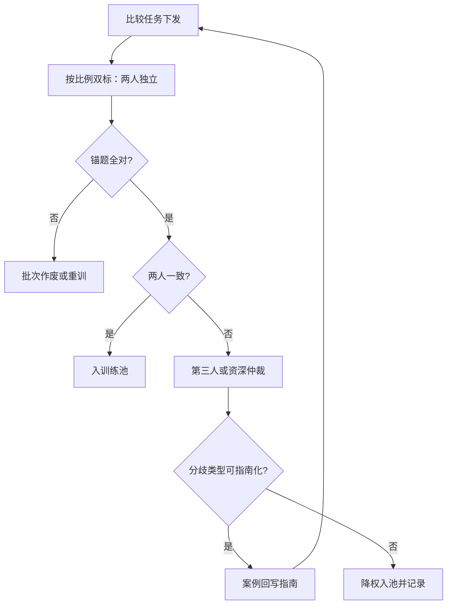

# 标注一致性与仲裁

两个人对同一对回答给出同一个结论的频率，是偏好数据信噪比的下界；低于它的一切准确率都是幻觉。

<footer>—— 一致性系数见 Cohen 1960 与 Krippendorff 2004；标注员间一致率量级见 Ouyang 等 InstructGPT 2022 附录</footer>

[上一课](/llm/pairwise-listwise-pointwise)把采集钉在成对为主、列表拆对要过一致性抽检。那个「抽检」只查列表内部的自洽，没查标注员之间可不可重复。本课写重复性本身：一致率怎么定义、怎么测、分歧怎么仲裁，以及一致率怎么反过来给 RM 的准确率天花板定价。后课的强度标定要拿这里的翻转率当输入。

## 问题

成对标签是测量，测量的第一问是重测信度：同一对 $(x,y_w,y_l)$ 给两位合格标注员，结论相同的频率是多少？InstructGPT 附录报告的标注员间一致率在七成上下——这不是执行差，而是任务本身的属性：相当一部分真实对就是难分。一致率给 BT 损失立了一条硬边界：若标签以概率 $\epsilon$ 被翻转，任何 RM 在这个分布上的比较准确率上限是 $1-\epsilon$；在翻转率三成的域上追求九成验证准确率，只能在过拟合或捷径里找答案。不这么做会错在哪：团队盯着全局验证准确率上涨，实际涨的是「容易域的过拟合 + 长度捷径」，难域分数纹丝不动。

### 一致率怎么算

简单一致率 $p_o$ 会被猜测命中污染，要用修正 chance 后的系数。二值标签用 Cohen 的 $\kappa=(p_o-p_e)/(1-p_e)$， $p_e$ 是两人独立猜测的期望一致率；多标注员、含缺失时用 Krippendorff 的 $\alpha$，它对缺席与有序标签有现成口径。报告时按域分层：全局 $\kappa$ 是又一个会撒谎的平均数，安全域与写作域的一致率可以差出两成。除统计量外，工程上还要放锚题：池子里埋入已知答案的对（gold questions），标注员答错锚题的批次整体作废或重训——测的是人，不是题。

## 方法

流程是双标加仲裁：全量单标、按比例双标（敏感域提高双标率），双标分歧的对送第三人或资深仲裁员。仲裁有一条纪律：分歧必须归因。归因结果分三类——指南空白（案例回写指南，下一批不再分歧）、标注员失误（进培训或淘汰）、真模糊（对本身近不可分）。第三类不该由仲裁员硬判成训练标签：把「差不多」硬掰成「A 胜」等于把仲裁员个人噪声注入数据，更好的处理是降权入池或转给强度标定（下一课的「差不多」档）。指南因此是活文档：每一轮仲裁的产出之一是修订版指南，[InstructGPT](/llm/instructgpt) 的流程正是这样迭代出来的。

## 机制

一致率通过标签噪声影响 RM 的机制链：BT 损失对翻转对给出错误梯度，方向固定、逐样本独立；翻转率低时梯度期望仍指向真边界，方差变大；翻转率随域升高，期望本身被拉向 0.5 边界。两个推论：其一，一致率低的域要么补数据摊薄方差，要么直接换任务形态（改列表、加锚题），单纯加样本到噪声里没有复利。其二，翻转率可估计、可利用——利用它做损失加权与标签平滑，把一致率差的对降权，等价于给 BT 损失加了噪声先验；这个口子下一课展开。仲裁机制上要防的是单点化：所有分歧都听同一位资深仲裁员，等于把多人测量坍缩回一个人的一致率。

$\kappa$ 与 $\alpha$ 都有现成的解释区间惯例（如 Landis 与 Koch 对 $\kappa$ 的 0.2 一档划分），但偏好数据的口径应自定并写进数据卡：同一份 $\kappa=0.4$，在闲聊域可接受，在安全域必须返工。

## 边界

一致率高不等于指南对：全员一致地偏长、偏格式，$\kappa$ 照样漂亮，偏置要在测量单元（后课长度与风格偏置）里抓，一致性管的是精度不是准度。反向也成立：一致率低不全是坏事——指南外真正有价值的分歧（新需求、少数用法）会被「消灭分歧」的流程顺手磨掉，所以归因环节必须保留「真模糊」这一出口，而不是把所有分歧都压成统一答案。最后，一致性测的是当前指南、当前人群、当前任务形态下的可重复性，三者任何一个变了，旧的一致率作废，要重测。

## 小结

- 标注一致率是偏好数据的信噪比下界，直接给 RM 的可达准确率封顶。
- 报告用修正 chance 的 $\kappa$ 或 $\alpha$，按域分层，池内埋锚题控制执行质量。
- 流程是双标、分歧归因、仲裁；真模糊的对降权或转强度档，不硬判。
- 一致率管精度，不管准度：一致地偏也是偏，留给偏置单元。
- 出处：Cohen 1960；Krippendorff 2004；Landis 与 Koch 的区间惯例；Ouyang 等 InstructGPT 2022 附录的一致率口径。
