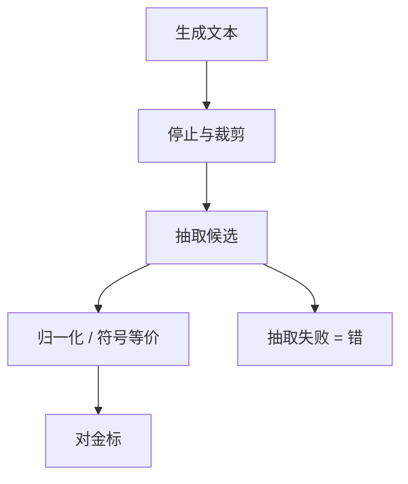

# 答案抽取与归一化

模型写对了推导，抽取器没认出最后一行的数，这道题在榜上是错的。评测的是管道，不只是网络。

<footer>—— 对照 GSM8K / MATH 的数字与 LaTeX 归一化；Minerva 对等价式的处理</footer>

[上一课](/llm/prompt-format-sensitivity)说明包装能改分。生成式协议还有更硬的一层：从自由文本里抽出可比较的答案。本课写抽取与归一化。缺口是把「生成质量」从「解析器质量」里拆开。后课 [pass@k](/llm/pass-at-k) 默认：代码评测的「对」来自测试执行，数学评测的「对」来自抽取器。

## 问题

Cobbe 的 GSM8K、Hendrycks 的 MATH 允许长推理，金标却是一个数或短表达式。模型若把答案写在「因此」之后而不是 `####` 之后，严格字符串匹配会判错。反过来，模型乱写一通但最后一行碰巧抄对数字，会判对——抽取器在奖励格式，惩罚健谈但正确的推导。

归一化同样改分：`1/2` 与 `0.5`、`$\\frac{1}{2}$` 与 `0.5`、单位、千分位逗号、中文「百分之十二」。Lewkowycz 等 Minerva 用符号等价（解析后比较）而不是字面匹配，数学分才接近「算对了」。未声明抽取器的 MATH 分不可复现。

选择题的「抽第一个字母」也是抽取器。它会把「答案是 B，但更完整地说是 C」判成 B。协议必须规定冲突时以谁为准。

## 方法

管道：生成 → 裁剪停止符 → 正则或语法抽取候选 → 归一化（去空白、统一减号、解析 LaTeX）→ 与金标比较。数学优先符号等价；数字允许相对容差（百分数题要声明）。抽不到则记错，不要回退到「全文是否包含金标子串」——那会把解析过程里出现的中间数当成最终答案。

报告应附抽取失败率。失败率高时，先修提示（「把最终答案放在 \boxed{}」）再谈模型；否则你在用提示补偿解析器。

## 机制

自回归没有「答案槽」这个变量，槽是评测脚本事后定义的。抽取规则等于在定义任务：GSM8K 的 `####` 是训练时就对齐过的槽；换一种槽，能力数字改的是接口，不是权重。符号等价把「同一数学对象」的多种表面形式收成一类，减小假阴性，但解析器自身会误读宏包与省略括号，引入假阳性。必须版本化抽取代码。

## 边界

开放写作没有金标槽，抽取器不适用，应走后课裁判或人评。代码用单测，不要对源代码做字符串匹配。下一课 pass@k 处理「对一次算会」的抽样统计，抽取/执行仍在内层。

## 小结

- 生成式准确率 = 模型 × 抽取 × 归一化；三者必须版本化。
- 数学用符号等价，避免字面匹配惩罚正确推导。
- 抽取失败应记错并单列失败率，禁止模糊子串匹配当主指标。
- 出处：Cobbe 等 GSM8K；Hendrycks 等 MATH；Lewkowycz 等 Minerva。
