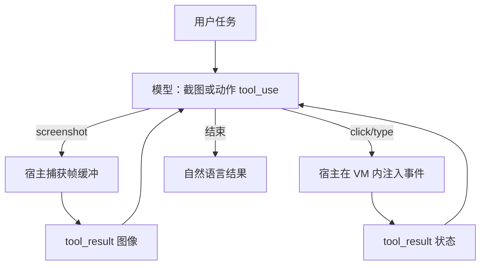

# Anthropic Computer Use

    
模型输出的是截图上的点击与键入，真正的鼠标键盘事件由宿主在受控环境里执行；计算机使用是工具循环，不是把操作系统装进权重。

    <footer>—— Anthropic，Introducing computer use（Claude 3.5 Sonnet 升级，2024 年 10 月 22 日）；Developing a computer use model</footer>

2024 年 10 月 22 日，Anthropic 为升级后的 Claude 3.5 Sonnet 开放 **computer use** 公开测试：开发者通过 Messages API 让模型看屏幕、移动光标、点击、键入，从而操作已有桌面软件，而不是为每个应用单独做 JSON 函数。同期 OSWorld 截图-only 设定上报 14.9%（当时下一系统约 7.8%），步数更宽时 22.0%。本篇写协议分层、截图—动作环、以及官方列出的部署约束。只讨论正当自动化（填表、操作内部工具）的架构，不讨论如何绕过确认、隔离或内容过滤，不提供攻击性操作序列。

## 问题

工具调用默认假设世界已被切成 schema 清晰的函数。真实工作却发生在浏览器、电子表格、专有桌面客户端里，没有 API 或 API 不全。为每个界面写一层包装，成本随应用数量涨，而且包装会与 UI 改版脱节。Computer use 把问题换成：模型是否能像人一样用像素与指针操作**已有**界面。能力上这是视觉—动作策略；系统上这是「模型建议、宿主执行」的循环，与 [function calling](/llm/function-calling) 同一权限边界——模型永远不该直接拿到本机 socket。

公开测试阶段官方自己写：笨、易错、实验性。OSWorld 的绝对水平仍低，不能当成可靠职场代理。安全上，界面里会出现与用户指令冲突的文字与图像（提示注入类风险），官方要求隔离、域名白名单、敏感操作人工确认。这些是产品约束，不是提示技巧清单。

### 宿主执行是权限模型

API 返回的是 `tool_use`：例如请求截图、在坐标点击、键入字符串。宿主在虚拟机或容器里调用系统事件，再把新截图或错误当 `tool_result` 回填。鉴权、网络、文件系统权限属于宿主镜像，不属于模型权重。把计算机使用接到日常办公电脑、且给予登录态，等于把模型的动作错误与注入风险接到真实账户。官方建议：专用 VM、最小权限、避免把账号口令交给模型、互联网白名单、对有真实世界后果的步骤做人审。

坐标来自对截图分辨率的计数。缩放、HiDPI、宿主与模型对屏幕尺寸不一致，会造成系统性点偏。这是工程校准，不是「模型不会用电脑」。声明 display 宽高必须与实际 framebuffer 一致。

## 方法

请求侧在 `tools` 里声明计算机使用工具（早期公开测试为带版本后缀的 computer / bash / 文本编辑工具组合；后来文档演进为 toolset 一次声明多个成员工具，如截图、点击、键入。集成应以当前平台文档的 `type` 字符串为准）。模型在需要看屏幕时请求截图；在需要操作时给出动作类型与参数。开发者必须自己写 **agent loop**：执行动作 → 回填观察 → 再请求，并设步数上限，避免死循环。Bash 与文本编辑工具用于终端与文件，和像素级指针互补：能走文件接口的不要强迫去点 IDE 菜单。

评测协议 OSWorld 测的是「像人一样用计算机」的任务成功，截图-only 更接近纯视觉环；增加步数等于加测试时计算。14.9% / 22.0% 绑定当时的 3.5 Sonnet 升级版与该基准版本，后续模型会变。研究博文 *Developing a computer use model* 把技能说成降低「把认知接到现有软件」的壁垒，并称按当时 Responsible Scaling Policy 评估后仍处 ASL-2，关注点是当下误用而非新的灾难能力跃迁。参考实现与安全说明在文档与 GitHub 示例，生产应抄隔离建议，而不是只抄循环伪代码。

流式与确认：长时间循环会多次往返，TTFT 之后的间隔是动作延迟加推理。官方描述：当分类器在截图中标出潜在注入时，可强制模型在下一步前征求用户确认；无人工在环的场景需要另做策略，不能默认关确认还宣称同等防护。告知终端用户风险并取得同意，写在文档的安全节。

### 与浏览器专用工具、MCP 的关系

若任务完全在网页 DOM 内，后来的浏览器专用工具可以读页面结构，不必整桌面。Computer use 的卖点是**任意 GUI**，包括无障碍树残缺的客户端。MCP 仍可在同一宿主里提供日历、文件系统等结构化工具：模型应优先走结构化工具，把像素环留给没有 API 的缝。三者叠用时，权限要分域：MCP 服务器密钥 ≠ VM 里的浏览器登录态。

动作批处理（较新的 toolset 一次多成员调用）减少往返，但也让单轮副作用变大，确认点更难插。实现应在执行器里对「导航到新域、提交表单、下载」保留策略钩子，而不是盲目执行模型给出的整批动作。

## 机制

训练目标是让视觉编码器与动作头在「屏幕像素 → 指针位移 / 按键」上对齐。官方叙述：模型看截图，估计要点的像素偏移，再发出点击。没有新的操作系统进入权重；泛化来自 GUI 的统计规律（按钮在视窗顶栏、主按钮偏圆角矩形等），对未见过的企业内部皮肤会掉点。错误模式包括：点错相邻控件、滚动后坐标过期、模态对话框挡住目标、等待异步加载不够。循环里每次动作后重新截图，是为了减轻过期坐标，不是为了提高理论成功率上限。

提示注入在这里的机制是：屏幕是不可信输入通道。网页、广告、文档里的指令可能与系统提示冲突。隔离与白名单减小接触面；分类器确认减小自动执行的伤害。它们不把通道变成可信。人审是最后一层，针对转账、接受条款、cookie 墙等「有法律效果的点击」。把人审做成永远点「继续」，等于拆掉这层。

Computer use 不自动具备新的网络或物理世界能力，除非宿主把网络和设备映射进 VM。风险叙述应绑宿主暴露面：无网隔离 VM 与带公司 SSO 的桌面，不是同一威胁模型。

### 为何 OSWorld 很低仍值得做协议

基准低说明策略还远未可靠；协议先行是为了让开发者在隔离环境里试任务类型，并把反馈打回模型训练。对产品经理：只应选择失败代价低、可逐步确认的流程（内部仪表盘查询、复制公开信息到表格），不要选择不可逆操作。对评测：应报任务成功率、平均步数、需人介入次数，而不是只报「支持 computer use」。

## 边界与工程取舍

公开测试易错：拖拽、快速动画、高密度表格、验证码、多显示器，都是已知痛点。分辨率与缩放必须固定。延迟与截图 token 费用高，不适合当通用聊天默认。法律与合规：操作记录应落审计日志（动作序列与截图保留策略按法规），官方亦提到部分安全分类器路径的数据保留，产品要在隐私说明里写清。后续模型与 tool 版本号会变，旧 beta header 与新 toolset 不能混抄。

不要把本篇写成桌面控制的利用手册。不讨论如何关闭隔离、如何对确认框自动同意、如何把注入写进网页。开发者文档里的防护列表是**最小约束**，不是可选优化。无浏览器工具可用时才上整桌面；能 MCP 就不要像素点击。

14.9% 是截图-only OSWorld，不是办公套件 SLA。对内演示用精心挑过的任务会严重高估。应用层必须自建任务集与失败回放。

### 何时不必开 computer use

目标系统有稳定 API 或 MCP 服务器。任务不可逆且无人审预算。无法提供隔离 VM。纯文本对话、代码补全、结构化 function calling 已覆盖。评测环境禁止执行任意 GUI 动作。

## 小结

- Anthropic computer use：Messages API 上的截图与键鼠工具，宿主在受控环境执行，模型只产出 tool_use。
- 2024-10-22 随 Claude 3.5 Sonnet 升级进入公开测试；OSWorld 截图-only 14.9%，更多步数 22.0%。
- 必须自建动作循环、步数上限、显示尺寸对齐；优先隔离 VM、网络白名单、敏感步骤人审。
- 与 bash/文本编辑、浏览器工具、MCP 分工：有结构接口就不要走像素。
- 出处：Anthropic，*Introducing computer use, a new Claude 3.5 Sonnet, and Claude 3.5 Haiku*，2024-10-22；*Developing a computer use model*；平台文档 Computer use tool。
