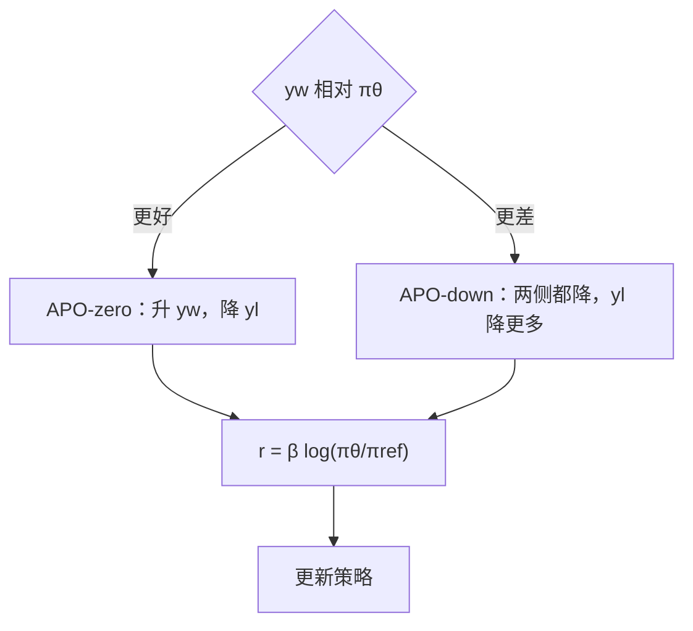

# APO

    
DPO 只约束喜欢与不喜欢的相对间隔，不规定两侧似然绝对上升还是下降；把绝对方向写进目标，目标与数据和模型的关系才不再欠定。

    <footer>—— D’Oosterlinck 等，Anchored Preference Optimization and Contrastive Revisions，2024</footer>

成对对齐有两处欠定。数据上，$y_w$ 与 $y_l$ 可以在许多与偏好无关的轴上不同，模型会利用任何能降损失的差。目标上，[DPO](/llm/dpo) 的 logistic 只推 $r_w-r_l$，三种几何都能降损失：两边都升且赢家升得更多、两边都降且输家降得更多、一升一降。若 $y_w$ 其实不如当前模型会说的话，第一种几何会把模型拉坏。D’Oosterlinck 等人同时给出数据侧的 Contrastive Learning from AI Revisions（CLAIR）与目标侧的 Anchored Preference Optimization（APO）。本篇写 APO：一族在成对奖励上加绝对锚的损失；CLAIR 只在需要解释「何时选哪一个 APO 变体」时出现。

## 问题

设隐含奖励 $r_\theta(x,y)=\beta\log(\pi_\theta(y\mid x)/\pi_{\mathrm{ref}}(y\mid x))$。DPO 最小化 $-\log\sigma(r_w-r_l)$。梯度保证间隔变大，不保证 $r_w$ 的符号。训练轨迹上常见：喜欢与不喜欢的似然一起下降，间隔仍为正。对已经强于数据集赢家的模型，继续提高 $y_w$ 是错误方向；对赢家明显更好的数据，一起下降又会丢掉能力。KTO 用参考点分开得失，但默认吃的是不成对标签。需要一种仍吃 $(y_w,y_l)$、却能点名「赢家似然应升还是应降」的目标。

欠定的另一面是数据。裁判在两条独立生成里挑赢家，两条回答可能风格、长度、主题同时变。CLAIR 让更强模型对当前模型的回答做最小修改得到 $y_w$，留下 $y_l$ 为原文，使差集中在与偏好有关的编辑上。APO 不依赖 CLAIR 才能定义，但论文用 CLAIR、在策略裁判、离策略裁判、Stronger Preferred 四套可比数据说明：目标变体的选择由「赢家相对当前模型有多好」决定。

### 相对间隔不是绝对方向

间隔目标与 SVM、[SimPO](/llm/simpo) 的 $\gamma$ 同类：它们规定差，不规定原点。DPO 的原点本应是参考策略，但 logistic 对「两边同等偏离参考」不敏感。于是参考锚在梯度里变弱。APO 把 $\sigma(r_w)$、$\sigma(r_l)$ 这类绝对项写进损失，原点重新起作用。这不是把 DPO 的 $\beta$ 调大能代替的——$\beta$ 只缩放差的幅度。

论文把 APO 定义成一个家族：凡是对比目标之外再对某一侧奖励加绝对约束，都可以叫 APO。正文具体写了 APO-zero 与 APO-down。TRL 里的 `apo_zero` / `apo_down` 对应这两式，不是第三种未发表变体。

## 方法

APO-zero 要求赢家奖励变大、输家奖励变小：

$$
\mathcal{L}^{\mathrm{APO}}_{\mathrm{zero}}=-\sigma\bigl(r_\theta(x,y_w)\bigr)+\sigma\bigl(r_\theta(x,y_l)\bigr).
$$

APO-down 要求两侧奖励都下降，但间隔仍要拉大——输家降得更多：

$$
\mathcal{L}^{\mathrm{APO}}_{\mathrm{down}}=\sigma\bigl(r_\theta(x,y_w)\bigr)-\sigma\bigl(r_\theta(x,y_w)-r_\theta(x,y_l)\bigr).
$$

选择规则写在数据与模型的关系上：若赢家总体上好于当前策略（$y_w\succ\pi_\theta$），用 APO-zero 去抬赢家、压输家；若赢家总体上不如当前策略（$y_w\prec\pi_\theta$），用 APO-down 把质量从数据集的差回答上撤下来，同时保持对比。作者用 Llama-3-8B-Instruct，在 32k UltraFeedback 提示上构造四套数据，目标包括 DPO、[KTO](/llm/kto)、只对赢家 SFT、以及两种 APO，指标是与人类排序相关较高的 MixEval-Hard。CLAIR + APO-zero 把该基座提高 7.65%，相对 GPT-4-turbo 的差距缩小约 45%。离策略裁判数据上 APO-down 更好，与「赢家不如当前模型」的判断一致。Stronger Preferred（强模型回答当赢家、无最小对比）上对比目标整体伤模型，说明绝对方向对了也救不了伪相关数据。

### 梯度饱和与 δ 缩放

论文把 APO 各项的梯度分解成方向与幅度。方向由公式写死：zero 对 $r_w$ 为正、对 $r_l$ 为负；down 对 $r_w$ 的绝对项为负，对比项仍推间隔。幅度含 $\delta(x)=\sigma(x)(1-\sigma(x))$，在 0 处最大、两端趋于 0。训练走到远离初始化的区域后梯度自动变小，作者引用 Ethayarajh 等的讨论，认为这种饱和有助于稳健。DPO 的 $\sigma$ 在间隔极大时也饱和，但饱和的是相对差，不是绝对奖励的位置。因此 APO 的「锚」是绝对项加饱和，而不只是又一个温度。

## 机制

### 为何离策略裁判常该用 down

离策略 $y_w$、$y_l$ 都不是当前模型采样的，初始似然往往都低。DPO 仍可能把两边一起抬或一起压。若这些回答整体弱于 Llama-3-Instruct 已经会说的话，抬 $y_w$ 等于用弱示范做 SFT。APO-down 明确降低赢家似然，同时把输家降得更低：模型被允许离开这批数据的表面字符串，只保留相对排序。这看起来违反「模仿赢家」，却符合「当前模型已经更强」的前提。CLAIR 的 $y_w$ 由更强修订者产生，通常好于当前模型，故配 APO-zero。同一套 APO-down 配 CLAIR 在论文表里会变差，说明变体不能当默认万能损失。

持有集上的似然轨迹可以诊断选错没有。作者画出赢家/输家的 log-likelihood 与奖励。奖励从 0 出发（相对参考的变化），似然可以仍为负间隔——CLAIR 上就出现过：对比目标在拉间隔，但初始似然差没有被完全翻过来。下游 MixEval-Hard 仍可升，因为最小对比让被利用的差是有关的。Stronger Preferred 的似然轨迹可以长得很像 CLAIR，下游却崩，因为被利用的差是无关的。

「$y_w\succ\pi_\theta$」不是一条自动不等式，要用持有集上的似然或裁判分估计。不要看见数据来自 GPT-4 就一律 APO-zero：若提示上 GPT-4 的回答风格与聊天模型不兼容，绝对似然可能仍然更差。

### CLAIR 与 APO 为何要一起读

CLAIR 降低虚假对比，APO 降低目标欠定。只换目标、数据仍是两条独立生成，模型照样可以抓住长度或套话。只换数据、目标仍是 DPO，绝对方向仍随机。论文最强数字是两者的组合，不是 APO 单独的普遍第一。把 APO 接到任意公开偏好集上，应先估计赢家相对当前检查点的位置，再选 zero 或 down。

## 边界与工程取舍

APO 仍要参考模型与成对数据，前向成本与 DPO 同级。多一个「选哪个变体」的决策，选错会比 DPO 更差——CLAIR 配 APO-down 在表里为负增益。它不处理非传递偏好，也不是在线采样。KTO-pair 被作者视为另一种锚（KL 当参考点），属于同一家族的讨论，不是实验主线。

实现时 $r_\theta$ 必须是普通的反向 KL 对数比。把 f-DPO 的其它散度塞进 APO-down 的两项，会破坏原文公式的对称性；若用现成库，应核对两项是否都走同一套 log-ratio。

APO-zero 的两项没有 $r_w-r_l$，间隔是间接出现的：抬 $r_w$、压 $r_l$ 自然拉大差。数据极噪时，它比 DPO 更像两个独立的 logistic 回归，缺少成对耦合，可能对标签翻转更敏感。

### 何时不必上 APO

赢家与当前模型谁强说不清，DPO 的欠定反而更保守。没有参考检查点，APO 的 $r_\theta$ 未定义。只有不成对点赞，用 KTO。数据已经是最小对比、模型明显弱于赢家，DPO 常常已经在「升赢家、降输家」的几何里，APO-zero 的额外约束不一定换来收益。

## 小结

- APO 是成对对比之外再规定绝对似然方向的损失族；正文给出 APO-zero 与 APO-down。
- zero：抬赢家、压输家，适合 $y_w$ 强于当前模型；down：两侧都降、输家降更多，适合 $y_w$ 弱于当前模型。
- DPO 只约束间隔，三种绝对几何都能降损失，这是 APO 要消除的欠定。
- 变体必须按数据–模型关系选；配错会比 DPO 差。
- CLAIR 解决数据侧虚假对比，与 APO 互补，不是同一个方法。
- 最强实验数字来自 Llama-3-8B-Instruct + 32k CLAIR + APO-zero 的 MixEval-Hard。
- 出处：D’Oosterlinck, Xu, Develder, Demeester, Singh, Potts, Kiela, Mehri，*Anchored Preference Optimization and Contrastive Revisions: Addressing Underspecification in Alignment*，arXiv:2408.06266，2024。
