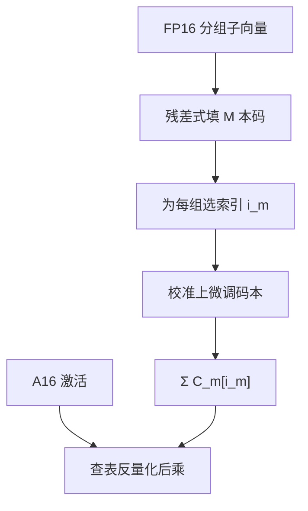

# AQLM

    
把一行权重写成若干码本向量之和，比特预算花在「选哪几个码字」而不是「每个标量均分 2 bit」；再在校准上微调码本，2-bit 的帕累托才能从均匀格子里逃出来。

    <footer>—— Egiazarian 等，Extreme Compression of Large Language Models via Additive Quantization，ICML 2024</footer>

Vage Egiazarian、Andrei Panferov、Denis Kuznedelev、Elias Frantar、Artem Babenko 与 Dan Alistarh 的 ICML 2024 论文（arXiv:2401.06118）把计算机视觉里的 **加法量化**（Additive Quantization, AQ）接到 LLM 权重上，简称 AQLM。一层权重的一组坐标不再共享一个均匀尺度，而是表示为 $M$ 个码本各自查表再相加。2-bit 附近它与 [QuIP#](/llm/quip) 反复争夺帕累托前沿：谁赢取决于码本微调、分组维度与是否同一校准。Alistarh 组同时出现在 GPTQ、QuaRot 等谱系里，但 AQLM 的推理原语是 **多码本查表**，不是 INT4 GEMM，也不是 E8 格的最近邻。

## 问题

均匀 2-bit 每元素四个电平，无法表达权重里残留的相干结构。GPTQ 改的是取整顺序与邻居补偿，格子本身仍是均匀的。向量量化（VQ）给一组坐标共用一本码，表达力强，但码本一旦变大，最近邻变贵，显存也被码本吃回去。加法量化是折中：用 $M$ 本较小的码，$M$ 次查表相加逼近高分辨 VQ，码本体积与搜索成本按加法分解，而不是按笛卡尔积爆炸。

LLM 层宽大、层数多，码本不能每层都做成视觉里那种巨型表。还要在校准激活上对层输出做重建，否则码字对 WikiText 好看、对下一层输入的分布不看。问题是：在 2–3 bit 每参数的预算内，如何布置分组维度、码本个数与比特，使重建误差低于均匀 GPTQ，并且推理时查表核跑得动。

### 加法量化把一行拆成多本码字之和

对一组 $g$ 维子向量 $w$，

$$
w \approx \sum_{m=1}^{M} C_m[i_m],
$$

其中 $C_m\in\mathbb{R}^{K\times g}$ 是第 $m$ 本码，$i_m$ 是索引。存储是 $M\log_2 K$ 比特加码本本身均摊到每参数的开销。常见配置用多个 8-bit 索引或更碎的组合，使平均比特落到 2-bit 附近（论文表中的 $1\times16$、$2\times8$ 一类记法是「码本数 × 每本比特」）。$g$ 太大，码本表达力不够；$g$ 太小，退回接近标量量化。这是结构超参，不是训练超参。

AQLM 压缩的是权重。激活在原文主实验里仍是较高精度。不要把「extreme compression」理解成 W2A2。KV 也不在这篇合同里。

## 方法

初始化：按分组把权重切成子向量，用残差 k-means 或类似程序逐本填码本——先拟合第一本，残差再拟合第二本，类似残差向量量化，但是最终前向是诸本**相加**而不是只走残差链的最后一本。编码：为每个子向量选一组索引，可用交替搜索（固定其它本，更新一本的索引）。量化感知微调（论文称 PV-tuning 一类）：在校准激活上对码本条目——有时也对索引分配——做块级或层级的重建下降，直通梯度穿过查表。这一步往往比初始 AQ 编码更能移动 PPL，是帕累托曲线上「AQLM 点」真正可引用的原因。

主表：LLaMA-2 7B/13B/70B 在约 2-bit 每参数时 WikiText 困惑度进入与 QuIP# 同场可比较的区间，并随是否 PV-tuning、平均比特的微小变化而左右。零样本任务用来防止只刷 PPL。作者强调应报告 **平均比特**（含码本开销），而不是只报索引比特——码本在 7B 上均摊更大，在 70B 上更便宜。把 7B 的「2-bit」和 70B 的「2-bit」当成同一压缩比，会低估小模型的码本税。

### PV-tuning 才把码本推到帕累托前沿

没有微调的加法码本，只是一种更好的初始化网格。校准下降让码字迁到该层权重与校准激活共同定义的误差面上，类似于 QuIP# 微调 E8 代表点，但参数化更自由：加法码本不必落在格上。自由的代价是最近邻没有格的代数结构，推理更依赖查表与累加。原文把「是否微调」写成必须披露的开关；拿未微调的 AQLM 去打微调过的 QuIP#，或反过来，都不是公平点。

## 机制

均匀格子把比特均分给每个标量。加法码本把比特花在离散选择上：两本 8-bit 码、8 维一组，表达的是 $256+256$ 个向量的和所张成的集合，远大于 $4^8$ 个立方格点里真正用得上的那一部分——前提是权重子向量确实聚集在低复杂度的并上。LLM 权重并非任意，预训练把它们推到可被少量子向量原型近似的区域，AQ 才有效。若某层接近白噪声，码本退化，收益回到 GPTQ。

查表核的屋顶线：decode 仍带宽墙，2-bit 索引少搬权重；但要把 $M$ 次 gather 合成 $g$ 维向量再乘激活，随机访存可能打满缓存。prefill 算力墙时，反量化后的 GEMM 与 FP16 同类，加速主要来自少从 HBM 取权重。没有为 AQLM 写过的核，质量表不能翻译成 token/s。

Elias Frantar 同时是 GPTQ 作者。AQLM 不是「GPTQ 的 2-bit 版」。GPTQ 补偿均匀网格；AQLM 替换网格本身。相关工作里两者是对照，不是父子。

### 与 QuIP# 比的是比特–困惑度曲线

单点「2-bit LLaMA-2-7B」会因分组、是否微调、是否含码本比特而翻转胜负。正确引用是：在相同平均比特、相同校准、相同是否微调码本的前提下读曲线。QuIP# 保留格的快速解码；AQLM 保留更自由的并集近似。生产选型还要看现成核：有 Marlin / INT4 时 4-bit 往往更省事；只有在显存把 70B 逼到 2-bit 时，才进入这两篇的赛道。

## 边界与工程取舍

### 查表核与均匀 INT 核不能混用检查点

AQLM 权重文件是索引加码本，不是分组 INT4。vLLM / transformers 若未注册对应线性模块，会静默失败或错读。微调码本对校准域敏感，指令与代码模型要分别签字。分组维度与 $M$ 改变时，平均比特和核模板一起变，不能只改一个。嵌入与 `lm_head` 常常更高比特，报价时应写清「主体层 2-bit」。AQLM 不处理激活异常值；接到 W2A4 上需要另做平滑或旋转。

训练适配器时，基座前向必须走同一套反量化，否则 LoRA 学在错误的数值表面上。码本条目若在部署期被量化成更低精度，论文数字作废。70B 上码本均摊小、7B 上大，小模型更可能出现「名义 2-bit、实际 2.4-bit 且更慢」。

出处：Egiazarian et al.，*Extreme Compression of Large Language Models via Additive Quantization*，ICML 2024（arXiv:2401.06118）。实现与核以作者发布的 AQLM 仓库版本为准，不要把社区 fork 的默认比特写成论文表。

## 小结

- AQLM 用多码本加法量化表示权重子向量，把 2-bit 预算花在索引而不是均匀电平。
- PV-tuning 在校准上微调码本，是帕累托位置的关键，必须与「仅 AQ 编码」分列。
- 与 QuIP# 比较应沿平均比特曲线，并披露码本开销。
- 推理原语是查表累加，不是 INT4 GEMM。
- 出处：Egiazarian et al.，ICML 2024。
