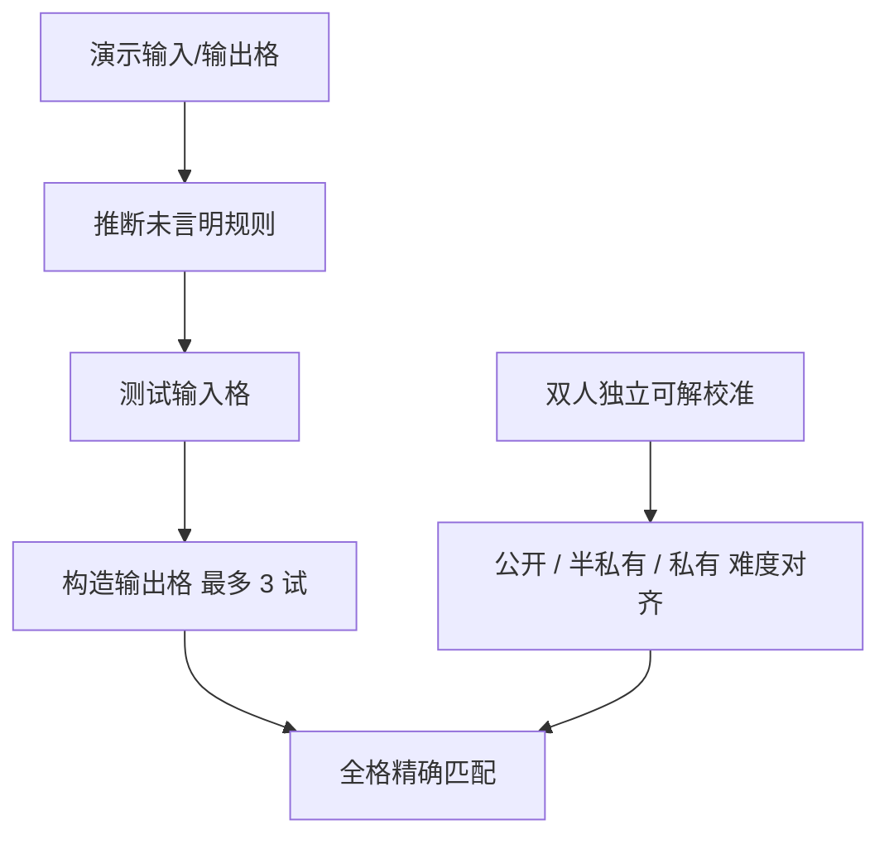

# ARC-AGI-2

    
格式不变：几对彩色格子演示一个未言明的规则，再在新的输入格上写出输出。换的是题——更组合、更抗穷举；人类仍能做，2025 年 5 月的前沿模型在半私有集上只有几个百分点。

    <footer>—— Chollet 等，ARC-AGI-2 技术报告 / arXiv:2505.11831；数据见 ARC Prize 公开集</footer>

2019 年的 Abstraction and Reasoning Corpus（后称 ARC-AGI-1）想测的不是知识，而是**流体智力**：从极少演示里归纳规则，应用到从未见过的格子上。它不需要语言、不需要百科。到 2024 年底，测试时适应（搜索、程序合成、大量测试时计算）把 ARC-AGI-1 推到接近饱和，o3 预览甚至在高计算档超过名义人类基线。Chollet 与 ARC Prize 团队因此交出 **ARC-AGI-2**：同一 JSON 格子格式，新题、新的人类校准、以及对「暴力搜 DSL」更不友好的设计。本篇按技术报告与 GitHub 数据说明写合同。排行榜会改写百分点；报告里 2025-05-14 那张半私有表只作当时快照。

## 问题

ARC-AGI-1 的三个裂缝。其一，相当一部分私有题能被穷举式程序搜索打中：2020 竞赛元分析显示，各队并集能覆盖约 49% 私有评估题，方法却不是高效抽象。基准于是奖励算力。其二，缺少官方、条件一致的人类基线，第三方众包数字难比。其三，同一 100 道隐藏题用了四届竞赛，累计约万次分数反馈，存在泄漏与过拟合风险。此外，高流体智力人类几乎能轻松做完 v1，基准在「人类智力光谱」上过早饱和。

ARC-AGI-2 要保持「每题独特、只需核心先验、人类可做」，同时让分数带宽更宽、子集难度对齐、并降低对朴素穷举的可打性。格式故意不动：格子 1×1 到 30×30，十种颜色（整数 0–9），通常若干演示对 + 1–2 个测试对，测试输入可试三次。工具链可以沿用。

### 人类校准是一等规格

报告写：2024-11 至 2025-05 三场受控测试，407 名参与者、515 场次，13,405 次测试对尝试，成功约 62%；尝试中位时间约 2.3 分钟。入集规则：评估子集中每题至少两名独立参与者在前两次尝试内解出至少一个子对。最终公开评估 / 半私有 / 私有集上，**100% 的题被至少两名非专家解出**；按题聚合约 75% 的人类尝试成功；按测试对约 66%。公开训练集约 1000 题、公开评估约 120 题（GitHub README）。训练集约容易、未做与评估集同样的难度对齐，不能当测试集用。

人口统计（职业、编程、数学、解谜自评）与成绩无清晰显著相关——支持「测的是一般问题解决，不是领域知识」这一设计声明。

GitHub 写公开评估人类样本平均约 66%。这与「至少两人能解」不矛盾：前者是尝试成功率，后者是题的可解性门槛。报模型分数时应对照同一划分（公开评估 vs 半私有 vs 私有），不要和 v1 的 400/400 划分混用。

## 方法

任务仍是：从演示对推断规则，构造测试输入的输出格，格尺寸自己定，必须全格精确匹配。核心先验仍是对象持续性、目标导向、初级数感、连通与对称一类，没有世界知识。2 的设计变化在**内容**：题目更独特；信息量更大（更大格、更多对象、更多概念）；强调组合泛化——多规则同时成立、多步状态依赖、上下文门控规则、以及题内临时定义的符号。

报告中的定性类型：多规则（先裁框再缩放再填洞）；多步（第 $N+1$ 个物体位置取决于前 $N$ 步，无法闭式跳算）；上下文（堆叠方向由轮廓颜色决定）；题内符号（带孔矩形编码「同孔数形状该涂的颜色」）。这些对当前系统难在「把已知变换再组合」，而不是「认不认格子」。

### 当时模型分数只作量级

报告表（半私有，2025-05-14）：o3-mini (High) 与 o3 (Medium) 在 ARC-AGI-1 上分别约 34.5% / 53.0%，在 ARC-AGI-2 上约 **3.0%**；ARC Prize 2024 的 ARChitects 约 56.0% → **2.5%**。低于约 5% 的准确率被作者视为噪声区，尚未出现稳定信号。后续榜上会有更高行；引用时写日期与是否允许测试时大量计算。v1 上「砸钱搜索」有效，不蕴涵 v2 上同一策略仍有效——v2 的明确目标就是减少对暴力 DSL 搜索的可打性。

竞赛：ARC Prize 2025 用 v2 驱动开源进度（报告写 2025-03-24 开赛等时间线）。私有集仍是隐藏裁判。公开 120 评估题用于从未见过这些题的模型测试；把公开评估当训练集是协议犯规。

## 机制

流体智力在这里被操作化成：**样本外、少样本、无语言知识** 的程序归纳。LLM 预训练的统计模式在 v1 的简单变换上开始够用，在 v2 的组合与题内符号上不够——后者要求在上下文里绑定「这个形状现在当符号用」，近似工作记忆里的变量，而不是检索一个见过的填色模板。测试时适应（梯度或搜索）在 v1 上被证明必要；v2 逼搜索代价升高，使「只靠放大测试时算力」的收益曲线变差。这是基准在调节的激励，不是某种模型永远做不出 2。

精确匹配使部分分没有意义：错一格即零。人类 2–3 分钟的中位时间说明题需要刻意思考，但不是竞赛数学。模型若用百万 token 穷举格变换，即便偶然打中，效率维度已经输了报告想比的那种智力。官方鼓励同时看准确率与计算成本。

v2 仍可能被新的搜索或神经程序合成打穿。基准的承诺是「比 v1 更抗当时的穷举」，不是「不可被任何算法解决」。一旦饱和，会再有 v3。把它当成 AGI 定义本身，是把尺子说成领土。

### 与语言基准的边界

ARC-AGI-2 不测工具使用、代码仓库或世界知识。高 SWE-bench、高 MMLU 可以与近零的 ARC-AGI-2 共存：那说明系统善用记忆与脚手架，而不是同一把流体智力尺。反之，专门的程序合成系统可能在 ARC 上好看、在 [SWE-Bench Pro](/llm/swe-bench-pro) 上无能。产品与研究应分开放分数，不要平均成「通用智能分」。

子集对齐（公开 / 半私有 / 私有人类正确率相差不超过约 1 个百分点）是为了让公开开发集分数能预测隐藏集。若你的方法只在公开 120 题上涨、隐藏不动，优先怀疑过拟合公开题，而不是「泛化奇迹」。

## 边界与工程取舍

不要用公开训练集当评估。不要把 v1 的 400 题分数与 v2 的 120 题公开评估直接比。不要把 o3 预览在 v1 上的 76%/88%（高额测试时费用）写成 v2 能力。网格上限 30×30 与十色是先验：超出这个 DSL 的「通用视觉推理」未测。人类基线来自自愿者、有金钱激励的 90 分钟场次，不是全体人口常模。

污染：公开训练与评估题在 GitHub 上，会被爬进语料。隐藏集与竞赛规则仍是主要防泄漏层。这与 [训练-评测污染](/llm/eval-contamination) 的 n-gram 审计互补：ARC 更怕「见过这道题」而不是「见过这种颜色」。

出处：Chollet, Knoop, Kamradt 等 arXiv:2505.11831；arcprize/ARC-AGI-2 仓库（1000 / 120 公开划分、人类 66% 说明）；Chollet 2019《On the Measure of Intelligence》为 v1 理论。榜以 arcprize.org 当日为准。

## 小结

- ARC-AGI-2 保持格子演示格式，重做题库以加强组合泛化、削弱对暴力搜索的可打性。
- 评估题经双人独立解出校准；公开评估约 120 题，人类样本约 66% 测试对成功。
- 2025-05 快照上，原 v1 强系统在 v2 半私有集上约 3%，低于 5% 视为噪声。
- 测的是少样本流体智力，不是语言知识或仓库工程；勿与 SWE / 终端榜平均。
- 公开题会污染；隐藏集与成本会计仍必要。
- 出处：ARC-AGI-2 技术报告与 ARC Prize 数据；v1 背景见 Chollet 2019。
