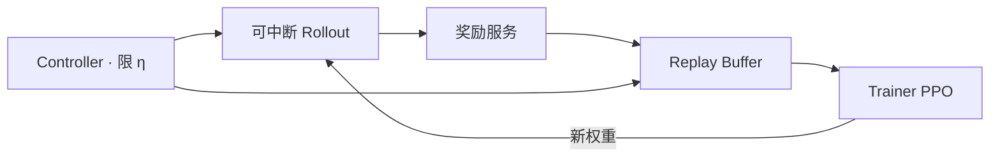

# AReaL 异步强化学习

    
生成不必等一批里最长的思维链结束才更新；训练只要凑满一批就走，再用 staleness 上限和解耦 PPO 把过期样本管住。

    <footer>—— Fu 等，AReaL: A Large-Scale Asynchronous Reinforcement Learning System for Language Reasoning，arXiv:2505.24298</footer>

同步 RL 系统按「整批生成 → 整批训练」交替。对长推理模型，同一批里有的答案 200 token 结束，有的要 32K 思维链；所有 GPU 都要等最慢的那条。Fu、Gao、Wu 等（蚂蚁、清华 IIIS、港科大）的 **AReaL**（arXiv:2505.24298，代码 `inclusionAI/AReaL`）把生成与训练彻底解耦：rollout worker 持续解码，trainer 凑满 batch 就更新，再把新权重推回生成侧。摘要报相对同步系统最高 **2.77×** 训练加速（引言另写吞吐最高 2.57×、线性扩到 512 卡），数学与代码基准上最终性能持平或更好。本篇钉异步带来的两个算法问题——数据过期、一条轨迹跨多个策略版本——以及他们用 $\eta$ 与解耦 PPO 怎么接。系统优化（可中断生成、动态组批、并行奖励服务）只在服务这条算法约束时展开。

## 问题

PPO / [GRPO](/llm/grpo) 要大全局 batch：文中举 128 条提示 × 16 条回复量级，每条又可能数万 thinking token。同步设计保证 batch 内样本来自同一（或最新）策略，理论干净，但生成相被长度分布的长尾钉死；把生成铺到更多卡上，每卡 decode batch 变小，解码掉进访存瓶颈，加卡不再加吞吐。One-step overlap（用上一步的策略生成当前步的数据）仍按**整批同一版本**出队，最长序列问题还在。

AReaL 要的是：生成 GPU 与训练 GPU 分池，生成以流式产生轨迹，训练不等「这一批全部结束」。这立刻破坏经典 PPO 的假设：$\pi_{\mathrm{old}}$ 是单一行为策略，轨迹内所有 token 由它采样。异步后，一个训练 batch 会混多个历史版本；可中断生成还会让**同一条序列**的前后段来自不同权重——中断时丢掉旧 KV、用新权重重算前缀再继续 decode。

### 同步气泡从哪来

设 batch 内长度 $L_i$。同步墙钟由 $\max_i L_i$ 主导，平均值 $\bar L$ 只决定计算量。推理模型的 $L_i$ 方差随训练增大：策略开始「想更久」。GPU 在短样本结束后空转，是系统浪费，不是优化器超参问题。把 max length 砍短能减气泡，但那是改任务，见 DeepScaleR 课程；AReaL 选择改时序。

摘要 2.77× 与引言 2.57× 不是笔误级别的冲突时，引用应写「最高约 2.6–2.8×，钉图表与设定」。不要把 512 卡线性扩展写成任意集群的保证。

## 方法

四个组件。**Interruptible rollout worker** 处理 `generate` 与 `update_weights`：后者中断在途请求，丢弃旧 KV，用新参数重算，再继续未完成序列。**Reward service** 对数学抽答案、对代码跑单测，与解码并行。**Trainer** 从 replay buffer 取样本，用一次即弃（保证新鲜），做 PPO 更新，参数写入分布式存储。**Rollout controller** 读数据集、调生成、送奖励、把 $(轨迹, r)$ 放入 buffer，并在更新后调 `update_weights`。

Staleness 用超参 $\eta$ 限制。当前策略版本为 $i$，已生成轨迹数 $N_r$，训练 batch 为 $B$，提交新的生成请求时要求

$$
\lfloor(N_r-1)/B\rfloor \le i+\eta.
$$

$\eta=0$ 退回同步（所有样本来自当前策略）。过小的 $\eta$ 会在超长轨迹上把生成节流回去，作者建议为吞吐把 $\eta$ 开大，并把算法改到能消化更过期的数据。组 batch 时优先更老的轨迹，避免饿死。

解耦 PPO 把行为策略 $\pi_{\mathrm{behav}}$ 与近端策略 $\pi_{\mathrm{prox}}$ 分开。重要性比相对 $\pi_{\mathrm{behav}}$，裁剪的信任域中心是较新的 $\pi_{\mathrm{prox}}$，而不是把最新策略往又老又差的行为策略拉。标准 PPO 里二者是同一个 $\pi_{\mathrm{old}}$。异步里若仍用行为策略当近端中心，更新会被旧版本拖住。

### 可中断生成等于动态的 partial rollout

同步系统里的 partial rollout 常按固定长度预算切开。AReaL 在权重到达时切开，切开点由系统事件决定。轨迹于是成为「若干策略版本拼接的分段」。目标函数必须能在 token 上使用对应版本的 $\pi_{\mathrm{behav}}$，而不能假装整段都来自 $\pi_{\mathrm{old}}$。文档里 `rollout.max_head_offpolicyness>0` 打开异步，`=0` 用于调试，并称同步通常大约慢 2×——这是实现注释，正式倍数仍以论文图表为准。

Replay buffer 样本只用一次，不是 DQN 式多 epoch 回放。LLM PPO 对复用同一批生成做多次更新本就不稳，异步更不能靠「把过期数据再学一遍」来凑步数。

## 机制

加速来自三处，不要混为一谈。（1）**消除等待 $\max L_i$**：短轨迹立刻可进入 buffer。（2）**生成与训练重叠**：训练步不再独占原生成 GPU。（3）**动态组批**：变长序列少填充。算法侧，$\eta$ 拒绝会让系统在过期时主动降采样吞吐，换稳定性；解耦目标让较大的 $\eta$ 仍能涨分。论文强调这是算法–系统共设计，而不是只拉满异步吞吐。

与 [OpenRLHF](/llm/openrlhf) 的异步 dataflow、[slime](/llm/slime-rl) 的 fully_async 例子同属「重叠」家族，但 AReaL 把 staleness 公式和解耦 PPO 写成论文一等对象。verl 后来的 fully async 模式（staleness、partial rollout、流式传数）是同一问题的另一实现，见 [异步 rollout 架构](/llm/async-rollout-arch)。引用加速比时必须写清对照是「同步 AReaL」还是「另一框架的同步」，以及是否同卡数。

### 过期与 KL 不是一件事

KL 对参考策略，管的是离 SFT / 旧锚多远。Staleness 管的是离**当前正在更新的策略**差几个版本。可以 KL 很小但 $\eta$ 很大：模型在快速迭代，生成侧还在用三步前的权重。也可以 KL 大而同步：整批都很 on-policy，但已经偏离参考。调参时不要用 $\beta$ 去补 $\eta$。

## 边界与工程取舍

异步不自动提高上限能力；它提高的是给定卡数下的步频。若验证器很慢，并行奖励服务跟不上，瓶颈只是从 GPU 挪到 CPU。中断重算 KV 有计算税，权重更新过于频繁会把生成核打成「重计算前缀」。$\eta$ 过大时，即使有解耦 PPO，分布偏移仍可能伤最终准确率——论文给的是「匹配或更好」，不是任意 $\eta$。实现需记录每条轨迹的版本向量，日志与复现成本高于同步。

不要在同步 GRPO 脚本上只把生成线程拆出去、却仍用单一 $\pi_{\mathrm{old}}$ 算重要性比。那是把系统异步、算法当同步，梯度是错的。

真实编号：Fu、Gao、Shen、Zhu、Wu 等 *AReaL*，arXiv:2505.24298。PPO 见 Schulman 等 2017。解耦近端目标应回引文中引用的 decoupled PPO 文献（文中标为 [10]），不要写成 AReaL 发明了 PPO。代码 https://github.com/inclusionAI/AReaL。

## 小结

- AReaL 把 rollout 与训练分池流式重叠，用 $\eta$ 限制样本过期，用解耦 PPO 分开行为策略与近端中心。
- 可中断生成会在一条轨迹内混多个权重版本，必须按段记账。
- 相对同步对照最高约 2.6–2.8×，并报告到 512 GPU 的扩展；钉论文设定。
- 出处：arXiv:2505.24298。
