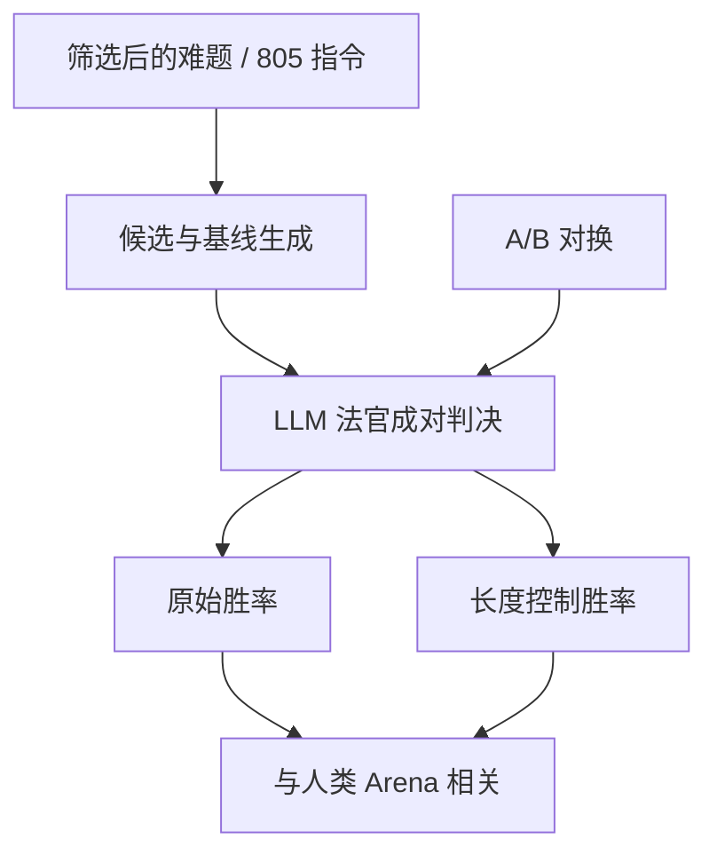

# Arena-Hard / AlpacaEval 2

真人 Arena 的 Elo 贵、慢、提示不可复现；用一套从线上筛出的难题，让强模型当法官做成对比较，并控制长度，可以得到与人类榜相关、却能每周重跑的代理指标。

<footer>—— Li et al., Arena-Hard；Dubois et al., Length-Controlled AlpacaEval</footer>

[LMSYS Arena](/llm/lmsys-arena) 直接测人更想用谁，但投票要积累、提示分布会漂、闭源模型上新要等。实验室需要一个能对着同一批题反复跑的近似。Li 等人的 Arena-Hard（及自动评测管线 Arena-Hard-Auto）从 Arena 日志里筛「更难、区分度更高」的提示，用 GPT-4 一类模型当法官，对候选与固定基线做成对判决，得到与人类 Arena 名次高相关的胜率。Dubois 等人的 AlpacaEval 2 用约八百条指令、同样 LLM 法官，并显式做**长度控制**（LC win rate），纠正「更长更容易赢」的偏差。两套都是 LLM-as-judge 的成对代理，不是知识闭卷考，也不是 [MT-Bench](/llm/mt-bench) 那种绝对 1–10 分。本篇写题怎么筛、法官偏差怎么补、以及代理榜不能替代真人票。

## 问题

静态能力榜饱和之后，产品差距更多落在文风、拒答、指令服从和长回答是否真有用。这些很难用精确匹配打分。Arena 能打，但工程师不能每次改系统提示都等一万票。朴素的自动替代——让 GPT-4 给回答打 1 到 10——会撞上绝对评分的校准问题，见 [Likert 与绝对评分](/llm/absolute-rating-prefs)。成对「A 还是 B」更稳，但仍有位置偏差、自我增强（法官偏爱同家族腔）、以及冗长度偏差。

题也不能太随便。Alpaca 早期那批过短、过易的指令，强模型之间分不开。需要从真实用户提示里挑出「足够难、足够多样、模型之间会打架」的子集，否则代理榜会在满分附近抖动。Arena-Hard 的「Hard」指的是区分力，不是奥数。

### 与人类 Arena 相关，不等于测同一个量

相关高，说明法官在这批题上的偏好序接近投票者的偏好序。提示分布一旦离开 Arena 用户（例如全是内部客服话术），相关可以掉。风格控制实验（截断到相近长度再判）若让名次洗牌，原相关里有相当一部分是在奖长度。因此「与 Arena Spearman 高」是该协议、该题集、该法官上的性质，必须随三者一起引用。

法官模型一换代，分数尺度和偏好都会动。Arena-Hard / AlpacaEval 的数字只能在冻结的法官版本内比。换 GPT-4o 当法官之后，不要和论文里 GPT-4-0314 的表直接减。

## 方法

Arena-Hard-Auto 的典型协议：约五百条从 Arena 聚类、过滤后的难题；候选模型与基线（如 GPT-4-0314）对同一提示各生成一条；法官看一对、输出胜者；聚合为对基线的胜率，有时再映射到类似 Arena 的分数。提示筛选要去掉过短、过危险、或几乎所有模型都答好的题，否则方差全是噪声。生成侧的温度、长度上限应接近 Arena 的产品设定，否则代理的是另一套解码。

AlpacaEval 2 用固定的 805 条指令（来自 AlpacaEval 源头），法官同样成对，对照一个参考模型。Dubois 等人的长度控制把「因更长而赢」的部分回归掉，报告 LC 胜率。应同时报原始胜率与 LC：两者差距大，说明在刷长度；差距小，说明赢在内容或其它风格维。不要只报对自己有利的那一列。

$$
\mathrm{WR}=\frac{n_{\mathrm{win}}+\tfrac12 n_{\mathrm{tie}}}{n_{\mathrm{win}}+n_{\mathrm{lose}}+n_{\mathrm{tie}}}
$$

LC 则在此之上对长度做调整（论文中的回归 / 再加权）。平局处理、位置对换（A/B 各判一次）必须写进脚本：只跑一个方向会把位置偏差写进胜率。

### 风格控制不是可选项

长度、列表、emoji、套话道歉，都是 LLM 法官与人类投票者的共同弱点。Arena-Hard 后续工作加入风格控制特征；AlpacaEval 2 把长度提到一等指标。内部复现至少要做：原回答、截断到基线相近词数、去 markdown。三列名次若剧烈跳动，对外只报原胜率就是在发风格榜。这与真人 Arena 的长度控制实验是同一逻辑。

## 机制

LLM 法官近似的是「哪条读起来更像好助手」，特征来自它自己的对齐：有结构、有步骤、语气稳、少明显错误。它不自动检查代码是否能跑、事实是否新、政策是否违规——除非提示里把这些写成评分规则，且法官真的执行。因此代理榜会系统性抬高「看起来勤快」的模型，压低「短而正确」的模型；LC 只修正勤快里的长度分量，修正不了列表癖和套话。

题的难度机制也不同。Arena-Hard 来自真人已经打过的硬提示，长尾、脏、带真实意图；AlpacaEval 的 805 更干净、更像早期指令微调分布。前者更接近 Arena 相关，后者更便宜、更稳、更易被指令数据污染。两套一起看：AlpacaEval LC 高而 Arena-Hard 低，可能是在老指令分布上过拟合；反过来，可能更适应线上难题、不适应 Alpaca 腔。

### 自我增强与家族腔

法官若与候选同家族，可能偏爱相似的拒答模板、相似的代码块风格。盲的是名字，不是文风水印。缓解包括：用与候选无关的法官、多法官投票、以及在报告里标明法官身份。不能消除。这是所有 LLM-as-judge 成对协议的结构缺陷，不是 Arena-Hard 独有，见 [成对比较协议](/llm/pairwise-label-protocol)。

相关是序的相关。两个模型在代理榜上差 2 个胜率点，在真人 Arena 上可能分不开，也可能差半档 Elo。不要把代理胜率差直接翻译成「用户会多喜欢百分之几」。

## 边界与工程取舍

两套都不测工具、多轮长会话、或私有知识。难提示仍以英语、技术、写作类为多，中文产品要换中文题与中文法官，相关必须重新测，不能借用英文 Spearman。安全题若被筛掉，代理榜会鼓励更敢答的模型，与内部安全门禁冲突——应另跑安全集，不要把 Arena-Hard 当有害性证书。

污染：805 条和 500 条都会进下一轮爬虫与合成数据。动态补充新难题、保留私有平行集，与静态基准相同。法官费用随对数线性涨；可用更小法官做 CI、用论文指定法官做发布，但两套分数不可混写进同一列。

不要用这两张表替代 [MMLU](/llm/mmlu)、数学与代码。代理的是聊天偏好序。一个 Arena-Hard 很高、GSM8K 很低的模型，可能是讨好型助手，不是通才。

基线模型必须冻结。对照「当时最强的内部 checkpoint」而不是论文指定的 GPT-4-0314，胜率无法与文献比。内部纵向比较可以另选基线，对外引用不行。

## 小结

- Arena-Hard 用线上筛出的难题和 LLM 成对法官近似人类 Arena；AlpacaEval 2 用 805 条指令并报告长度控制胜率。
- 原始胜率与 LC、截断、去格式三列都应看；只报一列会把风格当成能力。
- 与 Arena 的相关绑定于题、法官版本和生成协议，换任一者要重测。
- 自我增强、位置偏差、英语偏置和污染是结构限制。
- 它们不替代真人票、也不替代知识 / 数学 / 工具评测。
- 出处：Li et al., Arena-Hard；Dubois et al., *Length-Controlled AlpacaEval*；人类榜见 LMSYS Chatbot Arena；成对骨架见 Zheng 等 LLM-as-judge 工作。
