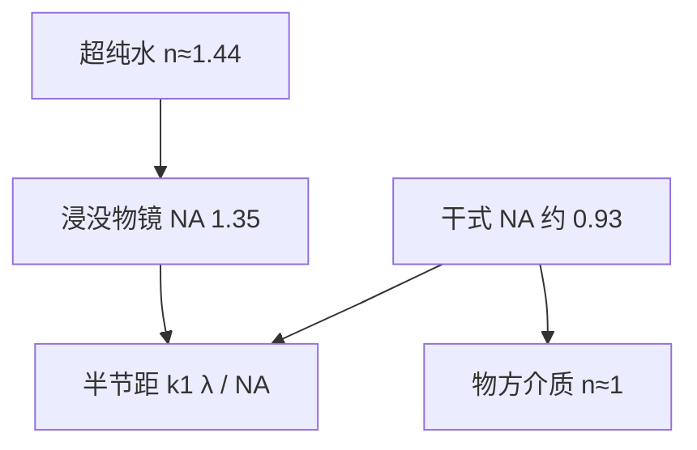

# ArF 浸没：水作介质抬高 NA

干式光刻的 $\mathrm{NA}$ 大约只能到 0.93。在镜头与晶圆之间注入超纯水，才能把系统做成 $\mathrm{NA}$ 高达 1.35。

<footer>—— ASML, TWINSCAN: 20 years of lithography innovation（公开故事）</footer>

数值孔径 $\mathrm{NA}=n\sin\theta$。空气中 $n\approx 1$，镜头半孔径角再大，$\mathrm{NA}$ 也过不了 1。193 nm 的超纯水折射率大约 1.44，浸没把最后一片镜头元件与晶圆之间的空气换成水，使 $n\sin\theta$ 可以大于 1。ASML 公开写明：干式约 0.93，浸没做到 1.35。Mack 还强调一句容易说反的话：往旧镜头缝里灌水，并不会自动抬高已经做死的 $\mathrm{NA}$；要的是按更高 $n\sin\theta$ 重新设计的浸没物镜。本篇只讲这一介质替换如何进入瑞利公式，以及它没有改掉的东西。

## 问题

193 nm 干式在高 $\mathrm{NA}$ 下已经接近 $\sin\theta\approx 0.93$。再抬角度，镜头边缘光线、偏振与镀膜都更难，而 $\mathrm{NA}$ 仍小于 1。下一档波长 157 nm 没有成为量产台阶。[瑞利](/llm/rayleigh-litho) 半节距 $R=k_1\lambda/\mathrm{NA}$ 若要在同一 $\lambda$ 上继续缩，只剩加大 $\mathrm{NA}$ 或压 $k_1$。浸没走前一条：把物方介质的 $n$ 从 1 换到约 1.44，给镜头设计师一个大于 1 的 $\mathrm{NA}$ 预算。

水必须在扫描时形成稳定、无气泡的液膜，随工件台高速运动而不留下水印、不腐蚀镜头、不从胶里溶出组分。光学问题立刻变成流体与缺陷问题。这就是为什么浸没是一套机台架构（喷淋头、回收、动态密封），而不是「在晶圆上滴一滴水」。

### 灌水不等于把旧 NA 乘以 1.44

$\mathrm{NA}=n\sin\theta$ 中的 $\theta$ 是物方孔径角。若镜头设计锁死了玻璃里的孔径与像方约定，只把间隙灌水，有效 $\mathrm{NA}$ 不会按折射率线性跳变。Mack 讲义写得很硬：加水允许设计并制造更高 $\mathrm{NA}$ 的镜头，而不是给现有干式镜头乘一个 $n$。量产数字 1.35 是浸没物镜的设计值，对应水中很大的 $\sin\theta$，不是 0.93 × 1.44。

水在 193 nm 的折射率常取约 1.44（文献精细值约 1.437）。温度改变 $n$，因而改变有效焦面与 $\mathrm{NA}$。浸没机把水温当成成像参数来控，不是纯机械冷却。

## 方法

浸没扫描机在投影物镜最后元件下方维持超纯水膜，晶圆在水下完成步进–扫描。ASML 第一台浸没系统 TWINSCAN AT:1150i 写在同一篇二十年故事里；随后 XT/NXT 浸没把 $\mathrm{NA}=1.35$ 做成平台常数。产品页（NXT:2000i / 2050i）给出：193 nm 折反射投影物镜，$\mathrm{NA}$ 1.35，全场 26 mm × 33 mm，$4\times$ 缩比；生产分辨率公开到 C-quad 约 40 nm、偶极约 38 nm 半节距量级。这些是设备在给定照明下的分辨率能力，不是某代逻辑的金属节距承诺。

焦深不能用低 $\mathrm{NA}$ 时代的 $\mathrm{DOF}=k_2\lambda/\mathrm{NA}^2$ 随便外推。高 $\mathrm{NA}$ 要用大角度形式；Mack 指出空间频率按 $n\sin\theta/\lambda$ 计。浸没在固定 $\theta$ 时因 $n$ 增大可改善焦深，但为了分辨率把 $\mathrm{NA}$ 拉到 1.35，$\theta$ 已经很大，实用焦深仍然很浅，所以必须依赖密高度图与[双工件台](/llm/twinscan-dual-stage)调平。

### 单次曝光极限仍由 k₁ 与 1.35 锁定

$k_1=0.25$ 的两束成像极限给出 $R\approx 36\,\mathrm{nm}$ 半节距。Mack 的实用单次曝光半节距约 38–40 nm，与 ASML 偶极/C-quad 公开分辨率同一量级。再密，不是把水换成更高 $n$ 的量产液体（高折射率浸没未成主流），而是 [多重图形](/llm/lele-multipattern) 或 [EUV](/llm/asml-nxe)。浸没把 193 nm 的单次曝光能力用到头，没有打开「任意节点只加水」的通道。

## 机制

分辨率收益来自更大的可收集空间频率。物方 $n$ 提高后，同样几何角对应更高的空间频率 $n\sin\theta/\lambda$，或允许更大的 $\theta$ 而不在空气中发生全反射限制。偏振在 $\mathrm{NA}>1$ 时成为一阶：TM 分量在干涉中对比度下降，矢量成像必须进 OPC/SMO，不能再用标量空中像敷衍。

缺陷机制与干式不同。气泡会局部当微透镜或遮挡；水膜破裂留下水印；胶组分沥出污染水与镜头（leaching）。这些改变的是缺陷密度与维护，不改瑞利公式里的 1.35。产线用疏水/亲水平衡、顶涂层、水化学与扫描速度窗口来管，属于[工艺流程](/llm/litho-process-flow)卫生，不是「NA 再高一点」。扫描时水膜由喷淋与回收维持弯月面，随晶圆台加速；弯月面失稳才会在光学尚未报错时先写出缺陷。浸没因此是流体约束下的成像，不是静止水槽。

高折射率浸没（$n>1.44$ 的液体）与 $\mathrm{NA}>1.35$ 的 193 nm 镜头在研究上讨论过，没有取代水浸没成为逻辑主路径。量产公开规格停在水、1.35。

### 与 EUV 插入的分工

浸没 DUV 在 EUV 量产之后并未退出。临界层可以迁到 13.5 nm，大量次临界层仍用 $\mathrm{NA}=1.35$ 的 193 nm，因为 wph 高、基础设施成熟。ASML 把 NXT 浸没的 overlay 与 EUV 的 cross-matching 写成产品要点，正是混跑现实。浸没解决的是 193 nm 的 $\mathrm{NA}$ 天花板，不是光子能量与随机效应。

## 边界与工程取舍

浸没不降低掩模复杂度。[离轴照明](/llm/off-axis-illumination) 与 [PSM](/llm/phase-shift-mask) 仍然要，才能把 $k_1$ 压到 0.3 附近。它也不自动改善套刻；水与热还可能增加瞬态变形，要靠编码器工件台与热控来补。成本账上，浸没机比干式贵，但相对 157 nm 新光学栈或过早的 EUV，它让 193 nm 又走了十余年，包括用多重图形走进 7/5 nm 商品节点的非 EUV 层。

不要把 1.35 写成「分辨率 1.35 nm」。$\mathrm{NA}$ 无量纲。也不要把 38–40 nm 的单次曝光半节距说成「做不了 7 nm 芯片」：7 nm 是商品名，金属与鳍可以用多重图形把节距劈开。本篇不提供任何节点良率。

引用浸没分辨率时写明照明：偶极与 C-quad 的公开数字不同。把偶极的 38 nm 套到二维金属上，是把一维专用照明当成通用能力。

## 小结

- 浸没用 193 nm 超纯水作物方介质，使量产 $\mathrm{NA}$ 做到 1.35；干式约 0.93。
- 加水是为了能设计更高 $\mathrm{NA}$ 的镜头，不是给旧干式镜头乘折射率。
- 单次曝光实用半节距约 38–40 nm 量级；更密靠多重图形或 EUV。
- 高 $\mathrm{NA}$ 下矢量成像、偏振与极浅焦深成为一阶。
- 气泡、水印与沥出是缺陷机制，不进入瑞利公式。
- 浸没与 EUV 在产线上按层混跑，而不是互相一次性替代。
- 出处：Mack, *Fundamental Principles of Optical Lithography*；ASML 公开故事与 NXT:2000i/2050i 产品页。
