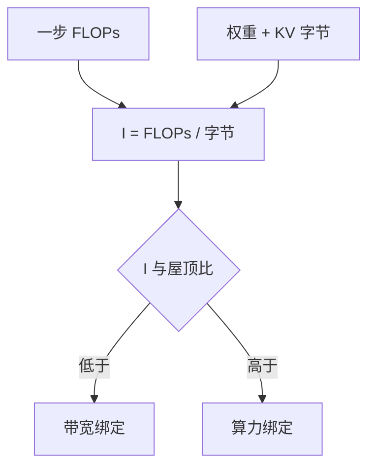

# 解码的算术强度

算术强度是 FLOPs 除以字节；decode 每步搬完全部权重，只换一行激活，强度掉到带宽屋顶之下。

<footer>—— Williams et al., Roofline: An Insightful Visual Performance Model, CACM 2009；接到 Transformer 推理见 Pope et al., 2022</footer>

[上一课](/llm/kv-cache-size-math)写出 KV 有多少字节。本课问这些字节在一步 decode 里能摊到多少计算。Williams 的屋顶线把工作点分成算力屋顶与带宽屋顶；[显存墙](/llm/decode-memory-wall)已经给出逐步时间下界。这里把 *算术强度* $I=\mathrm{FLOPs}/\mathrm{bytes}$ 钉成可比较的量：prefill 高、$B=1$ 的 decode 低、加大 batch 或投机加宽查询则回升。后课用拐点谈「batch 要到多大才离开带宽屋顶」。

## 问题

一步 decode 的主导 FLOPs 是投影与 FFN 的「瘦」GEMM（激活行数 $\approx B$）加上对长度为 $n$ 的 KV 做注意力。主导字节是读权重 $W_{\mathrm{bytes}}$ 加读 $\mathrm{KV}(n)$。[FlashAttention](/llm/flashattention) 避免写 $n\times n$，不把二次矩阵算进 HBM 流量，计算仍是 $\Theta(n d)$ 量级的点积。当 $B$ 小，$W_{\mathrm{bytes}}$ 几乎不被复用，$I$ 远低于 GPU 的屋顶比 $\mathrm{peakFLOP}/B_{\mathrm{HBM}}$，墙钟由搬运决定。缺口是把这句话写成强度，而不是再描述一遍「GPU 利用率低」。

投机校验把 $n_q$ 从 1 拉到 $\gamma+1$，同一份权重摊到略多的查询，强度上升——这是投机在带宽墙上能赢的硬件原因，不只是「少了逐步次数」。

强度随 $n$ 缓升（注意力项），但权重项是常数。长上下文并不会自动变成 compute-bound：权重那一项仍然在。只有 $B$ 或 $n_q$ 把权重摊薄，工作点才移动。

## 方法

估一步：

$$
I_{\mathrm{decode}}\approx\frac{\mathrm{FLOPs}(B,n)}{W_{\mathrm{bytes}}+\mathrm{KV}(n)\cdot B_{\mathrm{eff}}}.
$$

$B_{\mathrm{eff}}$ 是本步真正要扫 KV 的序列数（连续批里各 $n$ 不同，用和）。与硬件屋顶比 $I_{\star}=\mathrm{peak}/\mathrm{bandwidth}$ 比较：$I<I_{\star}$ 则带宽绑定。优化按分子分母：减字节（量化、GQA、MLA）、增 FLOPs 复用（加大 $B$、chunked prefill 混入、投机加宽 $n_q$）。换一张 FLOPS 翻倍、带宽不变的卡，带宽绑定区的 TPOT 几乎不动——用强度可以事先预言，而不必上机「试一下」。

## 机制

屋顶线是不等式，不是平均利用率仪表。仪表上的 SM% 低，可能是真的带宽绑定，也可能是核启动太碎、或 [KV 布局](/llm/kv-layout)跨步导致有效带宽远低于峰值。强度分析应配合 profiler 的 HBM 吞吐：若 HBM 已接近峰值而 SM% 低，解释成立；若 HBM 也低，先修布局与占用率（FlashDecoding 切 KV）。Pope 等人强调阶段拆分：同一模型，prefill 与 decode 的 $I$ 可以差一个数量级，服务若用一个并行度套两段，必有一段坐错屋顶。

## 边界与工程取舍

不要用训练的 MFU 估 decode。不要把 FA 的「少写 A」写成「decode 变成 compute-bound」。MoE 只激活部分专家时，$W_{\mathrm{bytes}}$ 是 *被点到的* 专家加注意力权重，强度画像随路由波动——均值会骗人。后课把 $I(B)$ 画成拐点。

出处：Williams et al., CACM 2009；Pope et al., 2022。不发明编号。

## 小结

- 算术强度 $I=\mathrm{FLOPs}/\mathrm{bytes}$；小 batch decode 通常低于屋顶比。
- 权重项使长 $n$ 也不能单独把 decode 变成算力绑定。
- 加大 $B$、加宽 $n_q$、减字节，是移动工作点的合法手段。
- FA 改 HBM 上的 $A$，不自动改 decode 的屋顶。
- 布局与占用率会让有效带宽低于峰值，强度分析要对照 profiler。
- 下一课：batch 多大才越过拐点。
- 出处：Williams et al., 2009；Pope et al., 2022。
