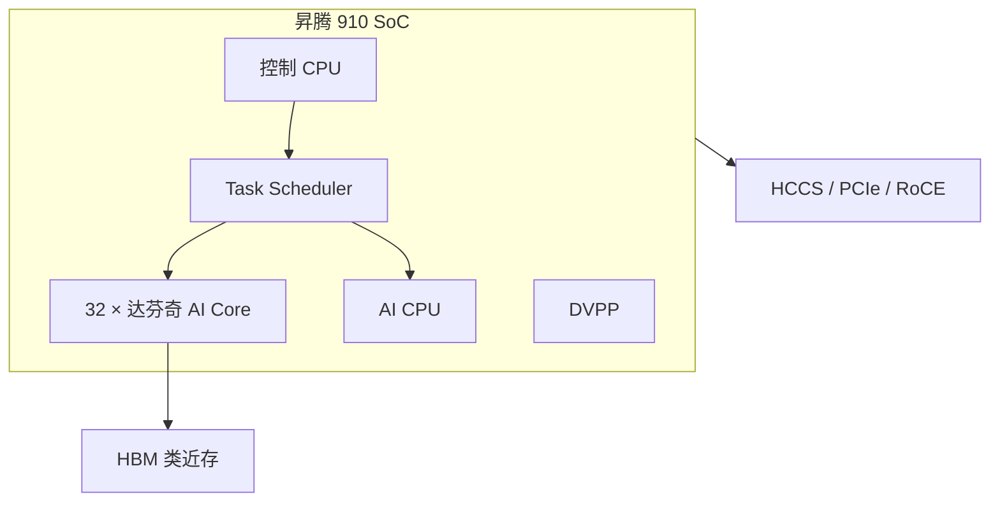

# 昇腾 910 架构要点

半精度 256 TFLOPS、整数 512 TOPS；达芬奇架构，设计功耗 350 W，达到规格算力时实测约 310 W。

<footer>—— 华为 2019 年 8 月 23 日昇腾 910 与 MindSpore 发布会公开规格</footer>

昇腾 910（Ascend 910）是华为云端训练取向的 AI 处理器，2018 年全联接大会公布方向，2019 年正式发布。公开要点是：7 nm 级工艺（发布材料写作 7nm+EUV）、单 Die **32 个达芬奇 AI Core**、FP16 **256 TFLOPS**、INT8 **512 TOPS**、设计功耗 350 W、达到设计算力时功耗约 310 W。芯片不止矩阵核：还集成控制 CPU、数字视觉预处理（DVPP）与任务调度器（Task Scheduler），组成可自我管理的 SoC。互连方面，公开产品与架构材料提到 HCCS、PCIe、RoCE 等，用于卡间与主机。本篇钉这一代的公开骨架，迭代产品 910B / [910C](/llm/ascend-910c-dual-die) 的双 Die 与 HBM 容量以各世代文档为准，不把 910C 的 128 GB 写回 2019 年的 910。

## 问题

2019 年的训练芯片要同时回答三件事：稠密矩阵乘的峰值、卷积/视觉预处理、以及如何把算力接到当时的 TensorFlow / 自研 MindSpore 上。通用 GPU 用 SIMT 覆盖这一切；华为选择领域架构 **达芬奇**，用 Cube / Vector / Scalar 三条流水对矩阵、向量与控制，见 [下篇](/llm/davinci-cube-vector)。问题是：如何在单 Die 上铺 32 个这样的 AI Core，并配上足够的片上缓冲与片外高带宽内存，使训练任务的数据喂得动。

发布会强调算力达到规格且功耗低于设计值，针对的是「高峰功耗不可部署」的质疑。对今天的 LLM 读者，910 的意义是昇腾软件栈（CANN、MindSpore、后来的 MindIE）的第一代云端锚点：图编译、算子库、集合通信都从这一代的核模型长出来。把 2024 年 910C 的双 Die 故事读回 910，会错核数、错内存、错互连。

### SoC 而不只是加速器阵列

910 把 Task Scheduler、AI CPU、DVPP 放进同一颗芯片，是为了减少主机往返：视觉流水可以在 DVPP 上做缩放与色彩转换，标量/控制类算子可以落 AI CPU，矩阵落 AI Core。训练任务若每步都把预处理打回主机 CPU，PCIe 会先于 Cube 成为屋顶线。这一分工在后来的 LLM 推理里部分被 tokenizer 与主机侧调度取代，但核模型没有变：异构引擎，而不是单一 SIMT 池。

256 TFLOPS FP16 与 512 TOPS INT8 是峰值规格。真实训练利用率取决于算子是否走 Cube、是否能与搬运重叠、以及 HCCS/RoCE 上的梯度同步。不要把发布会峰值写成「任意网络的稳态吞吐」。

## 方法

把 910 看成四块公开模块。**AI Core 阵列**：32 个达芬奇核，承担矩阵与向量密集计算。**控制与调度**：片上 CPU 与 Task Scheduler 把内核下发到 AI Core 或 AI CPU。**DVPP**：图像/视频预处理专用通路。**存储与互连**：AI Core 内侧是多级 Buffer（L0/L1/UB 等，细节见达芬奇篇），外侧是 HBM 类高带宽内存（2019 年 Hot Chips 相关介绍提到训练芯片用上 HBM2E 一类高带宽颗粒）；卡间走 HCCS，主机走 PCIe，多机可用 RoCE。软件上，2019 年同时发布 MindSpore；底层则是后来系统化的 [CANN 图编译](/llm/cann-graph)。

系统产品把多颗 910 收进 Atlas 训练服务器与 Atlas 900 集群。华为全联接 2019 对 Atlas 900 给出过基于大量 910 互联的集群 FP16 算力量级（公开口径为数百到约一千 PFLOPS 量级的区间，随节点数变化）。集群数字用于理解「910 被设计成可堆叠」，不是本篇的单芯片规格。

### 与 GPU 编程模型的差

CUDA 程序员看到的是统一 SM 与全局内存。910 程序员看到的是：矩阵是否在 Cube 上、向量是否在 Vector 上、搬运是否走 MTE、同步是否用事件标志。CANN / TBE / Ascend C 把这些暴露成图或核函数。直接把 CUDA 核「翻译」过来，往往会得到标量路径，峰值 256 TFLOPS 与你无关。正确方法是让图编译把 MatMul 送到 Cube，把逐元素融合进 Vector，见 [NPU 友好算子](/llm/npu-friendly-ops) 的一般原则。

## 机制

达芬奇核用 Cube 一个节拍完成固定尺寸的矩阵乘加（公开教材写 16×16 与 16×16 的矩阵乘形态），用累加器把部分和留在片上。32 核并行给出芯片峰值。Vector 覆盖 FP16/FP32/INT8 等逐元素与归约，避免小算子打回主机。Scalar 负循环与地址，使另外两条流水可以异步前进。存储层次用片上 Buffer 减少对 HBM 的往返；HBM 提供训练激活与权重的容量与带宽。这一机制与后来 LLM decode 的带宽墙是同一屋顶线语言，只是 2019 年的主场景是训练的大 GEMM。

功耗机制：350 W 设计包络给供电与散热；310 W 达到规格说明峰值点不在包络墙上。对机房，仍应按 350 W 与服务器整机功耗规划，不能按「实测 310」去堆密度。

工艺节点的公开表述是 7nm 级 / 7nm+EUV，具体代工厂与后续 910B/C 因出口管制发生的流片变化，以华为当时官方口径为准，本文不推断未证实的代工厂细节。

### 从训练卡到后来的推理栈

910 首先是训练规格。LLM 推理后来跑在 910B/910C 与 MindIE 上，见 [MindIE](/llm/mindie)。架构连续性在于：仍然是达芬奇三维计算、仍然要图编译、仍然要集合通信。断裂在于：decode 小 batch、KV 缓存、连续批，这些不是 2019 年发布会的对象。读 910 是为了读懂核，不是为了抄 256 TFLOPS 去估 2026 年的 token/s。

## 边界与工程取舍

不要把百科或媒体上未带华为文档的 910C 晶体管数、FP16 800 TFLOPS 等数字写进 910 这一篇。不要假设 32 核可以当 32 路独立 CUDA SM 做任意 SIMT。不要忽略 DVPP：视觉训练流水关掉它会把主机 CPU 打满。多机训练的梯度同步走 RoCE/HCCS 时，算法与 NCCL 同构，库与拓扑以 HCCL 文档为准。

910 的历史位置：它证明达芬奇可以上云端训练规模；软件栈从这一代开始必须处理图、算子缺口与多机。后续双 Die、UB 超节点是另一组产品，见 910C 与 CloudMatrix 公开论文，不要在本篇展开未属于 910 的规格。

出处：华为 2019-08-23 昇腾 910 / MindSpore 发布规格；Hot Chips 相关达芬奇/910 公开介绍中的 32 核与工艺表述；《Huawei Atlas AI Computing Solution》等公开教材中的 SoC 模块划分。不编造未公布的 HBM 容量与单核频率。

## 小结

- 昇腾 910：32 达芬奇核，FP16 256 TFLOPS，INT8 512 TOPS，设计 350 W / 达标约 310 W。
- SoC 含控制 CPU、AI CPU、DVPP、Task Scheduler，不只是矩阵阵列。
- 存储为 HBM 类近存，互连含 HCCS、PCIe、RoCE 等公开接口族。
- 编程走 CANN 图与 Cube/Vector 映射，不是 CUDA SIMT。
- 本篇规格停在 2019 代；910C 双 Die 另文。
- 出处：华为 2019 发布会与公开架构教材。
