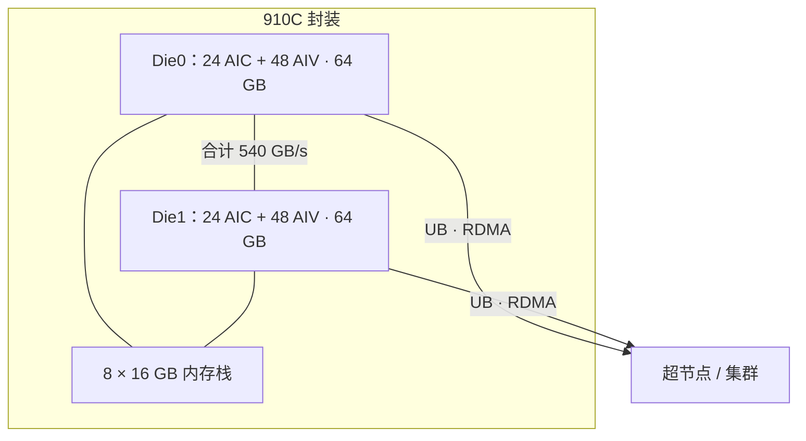

# 910C 双 Die 共封装与片上互连

910C 是双 Die 封装：两颗相同计算 Die 共封装，共享八个封装上内存栈，并以高带宽 Die 间互连相连。

<footer>—— Zuo et al., Serving Large Language Models on Huawei CloudMatrix384（公开论文 §3.3.1）</footer>

昇腾 910C 是 2024 年一代旗舰 NPU，接在 910B 之后。华为公开论文把它写成**双 Die 共封装**：两颗相同计算裸片放在同一封装里，共享 **8 个内存栈（各 16 GB，共 128 GB）**，Die 间互连合计最高 **540 GB/s**（每方向 270 GB/s）。每 Die **24 个 AIC、48 个 AIV**，计算引擎支持 FP16/BF16 与 INT8；封装内存带宽合计最高 **3.2 TB/s**（每 Die 1.6 TB/s）。网络上每 Die 接两平面：UB Scale-Up（七条 224 Gb/s 收发，单向约 196 GB/s）与 RDMA Scale-Out（单向最高 200 Gb/s）。本篇只用这些已发表数字讨论「一封装两 Die」对 LLM 并行的含义，不补充未出现在论文或华为文档里的工艺节点与晶体管数。

## 问题

单 Die 受光罩面积、良率与 HBM PHY 数量限制，算力与内存涨到头。下一代可以选择更大的单 Die，或把两颗成熟 Die 封在一起。910C 走后者：软件看见的「一张 910C」内部其实是两个计算复合体，靠封装内互连当桥梁。问题是：对框架而言，910C 是 1 个装置还是 2 个 rank？KV 与专家按封装切还是按 Die 切？Die 间 270 GB/s/方向比 UB 平面与 HBM 都窄一档，放错通信就会在封装内部打满这座桥。

CloudMatrix384 把 384 张 910C 收成超节点时，表格按 **per-die** 报带宽，并写明每张 910C 两 Die。服务侧 EP320 把 DeepSeek-R1 的专家铺到 **320 个 Die**（160 张 910C），「每 Die 一个专家」——这明确把 Die 当成并行原子，而不是把封装当成不可分割的一张卡。

### 共享八栈不等于单一统一内存

八个 16 GB 栈提供 128 GB 封装容量，每 Die 64 GB。论文的图示是共封装共享栈，同时给出每 Die 1.6 TB/s。编程上仍应假设**近端优先**：算子与 KV 尽量留在本 Die 的 64 GB 视图里，跨 Die 访问走 540 GB/s 的桥，而不是当 128 GB 无代价扁平空间。这与 Jalapeño 的切片化是同一类纪律，只是切分粒度从核切片变成 Die。

INT8 被写成在 910C 上达到与原生 FP8 硬件可比较的计算效率，但论文没有声称有独立的 FP8 Tensor Core。量化方案是 INT8，验收也按 INT8 进行。不要把 MXFP4 或 NVFP4 的峰值抄到 910C。

## 方法

把一张 910C 当成两个紧密耦合的 NPU Die 来切并行。张量并行若只有 2 路，可以落在同一封装的两 Die 上，All-Reduce 走封装内 270 GB/s/方向，不必出芯片。专家并行以 Die 为 rank：EP 度可以等于 Die 数。数据并行的副本以封装或节点（论文中每节点 8 张 910C）为单位，减少碎片。KV 按 Die 的 64 GB 规划，跨 Die 拼接要计入桥的带宽；长上下文更合理的是用 UB 把许多封装的内存池化，而不是在一张卡的两 Die 之间硬挤 128 GB 统一池。

节点级公开结构：8 张 910C + 4 鲲鹏 + 板上 7 个 UB 交换，12 个处理器进同一层 UB。封装内桥解决的是「一张卡内部」；节点与超节点的 UB 解决的是「卡与卡」。两者不要混用数字：540 GB/s 是 Die–Die，UB 单向 392 GB/s 量级是整卡对 Scale-Up 平面（每 Die 196 GB/s 单向）。

### 对 MindIE 与集合通信的含义

HCCL 通信域应能表达 Die 拓扑，而不是只枚举「NPU 0..7」。双 Die 若被操作系统暴露为两个逻辑装置，进程绑定必须钉死成对亲和，避免 TP 组跨到另一封装的远 Die 却以为还在「同一张卡」。若暴露为一个装置，运行时也要在核函数启动时把 AIC/AIV 平均分到两 Die，并显式处理桥上的同步。以你安装的 CANN / 驱动文档为准，不要假设与 CUDA `cudaSetDevice` 一一对应。

CloudMatrix-Infer 的 PD 分离与 EP320 说明：decode 实例用 160 卡 320 Die，就是把双 Die 当成可调度的 320 个专家槽。这比「160 路 EP、每卡两专家串行」更有利于延迟。方法是承认封装内部有结构，而不是对调度器隐瞒。

## 机制

双 Die 的机制是面积与良率：两颗较小的计算 Die 比一颗翻倍面积的 Die 更好造，HBM PHY 与 UB/RDMA SerDes 可以按 Die 复制。代价是 Die 间一致性与带宽。540 GB/s 合计大约是每 Die HBM 1.6 TB/s 的三分之一量级，因此跨 Die 的每次同步都比本 Die 内搬运贵。适合放在桥上的是低频、整块的激活或梯度；不适合的是 decode 每层两次、体积只有 $b\times d$ 的 All-Reduce——那应当尽量留在本 Die，或把 TP 度降下来。

热与供电按封装：两 Die 加八栈，散热是共封装问题。节点 8 卡已经是高密度；超节点再靠液冷与通信柜。故障上，一 Die 失效是否整封装报废，公开论文未写现场策略；运维上应按封装替换，不要假设可热摘单 Die。

论文还给出每 Die 七条 224 Gb/s 的 UB 收发。那是 Scale-Up 平面的注入，不是 Die–Die 桥。把 224 Gb/s × 7 换算成约 196 GB/s 单向，与封装内 270 GB/s/方向是两个不同的物理通道。

### 与 Jalapeño 双域、与 NVL 超芯的对比

Jalapeño 用以太域把 128/2048 颗整芯片连起来；910C 先在封装内用专用桥把两 Die 连起来，再在超节点用 UB。NVIDIA 超芯是 CPU–GPU 一致性互连。三者都是「把多个硅片收成一个产品」，但 910C 的两 Die 是同构计算对，不是 CPU+GPU。不要把 540 GB/s 写成 NVLink 5 的 1.8 TB/s，也不要写成 Jalapeño 本地域的 600 GB/s——数字来源不同、层级不同。

## 边界与工程取舍

不要用媒体未标注来源的 910C 算力峰值替代论文里的结构描述；本篇故意不填一份未在该论文给出的 PFLOPS 表。不要假设 128 GB 可以当单指针空间给任意算子 gather。不要在 Die 间做细粒度原子——公开材料没有提供 GPU 式的封装内统一缓存协议细节。出口管制后的工艺与产能属于商业与合规，不是这篇互连笔记的规格来源。

对 LLM 服务：优先「宽 EP、以 Die 为 rank、窄 TP」。对训练：两 Die 可以当 2 路 TP 的近端对，更大的 TP 走出 UB。始终先画通信落在哪一座桥上。

出处：Zuo et al. CloudMatrix384 论文 §3.3.1–3.3.2（双 Die、8×16 GB、3.2 TB/s、540 GB/s、24+48 核、UB/RDMA）；StrataCL 等后续公开论文对 910C 核结构的转述。不编造未公布的 Die 间协议与良率。

## 小结

- 910C：两颗同构计算 Die 共封装，8 栈 × 16 GB = 128 GB，封装带宽最高 3.2 TB/s。
- Die 间最高 540 GB/s 合计（270 GB/s/方向），窄于本 Die HBM，跨 Die 通信要省着放。
- 每 Die 24 AIC + 48 AIV；并行原子常常是 Die 而不是封装。
- 每 Die 同时接 UB Scale-Up 与 RDMA Scale-Out，与封装内桥是不同平面。
- 调度与 HCCL 域必须表达双 Die 拓扑。
- 出处：CloudMatrix384 公开论文的 910C 结构节。
