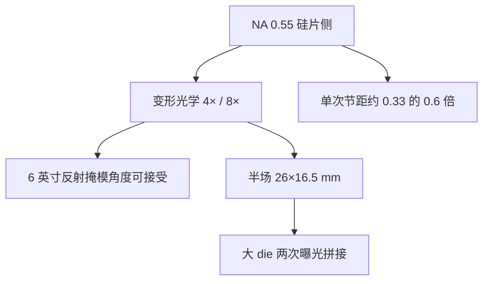

# High-NA 0.55 EXE：变形光学与半场

High-NA 把硅片侧数值孔径抬到 0.55，并用变形光学重新分配掩模侧角度与倍率；曝光场在一个方向上减半。

<footer>—— 改写自 ASML / Zeiss High-NA 公开材料</footer>

[NXE](/llm/asml-nxe) 的 0.33 把单次 EUV 送到 5/3 nm 关键层之后，下一截金属节距要么 EUV 双重，要么再抬 NA。ASML 的 TWINSCAN EXE（EXE:5000 开发、EXE:5200 量产取向）把 NA 提到 0.55，分辨率按比例约改善 $0.55/0.33\approx 1.67$ 倍。若仍用各向同性 4×，掩模侧 NA 和主光线角会大到[多层膜](/llm/euv-multilayer-mirror)与吸收体阴影不可接受，6 英寸版也放不下光瞳。解法是变形光学（anamorphic optics）：扫描向约 4×、狭缝向约 8×，硅片场从 26 × 33 mm 变成约 26 × 16.5 mm 的半场。本篇写为什么必须变形、半场如何拼大芯片，以及与 0.33 机队的并存关系。

## 问题

NA 提高时，掩模侧数值孔径是硅片 NA 除以倍率。4×、0.55 给出掩模 NA $\approx 0.138$，主光线角和入射角范围把多层膜布拉格峰、偏振分裂和三维阴影同时推过边界。镜子口径也按 NA 涨，POB 包络与可镀膜面积成为机械墙。继续用 26 × 33 mm 全场，光学做不出；缩小场又伤害大芯片的一次曝光完整性。

需要一种不对称倍率：在对阴影和多层膜最敏感的方向上提高倍率、减小掩模侧角度，在扫描方向上保持与工件台速度匹配的 4×。场在非扫描方向减半，大芯片用两次曝光拼接。这就是 EXE 相对 NXE 的结构变化，不是简单把 0.33 物镜「开光圈」。

### 1.67 倍分辨率从哪里来

$$
\frac{\lambda/\mathrm{NA}_{0.55}}{\lambda/\mathrm{NA}_{0.33}} = \frac{0.33}{0.55}\approx 0.60,
$$

即特征尺寸约缩到 0.33 系统的 60%，或密度约 2.8 倍（面积比）量级，具体仍乘 $k_1$。High-NA 的卖点是把原需 EUV 双重的节距拉回单次，节省循环与套刻层。它不自动消灭[随机效应](/llm/euv-stochastics)：更小孔里的光子更少，剂量与胶的压力可能更大。NA 解决的是光学截止，不是泊松统计。

「半场」指硅片上场尺寸约 26 × 16.5 mm，不是机器只能做半片晶圆。300 mm 硅片上照样排很多场；变的是单场面积，因而大 die 可能跨两个曝光场。

## 方法

蔡司为 EXE 做更大口径的变形投影光学：两个方向倍率不同，镜子是强非球面，波前计量按各向异性光瞳来。照明与掩模三维模型必须用两套倍率。扫描方向保持 4×，使掩模台与硅片台的速度比仍按熟悉的扫描同步来做；正交方向 8×，掩模上的场更「瘦」，从而 6 英寸版装得下。硅片场 26 mm（扫描）× 16.5 mm（狭缝）。

机台仍是真空双工件台、[磁浮](/llm/euv-maglev-stage)、LPP 源，但源功率、光学热负荷、[pellicle](/llm/euv-pellicle) 和套刻规格按 0.55 重写。Intel 等客户公开接收首批 High-NA，用于 18A 一类节点研发与后续 HVM；TSMC、Samsung 的导入节奏以各自公开为准。EXE:5000 偏工艺开发，5200 把产能与可用性往量产推。镜子更大、热更狠，收集镜与 pellicle 的寿命曲线不能从 NXE 直接拷贝，导入期要把光学、膜和胶一起重新资格认证。

### 拼接：半场如何覆盖大芯片

超过半场的 die 要把图形切成两次曝光，中间有拼接缝。缝上的套刻、剂量和 CD 必须落在金属/通孔的公差内，计算光刻要为缝设计重叠与分割规则。这是设计—工艺协同，不是只买一台更高 NA 的 NXE。小芯片、芯粒可以避开拼接；HPC 大 die 则把拼接当成新的良率项。半场的好处是光学可行，代价是部分产品的曝光次数与掩模策略变复杂。

## 机制

变形倍率把掩模侧角谱拉回多层膜能给高反、吸收体能给可接受阴影的区间。硅片侧仍是 0.55 的高 NA，焦深按 $\lambda/\mathrm{NA}^2$ 再变薄，调焦与硅片不平整度的预算更紧，工件台与对准传感器必须跟上。光瞳填充在两个方向不对称，SMO 的自由度增加，OPC 不能再用各向同性 4× 的老模型。

透过率方面，更大、更多角度的镜子可能让 $R$ 在光瞳边缘下降，系统能量账不比 NXE 更宽松。High-NA 因此仍依赖高功率 LPP 与高透过 pellicle。随机效应在更小接触孔上更显著，单次曝光省下的双重套刻，可能被更高剂量（更慢扫描）部分抵消。工厂经济要算的是「双重 EUV + 0.33」对「单次 0.55 + 可能拼接 + 更高剂量」。

变形不是「X 与 Y 分辨率不同」。硅片上的 NA 在设计上仍以 0.55 为目标成像；不对称的是掩模到硅片的几何倍率。不要写成 EXE 只能做椭圆孔。

### 与 0.33 机队的分工

NXE 不会因为 EXE 出货而停产逻辑。0.33 全场对中等节距更便宜、拼接少、成熟度高；0.55 吃最紧的层。同一节点里两种 NA 并存，类似当年干式与浸没 DUV。光源、掩模厂、胶、计算光刻都要为变形半场另开一条资格认证，这是导入周期以年计的原因之一。

## 边界与工程取舍

High-NA 不改变 13.5 nm，不取消真空与锡滴。它把成本堆在光学口径、半场拼接和更薄焦深上，以换单次分辨率。若某层随机缺陷在高剂量下仍不可接受，NA 再高也要靠胶与设计规则（冗余通孔、放大接触）。出口管制与价格使 EXE 比 NXE 更稀缺，产能爬坡取决于蔡司镜子产量和客户工艺，而不只是 NA 数字。计算光刻必须为变形光瞳和拼接缝另建模型，否则半场几何上的套刻合格，图形热点仍会在缝两侧成对出现。

公开权威是 ASML 与 Zeiss 的 High-NA 白皮书、SPIE 报告：0.55、anamorphic 4×/8×、半场 26 × 16.5 mm。Bakshi 提供 EUV 成像与掩模三维背景。不要把未公布的镜面张数或未证实的 wph 写死；写机制与场几何即可。

EXE 名称不要和 NXE 混用。NXE 是 0.33 平台，EXE 是 0.55 平台。说「ASML 的 EUV」而不标 NA，在 2026 年已经不够区分两代光学合同。

## 小结

- High-NA EXE 将硅片 NA 从 0.33 提到 0.55，光学特征尺寸约缩到 60%。
- 变形光学采用约 4×（扫描）与 8×（狭缝），压低掩模侧角度，保住多层膜与 6 英寸版。
- 曝光场约 26 × 16.5 mm；大芯片需要场拼接，套刻成为新良率项。
- 焦深更薄、随机效应在更小孔上更严，剂量与胶仍是一等限制。
- 与 NXE 长期并存：0.55 吃最紧层，0.33 吃全场成熟层。
- 供应商仍是 ASML 整机 + Zeiss 投影光学 + LPP 源。
- 出处：ASML / Carl Zeiss SMT High-NA 公开材料；Bakshi, *EUV Lithography*。
