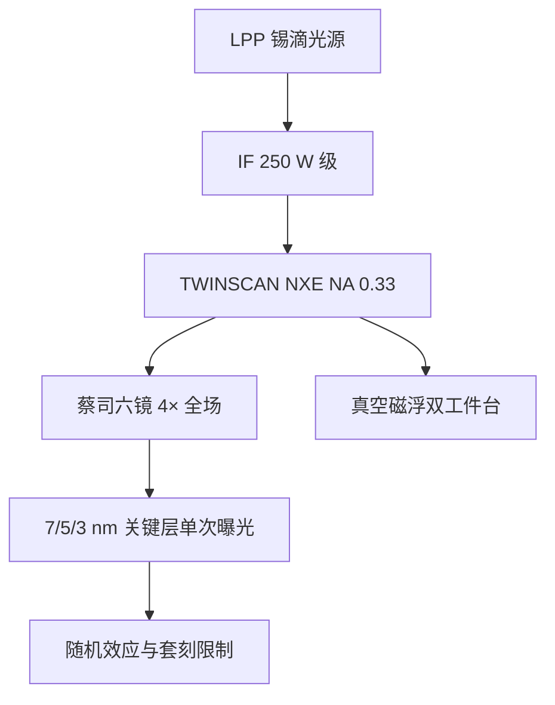

# NXE：NA 0.33 量产 5/3 nm

TWINSCAN NXE 以 NA 0.33 的全反射 EUV 把单次曝光推进到 7/5/3 nm 逻辑的关键层，中间焦点功率与光学透过率共同决定产能。

<footer>—— 改写自 ASML TWINSCAN NXE 公开产品说明</footer>

NXE 是 ASML 把 [LPP 锡滴光源](/llm/euv-lpp-tin)、[蔡司六镜物镜](/llm/zeiss-euv-optics)和真空扫描机集成后的量产平台，硅片侧数值孔径 0.33，缩微 4×，曝光场约 26 mm × 33 mm。波长 13.5 nm 代入瑞利式，$CD=k_1\lambda/\mathrm{NA}$，在可用 $k_1$ 下给出十几纳米的单次曝光分辨率，从而把 DUV 多重图形从关键层上撤下来。机台世代从研发型 NXE:3300 走到 3400/3600/3800 量产线，公开里程碑包括 IF 250 W 级功率与每小时百片以上的产能。本篇写 0.33 这一代能做什么、不能做什么，以及它如何接到 [High-NA EXE](/llm/asml-high-na)。

## 问题

ArF 浸没 NA 1.35、$\lambda=193$ nm，单次曝光停在大致 40 nm 半节距，7 nm 及以下逻辑要把金属与通孔拆成 LELE 或 SADP/SAQP，套刻层数、循环时间和缺陷一起爆炸。EUV 用 13.5 nm 换波长，NA 先定在 0.33：再高则镜子口径、掩模侧角度和透过率在当时不可用。问题变成：0.33 够不够支撑 5 nm、3 nm 的关键层单次曝光，以及光源、胶、套刻是否跟得上工厂经济。

不够的部分会以两种方式出现。一是分辨率：更紧的节距仍要叠加 DUV 多重或等待 High-NA。二是[随机效应](/llm/euv-stochastics)：光子少、胶模糊，局部 CD 和缺孔会在剂量不足时先于瑞利极限把良率打死。NXE 的量产叙事必须同时包含光学分辨率和随机/缺陷。

### 瑞利数字在 0.33 上意味着什么

$$
CD = k_1\frac{\lambda}{\mathrm{NA}} = k_1\frac{13.5\,\mathrm{nm}}{0.33}\approx k_1\times 40.9\,\mathrm{nm}.
$$

$k_1\approx 0.4$ 时约 16 nm；$k_1$ 靠 SMO、OPC、离轴照明压到约 0.3 时，半节距进入约 13 nm 量级。这与 5 nm/3 nm 逻辑的金属节距同一量级，因此 NXE 能吃关键层，而不是只能当「比 193 稍好的灯」。节点名称是商业标签，不等同于单层半节距；NXE 替换的是那些在 DUV 下需要两次以上图形化的层。

「NXE 等于 5 nm 机台」不准确。同一台 0.33 机器在 7 nm 插层、5 nm 量产、3 nm 继续用，差别在层数、胶、剂量和计算光刻，不在 NA。NA 0.33 是平台常数，直到 EXE 的 0.55。

## 方法

整机是真空版 Twinscan：双工件台，一台曝光、一台对准与调焦，硅片和掩模台用[磁浮](/llm/euv-maglev-stage)，因为气浮在真空里不成立。光源在舱内把锡滴打到 IF，经 DGL 进入照明，反射掩模（可加 [pellicle](/llm/euv-pellicle)）再进六镜 POB。扫描狭缝沿场扫过，剂量由源功率与扫描速度互锁。套刻继承浸没机的对齐传感器思路，但要在真空与反射对准标记下重做。

世代差异主要在源功率、可用性、套刻和生产力，而不是改 NA。NXE:3400C 一类机型把 250 W 与 HVM 可用性写进公开故事；后续 3600D、3800E 继续加功率、加控制带宽，以喂更厚的 3 nm 层数和更高剂量（对抗随机）。工厂侧还要接氢、锡回收、掩模检测和 EUV 专用胶。套刻规格随世代收紧，因为 3 nm 的层间余量比 7 nm 插层更窄；功率数字单独好看不够，必须和套刻、焦深、缺陷在同一份工艺窗口里同时成立。

### 场、倍率与掩模

4× 与 26 × 33 mm² 场让 6 英寸反射掩模继续用，芯片可以整场曝光，不必为了光学去切半场。主光线角带来掩模三维阴影，计算光刻必须建吸收体厚度和入射角模型。这是 0.33 相对未来 0.55 的结构优势：全场、各向同性 4×，OPC 和拼接更简单。代价是 NA 停在 0.33，更小节距要么涨 $k_1$ 风险，要么多重，要么等 High-NA。

## 机制

产能 $TPT$ 粗看是扫描速度、曝光场、换片与对准开销、源可用功率的函数。硅片剂量 $D$ 固定时，源功率越高，扫描可以越快，直到工件台加速、热和计量成为下一个墙。物镜透过率低，所以源必须先到 250 W 量级，扫描速度才进得了百片/小时。停机换收集镜、破 pellicle、氢系统联锁，都会进可用性，把名义 TPT 打折。

成像上，部分相干光瞳由照明决定，NXE 提供供 SMO 用的灵活光瞳。对比度够时，限制良率的往往是随机：接触孔缺失、线桥、局部 CD。剂量、胶化学、掩模偏差在这里耦合。因此「0.33 的分辨率够不够」在 3 nm 上常常要改写成「随机缺陷在目标剂量下够不够低」。光学 NA 只是必要非充分。

节点数字（5 nm、3 nm）来自代工厂命名，不是 NXE 铭牌。ASML 公开的是 NA、场尺寸、套刻规格和产能档。写供应链时应写「用于 5/3 nm 逻辑关键层的量产 EUV」，而不是「5 nm 光刻机」这种易混的简称。

### 在工艺整合里的位置

典型逻辑：Fin/GAA 相关层、关键金属与通孔走 EUV 单次；松节距层留在浸没 DUV。3 nm 上 EUV 层数增加，机台数量和掩模成本上升，但仍比把这些层全部 SAQP 更经济——这是 NXE 能铺开的商业机制。High-NA 针对的是 0.33 单次已经吃力、双重 EUV 又太贵的那一截节距，而不是立刻淘汰 NXE。两代会在同一工厂里并存多年。

## 边界与工程取舍

NXE 不把所有层都变成单次 EUV，也不消除多重图形：后段松金属、植入、某些切层仍用 DUV。0.33 对更先进金属节距会被迫 EUV 双重，成本优势缩小，这正是 EXE 的入口。出口管制把 NXE 变成地缘政治对象，但不改变 NA 与场的物理。胶灵敏度、pellicle 双程吸收和收集镜寿命同样进入单片成本：光学分辨率只决定「能不能印」，工厂账决定「印得起几层」。

引用以 ASML 产品页、投资者日和 SPIE 公开报告为准：NA 0.33、场 26 × 33 mm、4×、LPP、Twinscan 真空平台。Bakshi 书解释为何这套光学能成像；具体 wph 数字随胶剂量和工厂 mix 变化，不要把某一代广告产能写成物理上限。

不要用「EUV 量产从 NXE 才开始」抹掉之前十年的样机。3300 系列承担工艺开发；3400 之后才是晶圆厂 HVM 叙事的中心。写历史时把开发机与量产机分开，功率里程碑（250 W）分开。

## 小结

- NXE 是 NA 0.33、4×、全场约 26 × 33 mm 的量产 EUV 扫描平台。
- 瑞利尺度 $k_1\times 40.9$ nm，配合 SMO/OPC 覆盖 5/3 nm 逻辑关键层单次曝光。
- 产能由 IF 功率、光学透过率、双工件台和可用性共同决定，250 W 是公开 HVM 里程碑。
- 限制良率的经常是随机缺陷与套刻，而不只是理想分辨率。
- 与浸没 DUV 分工：紧节距层上 EUV，松层留多重或单次 193。
- High-NA EXE 在更紧节距上接棒，并不立刻替换 0.33 机队。
- 出处：ASML TWINSCAN NXE 公开说明；Bakshi, *EUV Lithography*。
