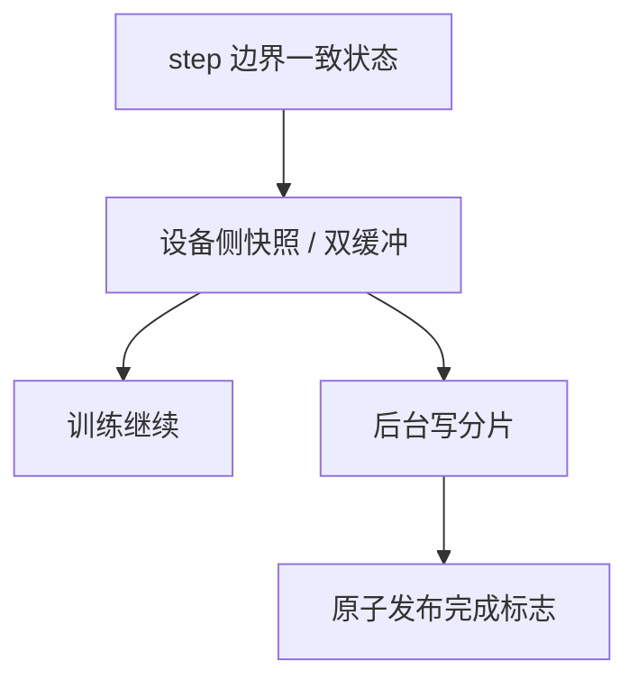

# 异步检查点

把参数与优化器状态的快照提交给后台线程写盘，训练流继续算下一个微批；检查点的墙钟不应等于一次完整的同步保存。

<footer>—— Mohan 等，CheckFreq；对照 Meta / NVIDIA 预训练中的异步保存实践</footer>

[上一课](/llm/moe-training-all2all)把稳态的 All-to-All 税付清。万卡上下一步不是更快的 GEMM，而是：多久必须落盘一次，才能在掉卡后只丢掉可接受的 token。同步保存会让整张集群等最慢的磁盘。本课不重讲专家置换。缺口是把保存从训练关键路径上挪走——异步检查点——以及它与 1F1B 在飞状态、DualPipe 双流之间的一致性约束。下一课谈落盘格式如何跨并行拓扑重切。

## 问题

检查点体积随 $\Phi$ 与优化器状态（Adam 两份矩）线性涨，MoE 更按专家数涨。同步 `save` 的时间可到数分钟，MegaScale 一类报告里故障间隔若也是这个量级，有效算力被保存吃掉。CheckFreq 把「多频繁地检查」做成系统问题：太稀则故障丢失大；太密则保存干扰训练。异步的意思是：训练线程拷一份（或用双缓冲）给 writer，writer 用独立流或 CPU 把分片写到并行文件系统。

危险是写的过程中参数还在变。必须在全局 batch 边界、优化器 step 之后取一致快照，而不是在 1F1B 稳态的半拍上取。DualPipe 双流、ZB 未完成的 $W$，都不允许作为快照点。

### 拷贝本身也可以很贵

GPU→CPU 或 GPU→GPU 暂存若走同步 memcpy，只是把停顿换了个名字。需要 pinned memory、流水化拷贝、或 GPU 侧的快照缓冲与计算双缓冲轮换。Mohan 等人讨论在不扰动训练节奏的前提下提高检查频率。

异步写尚未完成时又触发下一次保存，会堆积或覆盖。策略应是「进行中则跳过」或有界队列，并在日志里记实际成功的 step 号。

## 方法

在 step 边界：对参数与优化器状态做一次性一致捕获（可与 DP 分片、TP 分片、EP 分片的本地部分一起捕获，不必 gather 成整模型）。后台写本地分片。训练继续。故障恢复时，用上一课将定义的分布式格式按当前拓扑加载。保存频率按「丢失预算 / 平均步时」设：例如最多丢 15 分钟墙钟。

与数据加载器对齐：快照里必须有数据游标（样本 id、shuffle 种子、累积进度），否则恢复后会复读或跳过，污染去重会计。退火段切换 $w$ 时，游标格式要能表达配比版本。

### 校验

后台写完后做校验和或抽检张量范数，失败则标红并保留上一个完好点。不要让损坏文件覆盖完好文件。原子 rename 是最低要求。

MoE 专家分片漏写一个 rank，恢复后会静默变成随机专家。完成标志必须是全局 AND，不是「大多数 rank 成功」。

## 机制

训练的关键路径只做一次设备内快照，IO 与后续 GEMM 并发。墙上保存开销趋向拷贝时间而不是文件系统尾延迟。正确性来自「快照点 = 优化器状态与数据游标的同一全局步」。这与零气泡的 step 必须在所有 $W$ 之后，是同一条一致性链。

## 边界

异步不保证故障时「正在写的那份」可用，因此始终要保留上一完好点。它也不定义分片如何在改 TP 度后读回来。下一课专门规定分布式检查点格式。弹性扩容时，未完成的 writer 必须取消或排空，否则旧世界的分片会与新世界混写。

## 小结

- 本课不重讲 All-to-All；只补在 step 边界把保存移出关键路径。
- 快照必须含参数、优化器、数据游标；全局完成标志用 AND。
- 频率按丢失预算设；进行中的保存不可无界堆积。
- DualPipe / ZB 的半拍不是合法快照点。
- 出处：Mohan et al., *CheckFreq*, OSDI 2021；对照大规模训练中的异步保存实践。
