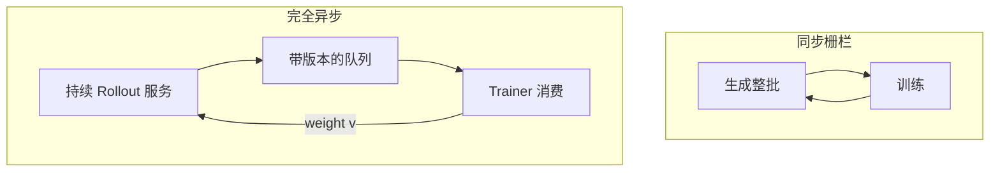

# 异步 rollout 架构

    
同步 RLHF 把生成、准备、训练收成逐步栅栏；异步把生成变成持续服务，训练变成消费流，用版本号代替「这一批必须同一权重」。

    <footer>—— 对照 Sheng 等 HybridFlow 的三阶段数据流，以及 Fu 等 AReaL 对完全解耦的定义</footer>

在线策略梯度需要「用当前策略采样，再在这些样本上更新」。落到集群上，这句话变成一条**时序契约**：生成引擎的权重与训练引擎的 $\pi_{\theta}$ 可以差多少。同步架构（DeepSpeed-Chat Hybrid Engine、早期 verl SPMD rollout、默认 GRPO 脚本）用栅栏保证差为零或一步。长思维链与工具延迟让栅栏的等待变成主墙钟。[AReaL](/llm/areal-async-rl) 把契约改成流式；[OpenRLHF](/llm/openrlhf) 写异步 dataflow；verl v0.7 默认改 **server 模式**；[slime](/llm/slime-rl) 提供 fully_async 例。本篇把这些实现收成同一张架构图：共置同步、一步重叠、完全异步，以及必须记账的 staleness 与 partial rollout。算法公式仍指向 [PPO](/llm/schulman-ppo) / [GRPO](/llm/grpo)，这里只写系统时序。

## 问题

HybridFlow（Sheng、Zhang、Peng、Lin、Wu 等，EuroSys 2025，arXiv:2409.19256）把 RLHF 写成数据流：节点是分布式 LLM 程序（生成 / 前向 / 反向），边是重切分多播。PPO 一步典型三阶段——生成、用 ref/RM/critic 准备、更新 actor——在同步执行里顺序发生。3D-HybridEngine 优化的是**同一批 GPU 上**训练布局与生成布局之间的零冗余重切分，吞吐相对当时基线 1.53×–20.57×。它不消灭「等最长序列」。推理模型把该等待从秒级拉到分钟级，加卡反而减小每卡 decode batch，更不划算。

异步要回答的问题因此不是「会不会 HybridFlow」，而是：**栅栏能否拆开，拆开后梯度还对不对**。One-step overlap 仍保持 batch 内同版本，只把「上一步训练」与「当前步生成」叠在不同资源上。完全异步允许一个训练 batch 混合多个版本，甚至一条序列在解码中途换权重。

### 三种时序不是实现细节

1. **同步栅栏**：$\pi_{\mathrm{old}}$ 全局唯一；实现简单；气泡 = 长尾。
2. **一步重叠**：资源利用率高一截；算法仍可当 on-policy（差一步）；最长序列问题还在。
3. **完全异步 / 流式**：生成是 server，请求完成即入队；必须有 staleness 上限、版本化 logprob、以及是否允许 partial rollout。

把 vLLM sleep 模式的共置时间片（OpenRLHF Hybrid Engine 文档：生成与训练轮流占卡）当成第 3 种是错误：那是**时间复用的同步**，不是流。

verl v0.7 去掉 SPMD rollout、默认 server 模式，主因是多轮与动态批，不一定等于 AReaL 式训练–生成分节点。Server 模式仍可逐步对齐权重再开训。读发行说明，不要把「server」等同「off-policy」。

## 方法

架构上把角色拆开：**Rollouter**（常驻推理服务，vLLM / SGLang / TensorRT-LLM）、**Learner**（FSDP / Megatron / ZeRO）、**Controller**（单进程编排，HybridFlow 的 single-controller）、可选 **Reward pool**。同步实现里 Controller 调用 `generate_sequences`，阻塞直到 batch 满且全部结束，再 `update`。异步实现里 Rollouter 不阻塞在 batch 边界：Controller 用队列长度与 $\eta$ 做反压（AReaL 的 $\lfloor(N_r-1)/B\rfloor\le i+\eta$），Learner 可独立 step。

权重同步是第二条边。共置重切分（3D-HybridEngine、vLLM sleep）延迟低、实现重。分置广播（OpenRLHF 切片管道、slime NCCL/delta、NeMo-Aligner 的 TensorRT refit）延迟高、调度自由。异步把这条边从「生成临界路径」上挪走：训练结束就推权重，生成侧可中断或等下一条请求再加载。Partial / interruptible rollout：未完成序列要么丢弃（浪费）、要么带着旧前缀继续（必须重算 KV 或接受混版本）。AReaL 选择中断 + 重算前缀。

### 控制面仍可以是单控制器

HybridFlow 的论点是：节点**之间**用单控制器写数据依赖，节点**之内**用多控制器跑 Megatron/FSDP，避免 RLLib 式把每个算子都从中心派发。异步不推翻这一点。AReaL 的 Rollout Controller、verl 的 AgentLoopManager、OpenRLHF 的 Ray 驱动，都是单控制器；变的是 `generate` 是否阻塞。多控制器把「何时更新」写进每个 worker 的本地循环，数据流一改就要改所有角色——正是 HybridFlow 要避免的。异步框架若把 staleness 逻辑复制到每个生成 worker，会回到多控制器的维护成本。

EuroSys 论文对照含 OpenRLHF 早期、DeepSpeed-Chat、NeMo-Aligner 等，倍数跨度 1.53–20.57 来自不同算法与规模，不能摘一个 20× 当异步 RL 的通用广告。

## 机制

正确性依赖三本账。**版本**：每条样本记录生成时的 policy version，重要性比 $\pi_\theta/\pi_{\mathrm{behav}}$ 用对。**近端中心**：完全异步时不要把过期的 $\pi_{\mathrm{behav}}$ 既当行为策略又当 clip 中心，AReaL 的解耦 PPO 把 $\pi_{\mathrm{prox}}$ 取较新锚。**Mask 与 token 身份**：流式多轮必须 token-in token-out，否则队列里的字符串再分词会与 logprob 错位，见 [AgentLoop](/llm/agentloop-server)。

吞吐来自重叠与减填充，不是来自更大的学习率。反压 $\eta$ 是在「利用率」和「偏差」之间的旋钮：$\eta=0$ 退回同步；$\eta$ 过大时即使 clip 也救不回分布。工具调用时，异步的收益还来自轨迹间不在 I/O 上对齐，这是 [VERLTool](/llm/verltool) 的 2× 来源，即使 Learner 仍逐步训练。

### 资源切分与算法切分

分池（生成卡 / 训练卡）是资源异步；允许混版本是算法异步。可以分池但仍栅栏（生成池跑完一整批再训），那只是硬件解耦。可以共置但仍流式（同一组卡上推理服务不停、训练插空），那是调度异步。写设计文档时分开，否则无法解释「为什么加了 vLLM 还是在等长尾」。

## 边界与工程取舍

调试永远先 $\eta=0$。日志必须能重建每条轨迹的版本向量，否则塌了无法归因。权重推送频率与中断成本要 profile：过于频繁会把 decode 变成 prefill。不要把 server 模式的动态批（提高多轮吞吐）与 off-policy 混为一谈。不要在未改目标函数时复制 AReaL 的中断生成。集群网络若撑不住分置广播，共置同步可能仍更快——异步不是层级关系，是长尾足够肥时才划算。奖励服务若与生成串行，工具或单测会重新引入栅栏：把 CPU 验证器做成可水平扩展的池，是 AReaL 把「并行奖励」写进系统贡献的原因，也适用于任何自称异步的栈。

Sheng 等 *HybridFlow*，arXiv:2409.19256，DOI 10.1145/3689031.3696075，代码 `volcengine/verl`。Fu 等 AReaL arXiv:2505.24298。Hu 等 OpenRLHF arXiv:2405.11143。Yao 等 DeepSpeed-Chat arXiv:2308.01320。Kwon 等 vLLM SOSP 2023。

## 小结

- 异步 rollout 拆的是生成–训练栅栏；HybridEngine 拆的是同卡上的布局切换。两者正交。
- 完全异步必须版本化样本、限制 staleness、并决定是否允许跨版本拼接的 partial rollout。
- Server 化推理提高多轮动态批，本身不等于 off-policy。
- 出处：HybridFlow EuroSys 2025；AReaL arXiv:2505.24298；verl v0.7 发行说明。
