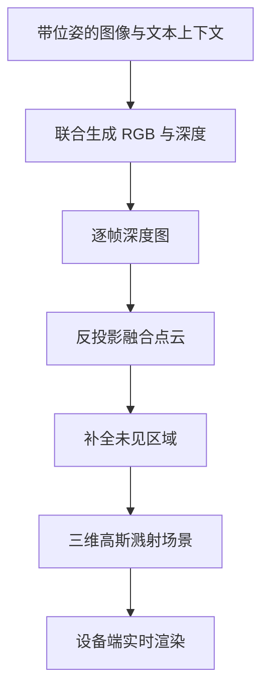

# 深度图、点云与高斯溅射写出

Atlas 原生同时操作二维图像帧与三维深度图，因而可以把世界写成点云或三维高斯溅射，而不只是一段好看的视频。

<footer>—— World Labs Team, Atlas: A World Model for Spatial Intelligence, 2026</footer>

世界模型若只能出 RGB 帧，下游仍要另跑深度估计、另做多视几何、再手工进游戏引擎。World Labs 的 Atlas 把深度图当成与图像对等的模态：每个深度图同样锚定在显式相机位姿上，进入同一套[空间上下文](/llm/atlas-spatial-context)。写出路径因此从「生成画面」变成「生成可度量的三维对象」——先有每像素深度，再反投影成点云，再把点云补全、转成可实时渲染的三维高斯溅射（3D Gaussian Splatting, 3DGS）。这与 Marble 产品线共用溅射表示，但本篇只写 Atlas 这条写出链，不把 Marble 的网格导出和编辑器复述成同一套 API。

## 问题

机器人、游戏、视效要的往往不是一张新视角图，而是一份能被别的系统接着用的几何。新视角合成可以在像素域里「看起来对」，却给不出碰撞、尺度和可重渲染的资产。传统管线把问题拆开：多视立体或 NeRF 一类方法估几何，高斯溅射或网格负责显示。拆开的代价是误差在接口处累积：深度尺度漂了，溅射就对不齐；帧间深度抖动，点云就出现层状重影。

Atlas 面对的是另一条约束：它是[多模态自回归扩散](/llm/atlas-ardt)，上下文里已经有带位姿的图像。若深度只作为后处理，模型在去噪图像时学到的三维一致性无法被下游读取。需要一种写出：深度与 RGB 在同一套条件上联合生成，再把深度变成点，把点变成可渲染的溅射，中间尽量少换坐标系。

### 三种写出对象不是同一信息量

深度图 $D\in\mathbb{R}^{H\times W}$ 仍绑在某一相机上，是 2.5D。点云把许多视图的深度反投影到世界系，得到 $\{X_i\}$，开始有跨视几何，但仍是无拓扑的离散样本。三维高斯溅射再给每个原语一组均值、协方差、不透明度和球谐颜色，才能在任意新相机下可微光栅化。从 $D$ 到点云是几何聚合；从点云到溅射是表示升级——补洞、抗锯齿、让实时渲染成立。World Labs 写得很直白：点云估计场景几何，溅射才让这份几何可用。

不要把「能出深度」写成「能出网格」。Atlas 公开发布材料确认的显式三维写出是深度、点云与 3DGS；原生网格、UV、材质与碰撞体并未作为 Atlas 的原生输出披露。网格若出现在产品里，更可能来自 Marble 一侧的导出，而不是这篇写出链的最后一步。

## 方法

记相机外参为 $(R,t)$、内参为 $K$。像素 $(u,v)$ 上的深度 $D(u,v)$ 反投影为

$$
X = R^\top\bigl(D(u,v)\,K^{-1}\tilde{u}-t\bigr),\qquad \tilde{u}=(u,v,1)^\top.
$$

单帧给出一层点；多帧把 $\{X\}$ 并入同一世界系。视频路径上，Atlas 对每一帧预测深度再融合；单图路径上，它联合生成新视角及其几何，再把未见区域补上。无论哪条路径，深度与 RGB 都条件在同一位姿上，避免「图是生成的、深度是另一套网络估的」那种错位。

溅射阶段把点云提升为高斯集合 $\{(\mu_j,\Sigma_j,\alpha_j,c_j)\}$。渲染时，相机 $P$ 把三维高斯投影到图像平面，按深度排序做 alpha 合成。这正是 Kerbl 等人 2023 年三维高斯溅射的表示；Atlas 的贡献不在发明溅射，而在让同一 omni 模型直接写出能送进该表示的几何，并与 Marble 的溅射世界对齐，从而可以在设备端高分辨率、高帧率渲染。

### 单图生成与视频重建两条入口

单张输入图只能约束可见表面。Atlas 的做法是：在空间上下文里按新位姿继续写出视图，同时估这些视图的深度，等于用生成补齐多视立体所缺的观测。视频输入则相反：每一帧已是对真实空间的采样，模型预测每帧深度并融合，想象主要用于相机从未扫到的缝。两条入口共用深度模态，因此写出格式相同，不需要「生成专用」和「重建专用」两套导出器。

## 机制

深度作为原生模态，意味着 Transformer 序列里深度块与图像块一样，前面有相机位姿条件。自回归一步可以是「下一张图」，也可以是「下一张深度」；[rectified flow](/llm/atlas-rectified-flow) 在潜空间里去噪的是连续场，深度与 RGB 都是高维连续对象，适合同一扩散骨架。联合去噪让对应像素的颜色与 $D(u,v)$ 共享噪声日程与空间上下文，几何一致性是训练目标的一部分，而不是事后拟合。

点云融合依赖位姿已知。Atlas 把位姿当[原生输入](/llm/atlas-native-camera)而不是从图里估，写出时外参误差不来自另一套 SfM 的漂移——至少在「用户给定轨迹」的生成设定下是这样。真实视频重建仍可能需要把捕获时的位姿估计进来；公开材料没有把 Atlas 内部的位姿求解器写成可复现算法，工程上应把「输入位姿的质量」当成写出质量的外生变量。

反投影公式假定深度与 $K$ 使用同一相机模型。若生成分辨率与内参标注不一致，点云会整体缩放或畸变。评估写出时要同时看深度图和反投影后的点，只看彩色渲染会把内参错误藏进「看起来立体」。

### 为何溅射而不是停在点云

点云能检查几何，却几乎不能当最终显示：稀疏、有孔、没有面片上的反锯齿。溅射用各向异性高斯覆盖空洞，并在新视角下可微渲染，适合浏览和预览。World Labs 强调这与 Marble 同一表示，产品含义是：Atlas 写出的世界可以进入已有溅射工具链，而不必先变成网格。对需要刚体碰撞或动画绑定的流程，溅射仍不够，必须另接网格化，那已超出本篇的写出定义。

## 边界与工程取舍

写出几何不等于度量重建。单视图路径上，被遮挡面与画外结构来自模型的世界知识，点云里那些点是想象，不是激光测量。多视图可以压低想象比例，但不能自动给出绝对尺度、相机标定残差或材料。把溅射场景送进物理引擎前，应另做尺度对齐与碰撞简化，而不是假设 $\mu_j$ 已是米制。

深度模态的数值范围、是否度量深度、视差与正交相机如何编码，官方未给模型卡。复现实验应把深度当成「与 RGB 对齐的稠密场」，用相对误差和跨视重投影来评，而不是直接拿消费级深度相机的毫米误差去比。点云融合若不做可见性与一致性过滤，重复观测会堆出厚壳；公开演示看起来干净，不代表默认写出没有离群点。

3DGS 的优化文献通常从多视图像拟合高斯。Atlas 是模型直接写出溅射场景，拟合迭代次数、球谐阶数、是否再做一次经典 3DGS 精修，均未披露。下游若质量不够，合法操作是把写出的点云或溅相当初始化，再跑 Kerbl 式优化，而不是声称 Atlas 已经替代了那篇 SIGGRAPH 论文里的训练循环。

时间维上，逐帧深度再融合会把动态物体拉出鬼影。本篇的写出默认偏静态或准静态场景；动态的时空一致性交给[视频作为带位姿的帧序列](/llm/atlas-video-as-frames)与后续的[reframing](/llm/atlas-video-reframe)，不要在点云里假装有4D 高斯。许可与早鸟访问同样构成边界：截至 2026 年 9 月的发布说明，Atlas 进入精选合作方早鸟，公开材料是博客与演示，不是可下载的写出权重。

## 小结

- Atlas 把深度图与 RGB 同为带位姿的模态，写出链是深度 → 点云 → 三维高斯溅射。
- 单图路径联合生成新视角与几何；视频路径逐帧估深度再融合，未见区域由模型补全。
- 点云用于聚合几何，溅射用于可渲染、可接入 Marble 的同一表示；原生网格不是这条链已确认的终点。
- 反投影依赖内参与位姿；写出质量首先受空间上下文与位姿质量约束。
- 单视写出必然混有想象几何，不可当作测量点云。
- 溅射便于预览，不自动提供碰撞、材质与拓扑。
- 出处：World Labs Team，*Atlas: A World Model for Spatial Intelligence*，World Labs Blog，2026；溅射表示见 Kerbl 等，*3D Gaussian Splatting for Real-Time Radiance Field Rendering*，SIGGRAPH 2023。
