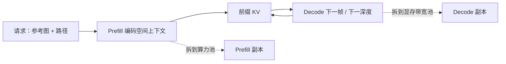

# 沿用 LLM 的 KV cache 与分离式服务

Atlas 是自回归 Transformer，因此可以吸收 LLM 服务端已经打磨过的 KV 缓存、缓存感知路由与分离式服务；它并未被声称成某个开源推理引擎上的官方插件。

<footer>—— 对照 World Labs Atlas 架构说明与 vLLM / DistServe 文献</footer>

世界模型若每出一帧都把参考图、已生成帧和文本从头算一遍注意力，长镜头的成本会按序列长度二次爆炸。Atlas 选择与现代 LLM 相同的骨架：对序列元素自回归，主干是 Transformer。World Labs 因此明确写：它可以受益于 KV-caching、cache-aware routing、disaggregated serving 等 LLM 侧的系统进展。本篇把这些进展当成可迁移的**思路**，对照 vLLM 与 DistServe 的公开概念，说明自回归扩散世界模型的哪一段像 prefill、哪一段像 decode。不要从这句话推出「Atlas 开源了 vLLM 插件」或「生产集群已经按 DistServe 部署」——官方没有这样写。

## 问题

LLM 解码的瓶颈是每步读出越来越长的 KV：[缓存体积随长度线性涨](/llm/kv-as-long-context)，算力却往往吃不满。vLLM 一类系统用分页管理 KV，减少碎片，让连续批处理吃满 GPU。另一条线发现 prefill（一次吃完提示）与 decode（逐步吐 token）的资源画像不同：前者算力密集，后者带宽密集，混在同一批里会互相拖累。DistServe 把两段拆到不同资源池，优化 goodput。

Atlas 的一步不是一个离散 token，而是一个多模态元素，内部还可能跑多步[潜空间去噪](/llm/atlas-diffusion-stack)。但它仍然是「先编码上下文，再一个一个生成后续元素」。参考图、位姿、文本构成前缀；后续帧构成生成段。若服务系统把前缀和生成绑在同一套调度上，长视频的前缀（多张 1440p 条件）会堵住短请求，生成段的 KV 读取又会让前缀算力闲置。问题是同一张账单：如何把 LLM 已经验证过的缓存与拆分，迁到自回归扩散上，而不改写注意力公式。

### 元素级自回归不等于 token 级内核已经现成

vLLM 的 PagedAttention 假设 KV 按 token 槽分页，头宽固定。Atlas 的一个「元素」可能是一整张潜空间图，token 化方式未公开。能直接搬的是调度语义，不一定是现成 CUDA 核。把「可以沿用」写成「明天就能 `pip install` 一个 atlas-vllm」，是把架构相容性说成了工程交付。

World Labs 的原句是 can take advantage of innovations used to serve and accelerate LLMs including KV-caching, cache-aware routing, disaggregated serving, and more。情态是能力与方向，不是部署清单。本篇只展开前三项的概念迁移，不编造 Atlas 的 QPS 数字。

## 方法

把一次 Atlas 请求写成两段。Prefill：把文本、参考图像、相机位姿、可选深度编码进 Transformer 上下文，写出前缀 KV。Decode：对 $t=1,\ldots,T$ 生成第 $t$ 个元素；生成时注意力只以查询形式读已缓存的前缀与 $1..t-1$，并把新元素的 KV 追加进去。这与因果 LLM 相同

$$
\mathrm{Attn}(q_t, K_{1:t-1}, V_{1:t-1}),
$$

差别在于 $q_t$ 可能来自扩散迭代中的带噪潜变量，且一步元素内部还有 $N$ 次去噪，每次是否共享同一套 KV，取决于实现是否把去噪步也展开进序列。公开材料没有给出这张计算图，方法上应把「元素间 KV」与「去噪步间 KV」分开设计，前者几乎肯定存在，后者是优化可选项。

分离式服务：前缀编码放到 compute 型副本，生成放到 memory 型副本，中间传 KV。cache-aware routing：同一空间上下文的多次查询（同一场景多轨迹、[多机位 reframing](/llm/atlas-video-reframe)、机器人多路径）应打到已持有该前缀 KV 的副本上，避免反复 prefill。这与会话粘滞、前缀缓存是同一类路由。

### 对照 vLLM 与 DistServe 而不绑定产品

Kwon 等人 2023 年的 vLLM 用 PagedAttention 把 KV 当成虚拟内存页，块可在请求间共享前缀。世界模型里，「同一组参考图」就是可共享前缀：十条不同相机路径不应复制十份参考图 KV。Zhong 等人 2024 年的 DistServe 指出 prefill/decode 干扰会伤害时延目标；Atlas 的前缀可能含多张高分辨率图，prefill 更重，拆分的动机只强不弱。这些是文献里的机制，迁移时要重做：页大小可能变成「一张图的 token 块」，而不是 16 个文本 token。

## 机制

KV 缓存能用，是因为注意力是因果的：生成元素 $t$ 不需要改写 $t$ 之前的键值（训练若是标准 next-element，推理就可以缓存）。扩散去噪若在元素内部迭代，每次迭代的查询变、键值若来自干净上下文则仍可缓存；若自条件也随噪声水平变，缓存命中率下降。这是扩散服务相对纯 LLM 的额外分叉，必须在实现时测量，而不是从博客推断已经解决。

分离的收益来自异质 roofline。Prefill 一张 1440p 条件图的 ViT 式 token 是大 GEMM；decode 一帧时，若上下文已长，瓶颈是扫 KV。混批会让短交互（单图新视角）等待长视频的 prefill。拆开之后，可以用不同并行度、不同量化、甚至不同 GPU 型号。路由则决定 KV 要不要在网上搬：搬 KV 的体积是 $O(L\cdot h_{\mathrm{kv}}\cdot d_k)$，图像 token 的 $L$ 很大，这是世界模型分离式服务比文本更疼的地方。

文本 DistServe 已经要认真对待 KV 传输带宽。图像元素令 $L$ 高一个数量级时，分离可能得不偿失，除非压缩 KV、分层传输或把 decode 与 prefill 放在同机高带宽互连上。官方只指出思路可迁移，没有公布互联选型。

### 缓存感知路由与空间上下文

空间上下文是可复用资产：同一房间的 $W$ 可以被导演路径、子弹时间查询、机器人机载查询反复读。路由键应是上下文哈希，而不是用户 ID。这与 LLM 的系统提示前缀缓存同构，只是值更大。若每次查询都当新会话，KV 收益只剩单次长镜头内部的逐步追加，吞吐会差一个前缀因子。

## 边界与工程取舍

兼容 LLM 服务思想，不等于兼容现成文本引擎的 API。元素粒度、VAE 潜空间形状、去噪步与 Transformer 步的交错，都可能让 PagedAttention 的块对齐失效。没有公开插件、没有模型 ID、没有 World API 上的 `atlas` 条目（公开发布时 API 仍以 Marble 模型为主），因此不能在运维文档里写「用 vLLM 部署 Atlas」。

扩散步数 $N$ 把 decode 放大 $N$ 倍：即使 KV 命中，每帧仍可能多次读同一份缓存。蒸馏减小 $N$ 会同时减轻服务压力，这是下一篇的算法杠杆，不是本篇的调度能单独解决的。量化 KV 会改生成几何，世界模型对空间一致性更敏感，文本里可接受的 4-bit KV 不一定能用。

「像 LLM 一样服务」容易让人以为交互延迟也像聊天模型。1440p、约一分钟的镜头即使 KV 全命中，仍可能是离线作业。RTFM 才是实时出帧那条产品线。本篇讨论的是 Atlas 离线/近线生成如何借用 LLM 系统栈，不是把聊天 TTFT 指标套到世界模型上。

批处理还要处理变长路径、变参考图数量。连续批在元素边界插入与退出，比在文本 token 边界更粗，气泡更大。这些都是迁移时要重做的工程，不是架构博客已经交付的开关。

## 小结

- 自回归 Transformer 使 Atlas 在概念上能用 KV 缓存：前缀与已生成元素的键值可追加复用。
- Prefill（编码空间上下文）与 decode（逐元素生成，内部或含扩散步）资源画像不同，分离式服务的动机与 DistServe 相同。
- 同一场景的多查询应走缓存感知路由，避免重复编码参考图。
- vLLM 的分页 KV 与 DistServe 的 PD 分离是对照文献，不是 Atlas 已发布的插件或集群配置。
- 图像级 $L$ 使 KV 传输更贵；去噪步数会放大 decode 读带宽。
- 实时交互与离线长镜头不要共用同一套延迟承诺。
- 出处：World Labs Team，*Atlas: A World Model for Spatial Intelligence*，World Labs Blog，2026；Kwon 等，vLLM / PagedAttention，SOSP 2023；Zhong 等，*DistServe*，OSDI 2024。
