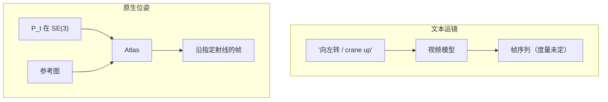

# 相机位姿作为原生输入而非文本描述

运镜不应写成「向左转」或「crane up」再碰运气；把外参当成与图像同级的输入，生成才能按指定射线看世界。

<footer>—— 归纳自 World Labs Atlas「pixel-perfect camera control」与评测设定</footer>

视频生成器控制相机的主流接口仍是自然语言或一组松散的运动标签：pan、truck、dolly。这些词没有度量，同一句「缓缓左移」可以对应无数条 $SE(3)$ 轨迹。Atlas 把精确相机几何列为原生输入类型，超出粗文本运镜。评测里它用原生格式编码目标路径，对照模型则把同一路径写成电影术语文本——官方也承认更好的提示工程也许能改善对照模型，但文本仍是那些模型最常见的运镜接口。本篇讲为什么原生位姿与文本不是程度差，而是类型差。

## 问题

相机是从三维世界到像素的投影，不是形容词。外参 $(R,t)$ 决定光心与朝向，内参 $K$ 决定焦距与主点。文本描述丢掉了这些度数，模型只能从训练视频里学「说到左转时像素通常怎么流」。复杂轨迹（连续几段不同的 cinematic 运动）下，文本条件与真实 $P_{1:T}$ 的互信息更低，跟随误差变大。Atlas 博客的人类评测正是：轨迹越复杂，原生相机相对文本运镜的优势越大。

世界模型还要把同一场景在多条路径下保持一致。若每条路径都用不同的散文去说，模型没有共享的几何变量去对齐「这是同一间房的另一次穿越」。原生 $P$ 让路径成为可替换的查询，场景条件可以保持不动。

### 文本运镜无法构成度量

设目标轨迹为 $P_{1:T}$，文本为 $s$。条件分布 $p(I_{1:T}\mid I_0,s)$ 即使得分高，也不保证存在可逆映射 $s\mapsto P_{1:T}$。度量跟随应用

$$
e_t=\mathrm{dist}(\hat P_t,P_t)
$$

需要从生成视频里再估 $\hat P_t$（例如用视觉里程计），误差里混有生成误差与估姿误差。原生输入把 $P_t$ 直接喂给网络，至少生成器没有「听错指令」这一层。估姿仍可用于评测是否真按 $P$ 投影，但训练接口已经是几何。

「向左转」在不同焦距、不同场景尺度下对应完全不同的像素位移。原生位姿把尺度放进 $t$ 的单位（米）与 $R$ 的弧度，不再让语言去承担度量。

## 方法

Atlas 的模态列表把 camera poses 与 text、images、depth 并列。每张图、每张深度图条件于显式相机。生成相机可控视频时，用户设计 $P_{1:T}$（博客中的一分钟 1440p 示例是手绘路径加少量参考图），模型沿路径出帧。像素级控制的含义是：指定位置与角度，而不是选一个运动形容词。从单张图生成场景的任意角度，包括物体背面与画面外的合理延续，也是同一接口：换 $P$，不换一套提示词。

对照设定值得单独记住，因为它界定了声明的范围：对照视频模型「不接受相机作为原生输入格式」，于是用标准电影术语在文本里描述路径。这不是说那些模型物理上无法吃位姿——只是公开接口与评测协议如此。Atlas 的增量是把 $P$ 放进预训练的多模态序列，而不是推理时用一个外挂位姿 ControlNet 去猜。

### 与空间上下文的衔接

原生相机若只在生成端出现、参考图却没有 $P$，模型仍可能把参考当风格板而不是空间观测。Atlas 要求图像与深度都钉在位姿上，见 [共享空间上下文](/llm/atlas-spatial-context)。于是参考与查询使用同一类几何对象，相对位姿 $P_\star P_j^{-1}$ 可计算。这比「图 + 一段话描述怎么转」少一次语言接地。

内参是否与外参一起作为原生输入，博客没有逐字段展开。没有 $K$ 时，焦距变化只能靠裁切或生成去猜，像素级跟随在变焦镜头上会弱一截。写作不要断言 Atlas 已把任意镜头畸变当成一等模态。

## 机制

Transformer 要「看见」$P$，必须把 $SE(3)$ 编成 token 或与视觉 token 相加的特征：旋转可用四元数或 6D 连续表示，平移要处理尺度。一旦编码存在，注意力就能把「查询位姿」与「已观测位姿」配对，这是几何，不是句法。扩散/整流流在去噪 $I_\star$ 时每步读取这些配对，等于在连续外观上执行条件新视合成。

文本运镜走的是另一套接地：词嵌入 → 交叉注意力 → 外观。语言先映射到训练时见过的运镜簇，再变成像素流。簇外的轨迹（不规则的手绘路径、精确停在某像素上的构图）没有词可对。原生 $P$ 把这条语言瓶颈拆掉。CFG 仍可用于文本风格，但相机不应靠 CFG 从「left」这个词里挤出来。

## 边界与工程取舍

原生位姿把负担转给用户或上游：路径从哪来？手绘、从 SLAM 来、从导演软件来，质量上限不同。位姿与内容不匹配时（参考图其实不是从声称的 $P$ 拍的），模型会在服从相机与服从像素之间撕裂，表现为扭曲。对照实验用文本描述路径，对文本模型不公平或公平取决于产品真实接口；Atlas 自己写了这条免责。不要把人类偏好百分比抄成物理误差毫米。

### 相对位姿比世界原点更要紧

生成关心的是 $P_\star P_j^{-1}$：查询相对已见观测怎么转、怎么移。把所有相机放进某个任意世界坐标系，只要相对量对，渲染应不变。文本运镜连相对量都没有：它没有「相对参考图的光心平移了 0.4 米」。原生 $P$ 的最小完备集其实是相对位姿加内参；绝对原点只是记账。实现若把绝对坐标喂进网络却不做归一化，尺度会漂。公开材料没写 Atlas 如何归一化平移，只写几何是原生输入——工程上仍要处理米与无量纲化。

也不要把「原生相机」写成已有 arXiv 上的 Atlas 位姿编码器图。出处仍是 World Labs Atlas 博客。图形学里相机从来是原生的；新意在于生成模型把 $P$ 当成与 RGB 同级的预训练模态，而不是后期用 ControlNet 补。

## 小结

- 文本运镜没有 $SE(3)$ 度量；原生位姿把位置与朝向直接送进模型。
- Atlas 将 camera poses 列为与图像、深度并列的输入；每张图条件于自己的 $P$。
- 评测中对照模型吃电影术语文本，Atlas 吃原生路径；复杂轨迹上差距被用来支持这一接口选择。
- 参考图同样要钉位姿，否则相机只是生成端的方向盘、不是空间上下文。
- 路径质量、内外参是否齐全、位姿与像素是否同源，决定跟随能有多「像素级」。
- 出处：World Labs Atlas 博客。对照 Ho 系视频扩散的文本条件；无 Atlas arXiv。
