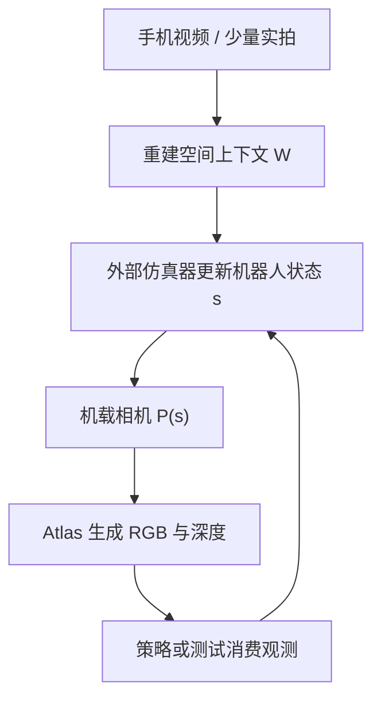

# Real-to-Sim：重建场景并生成机器人传感器视图

重建只是一半工作：当模拟里的机器人在空间中移动，Atlas 还要写出机载相机本应看到的 RGB 与深度；世界与机器人对世界的观测来自同一模型。

<footer>—— 改写自 World Labs Team, Atlas, 2026</footer>

机器人学习长期被「真机小时」卡住。仿真便宜，但渲染器的外观、深度噪声和场景布局对不上目标房间，策略一过实机就掉。Real-to-Sim 的想法是：先把真实场地变成可查询的模拟资产，再在里面大量采样。Atlas 在这条链上被放在视觉层——用少量真实图像或手机视频重建场地，然后沿仿真机器人的机位生成传感器视图。本篇只写这一层，不把 World Labs 更早的 Real-to-Sim-to-Real 全栈（物理、策略训练、实机回环）说成 Atlas 独力完成。

## 问题

标准仿真器用网格、材质和光栅化或光线追踪出图。要让它像某一间真实实验室，需要人工建模或昂贵扫描。扫描得到的网格还要挂上机器人相机的内参、外参、深度量化与延迟，否则策略学到的是「仿真相机」而不是「那台 RealSense 的像」。生成视频模型能出好看的走廊，却给不出与机器人状态 $s$ 对应的观测 $o$，因为 $s$ 在物理引擎里走，观测必须是 $s$ 的函数。

需要的接口是：真实场地 $\rightarrow$ 可查询世界 $W$；仿真器给出机器人相机 $P(s)$ $\rightarrow$ 模型返回 $\hat{o}=(I,D)$。$W$ 与 $\hat{o}$ 必须同源，否则重建用一套几何、渲染用另一套外观，域随机化会打在错误的差上。Atlas 的公开叙述正是这个接口：少量图像重建显式三维，再沿不同机器人路径生成机载 RGB 与深度。

### 导航与操作对 $W$ 的要求不同

导航示例里，官方用手机视频扫两处大环境，各取 24 帧重建，再模拟不同形态的机器人走不同路径，写出机身相机图像。这里 $W$ 主要是可行走空间的外观与大致几何，深度用于障碍的视觉信号。操作则进一步：要从几段随意录制里辅助建立「物体如何动、如何交互」的仿真，并在任务被模拟之后改物体、位姿、机器人运动、光照与背景。操作需要的 $W$ 含可动实体，不只是一张静场。

官方用词是 Atlas「aids in building」操作仿真，以及「opens up new ways to scale Real-to-Sim」。这是贡献重建与传感器视图，不是宣称 Atlas 内部有完整刚体/关节/可变形求解器。物理步进仍应默认在外部引擎；Atlas 提供看起来像那间真房间的观测。

## 方法

捕获可以极简：手机视频，关键帧进入空间上下文。重建阶段与[稀疏视角重建](/llm/atlas-sparse-view-recon) 相同，并可[写出点云或溅射](/llm/atlas-3d-writeout) 供仿真器里放置机器人。仿真循环每一步读取策略或脚本给出的相机 $P_t$（由机器人运动学算来），向 Atlas 查询该位姿上的 $I_t,D_t$。于是

$$
\hat{o}_t = f_\theta\bigl(P_t, W(\{I_k,P_k\})\bigr),
$$

其中 $W$ 是由真实观测锚定的空间上下文，$f_\theta$ 是同一 omni 模型。导航演示强调传统扫描这类空间需要昂贵设备，而这里 24 帧量级的手机帧已经能支撑多路径视觉。

操作路径上，官方展示从少量真实录像重建刚体、关节与可变形物的交互，并支持可控变体。把变体写成对条件的编辑：改物体集合、相对位姿、光照，再让 $f_\theta$ 出新观测。训练数据扩增发生在观测空间：同一物理轨迹可以对应多种视觉条件，只要 $P_t$ 仍由仿真状态给出。

### 为何强调「同一模型」

若重建用 NeRF、传感器用另一套神经渲染，坐标、尺度和时间衰减会对不齐。同一 $\theta$ 既解释训练图像又解释机载查询，投影关系至少共享一套先验。这并不能消灭尺度歧义：手机视频没有绝对米制，仿真器里的米必须与 $W$ 对齐，否则 $P(s)$ 会插进墙里。方法上要有一次显式的尺度标定（已知物体、地面网格或深度相机），Atlas 发布说明没有把这一步写进模型。

## 机制

Real-to-Sim 的视觉层解决的是观测函数近似：$p(o\mid s,\text{真实场地})$。物理 $p(s'\mid s,a)$ 仍是另一对象。Atlas 擅长前者：位姿条件的图像与深度。当操作演示里出现物体运动，有两种可能机制——（1）视频先验在生成观测时「演」出运动；（2）外部引擎积分接触力，Atlas 只渲染结果状态。公开材料没有拆开这两层。负责任的机制叙述是：外观与深度查询已展示；接触、摩擦、质量是否由 Atlas 内部完成，未作为可复现接口给出。

导航里多路径查询与「同一场景多轨迹」相同：24 帧把走廊钉住，不同机器人只是不同的 $P(t)$ 序列。机载相机通常是广角、低挂、有自遮挡（手臂、底盘）。训练若偏电影机位，机载域仍会有缺口。官方特意展示 body-mounted 视角，说明这条域是产品意图，但没有报机载深度的度量误差或闭路上的导航成功率。

传感器视图包含深度，并不等于仿真器可以关掉碰撞。生成深度可以穿模、可以平滑掉细杆。策略训练仍需要一套碰撞几何——溅射或点云的简化网格、或人工碰撞体。Atlas 写出几何可以当初始化，不能默认当物理世界。

### 域随机化落在哪一层

改光照与背景是视觉随机化，适合放在 $f_\theta$ 的条件上。改质量与摩擦是物理随机化，必须放在引擎。把两者都说成「Atlas 可控变体」会让人以为一个扩散模型在积分牛顿定律。正确拆分之后，Real-to-Sim 的扩增能力仍然很大：同一真实房间可以出无数机载轨迹与外观变体，这正是真机数据采集做不到的密度。

## 边界与工程取舍

没有公开的机载深度误差、内参标定流程、激光雷达或触觉接口。Atlas 披露的模态是文本、图像、相机位姿与深度图；关节角、力、IMU 不是原生 token。闭环控制还要把观测延迟、滚动快门和压缩噪声建模进去，否则 $f_\theta$ 的干净帧会比真机「更好看」也更骗策略。安全关键部署前，必须在真机上做 sim-to-real 对照；官方未把 Atlas 单独的实机迁移数字写出来。

操作演示中的可变形体尤其需要外部求解器或另行学习的动力学。生成模型容易给出看起来对的褶皱，能量却不守恒。评测应分开报：几何重建误差、观测外观 FID 一类、以及策略在真机上的成功率。只报好看的机载视频，等于只测了 $f_\theta$ 的演示切片。

World Labs 另有 Real-to-Sim-to-Real 系统叙述，含标定、物理变体、策略训练与「仿真表现能否预测实机」。Atlas 博客把机器人段落放在该方向下，但没有一张图把每个模块标成 Atlas 或非 Atlas。引用时写「Atlas 提供重建与传感器视图」，不要写「Atlas 就是整条 R2S2R」。

早鸟访问意味着多数实验室还不能把 $f_\theta$ 嵌进 Isaac / MuJoCo 循环里测延迟。在可测之前，这篇的工程结论停在接口设计：真世界 $\rightarrow W$；仿真 $P(s)$ $\rightarrow$ 同源 $I,D$。

## 小结

- Real-to-Sim 在 Atlas 上的含义是：用真实稀疏观测重建场景，再按机器人相机位姿生成 RGB 与深度。
- 导航演示可用约 24 帧手机关键帧支撑多路径机载视图；操作需要额外的物体与交互建模，官方措辞是「辅助构建」。
- 世界 $W$ 与观测 $\hat{o}$ 应来自同一模型，以免重建与渲染坐标系分裂。
- 物理积分、碰撞、力觉默认不在已披露的 Atlas 模态里。
- 尺度标定、机载域、噪声模型仍是仿真器与传感器侧的作业。
- 不要把更广的 R2S2R 全栈等同于这一篇的视觉层。
- 出处：World Labs Team，*Atlas: A World Model for Spatial Intelligence*，World Labs Blog，2026。
