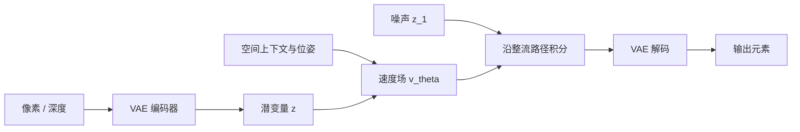

# Rectified flow 潜空间扩散

连续外观在压缩后的潜变量里沿近似直线的速度场从噪声流向数据；步数可以换质量，而不必在像素上跑完离散马尔可夫链。

<footer>—— Lipman et al., Flow Matching for Generative Modeling, 2023；Atlas 称自身为 rectified flow 的潜扩散模型</footer>

Atlas 的扩散一词有两层公开含义。第一，它是 rectified flow 模型，用逐步去噪生成高维连续数据，推理时可用步数换质量。第二，它是 latent diffusion model，去噪发生在 VAE 潜空间，并可使用蒸馏、CFG、偏移噪声日程与 VAE 进展。World Labs 没有为 Atlas 发表带 arXiv 编号的技术报告；整流流与流匹配的公式应回到 Lipman 等人 2023 年的工作（以及同期把路径拉直的整流流叙述），潜空间扩散回到 Rombach 等人的 LDM，离散时间去噪对照 Ho 等人的 DDPM。本篇只写这条生成内核，不把 Atlas 的层数写进不存在的论文。

## 问题

图像与深度不能像词一样做 softmax。DDPM 把数据逐步加高斯噪声到近似先验，再学反向去噪：

$$
q(x_t\mid x_0)=\mathcal{N}\bigl(x_t;\sqrt{\bar\alpha_t}x_0,(1-\bar\alpha_t)I\bigr).
$$

这条链在像素上算力极高。LDM 的回答是先把 $x$ 编成 $z=\mathcal{E}(x)$，在 $z$ 上扩散，解码 $\mathcal{D}(z)$。世界模型还要在潜空间里条件于空间上下文与相机，并且推理步数必须可调：展示用多步，产品用少步。标准 DDPM 的弯曲采样轨迹使少步时误差大，于是需要更直的流。

整流流 / 流匹配把生成看成沿时间 $t\in[0,1]$ 的常微分方程，而不是必须五十到一千步的马尔可夫链。目标是学速度场，使粒子从噪声走到数据。路径越直，少步欧拉积分越准，也越适合蒸馏。

### 潜空间与整流流解决的不是同一件事

潜空间降低的是每步的维数与感受野设计难度（感知压缩把高频交给解码器）。整流流改善的是从先验到数据的路径几何。可以在像素上做整流流，也可以在潜空间做 DDPM；Atlas 声明二者都要。缺少任何一侧，要么 1440p 算不起，要么少步时结构塌。

「Atlas 是整流流」不等于公开了具体的 $t$ 采样、是否 OT 耦合、CFG 加在速度上还是噪声上。那些是实现选择。本篇写公开代数，不写虚构超参。

## 方法

流匹配把条件路径定为从数据 $z_0$ 到噪声 $z_1$ 的插值。一条直线（最优传输条件流、与整流流叙述一致的形式）是

$$
z_t=(1-t)z_0+t z_1,\qquad
u_t(z_t\mid z_0,z_1)=z_1-z_0.
$$

网络 $v_\theta(z_t,t,c)$ 条件于空间上下文 $c$（含位姿与参考潜变量），回归 $u_t$。训练目标为

$$
\mathcal{L}=\mathbb{E}\bigl\|v_\theta(z_t,t,c)-(z_1-z_0)\bigr\|_2^2.
$$

推理从 $z_1\sim\mathcal{N}(0,I)$ 积 $\mathrm{d}z=v_\theta\mathrm{d}t$ 到 $t=0$，再 $\hat x=\mathcal{D}(z_0)$。步数 $N$ 就是把 $[0,1]$ 切成 $N$ 段。Atlas 所说「用去噪步数换速度与质量」，在这条 ODE 上就是 $N$ 的选择。蒸馏则学一个更少步仍近似同一终点的学生场。

CFG（Ho & Salimans）在扩散里把有条件与无条件预测外推。对速度场可以写成

$$
\tilde v=v_{\emptyset}+s\bigl(v_c-v_{\emptyset}\bigr),
$$

$s>1$ 加强文本或参考服从。这是家族技巧；Atlas 只说可以使用，没有给出 $s$ 的默认值。

### 与 DDPM 的对照

DDPM 学的是噪声 $\varepsilon_\theta$ 或 $x_0$ 预测，采样是离散反向链。整流流学速度，采样是 ODE。经验上直线路径在少步时更稳，这是视频与世界模型愿意换到 flow 的原因。LDM 与二者正交：无论 $\varepsilon$ 还是 $v$，都可以在 $z$ 上算。Rombach 等人证明高分辨率生成的瓶颈往往在像素扩散，不在骨干姓 Transformer 还是 U-Net。Atlas 的骨干是 Transformer，潜空间仍然必要，否则每个视觉元素的 token 数按像素计。

偏移噪声日程、感知压缩的下采样倍数、潜维，博客均未给出。写「Atlas 使用与 SD3 相同的 VAE」是猜测。只能写：它宣称自己是潜扩散，因而与 VAE 设计进展兼容。

### 条件出现在速度场里而不是事后warp

若先无条件出图再按 $P$ 去 warp，几何正确但遮挡与新可见面无法生成。整流流把 $c$（含查询位姿与参考潜变量）放进 $v_\theta(\cdot,t,c)$，每一步去噪都在问「这个 $P$ 下像素该是什么」，包括从未见过的背面。这与图形学的重投影+空洞填充不同：空洞由生成填，而不是只靠插值。少步时 $c$ 若弱，速度场会走向平均场景，形变重新出现——这是 [RTFM 形变](/llm/rtfm-morphing) 在 Atlas 内核上的对应物。

ODE 步数与自回归元素数是两笔账。加长视频是多元素，提高单帧清晰度往往是多步或更好的 VAE。把「一分钟」写成「扩散走了一分钟」是范畴错误。

## 机制

自回归与整流流接在元素边界上：抽到下一个元素是图像时，才在该元素的 $z$ 上跑 ODE；文本元素仍可以是离散。于是 KV 缓存的是已经完成的元素（及其注意力键值），不是 ODE 的中间 $t$。这与 LLM 兼容：服务框架看到的是变长序列，扩散是元素内部的循环。分离式 serving、cache-aware 路由之所以「可以沿用」，依据是这层接口，而不是已经公开了一张 Atlas 集群图。

空间条件 $c$ 在每一步 $t$ 注入，使去噪过程始终看见参考视与查询位姿。少步时，若 $c$ 弱（文本运镜、无 $P$），ODE 会抄近路到平均外观，表现为形变。原生相机与空间锚定的意义，有一部分就是给 $v_\theta$ 一条不能忽略的几何条件，减少少步积分的歧义。即便如此，整流流不创造三维元素：它只是在给定条件下运输概率质量。

## 边界与工程取舍

没有 Atlas 的训练曲线、步数–FID 表、蒸馏比。1440p 一分钟是展示，不说明 ODE 步数。VAE 会丢掉解码器补不回的高频，再强的流也回不到那些细节；深度与 splat 写出还依赖深度作为元素类型，不只依赖 RGB 潜空间。DDPM 文献里的很多稳定性技巧（学习方差、v-prediction）是否用在 Atlas 上，未知。

引用时分开三层：Lipman et al., *Flow Matching for Generative Modeling*, 2023（流匹配；直线路径与整流流叙述同属这一脉络）；Rombach et al., *High-Resolution Image Synthesis with Latent Diffusion Models*, 2022；Ho et al., DDPM, 2020；Ho & Salimans, CFG。Atlas 自身只应引用 World Labs 2026 年博客，不要给它编造论文编号。

## 小结

- Atlas 的生成内核是潜空间里的整流流：VAE 压维，速度场把噪声运到数据。
- 直线条件路径使少步积分与蒸馏成为合理的速度/质量旋钮。
- 这与 DDPM 的离散链、LDM 的潜空间、CFG 的条件外推是可组合的家族工具，不是 Atlas 独有公式。
- 自回归发生在元素之间，ODE 发生在元素之内，故能接 LLM 式 KV。
- 流不替代空间位姿：条件弱时少步更易形变。
- 出处：Lipman et al. 2023；Rombach LDM；Ho DDPM；CFG（Ho & Salimans）。Atlas 实现以官方博客为准，无 World Labs arXiv。
