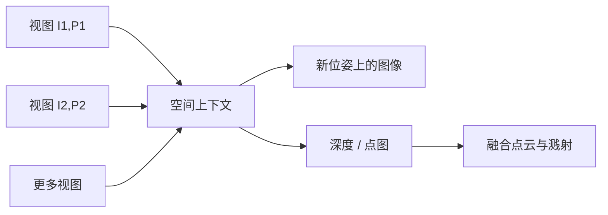

# 稀疏视角新视角合成与三维重建

从极少输入图像做新视角合成，是三维视觉里一个几十年的基本问题；Atlas 把它收进同一个 omni 世界模型，而不是再训一个专用重建网络。

<footer>—— World Labs Team, Atlas: A World Model for Spatial Intelligence, 2026</footer>

密集采集下，多视立体与神经辐射场已经能把场景「扫描」出来。真正难的是稀疏：一两张、三五张、最多几十张带位姿的图，中间有大块未见表面。专用重建模型在这条赛道上卷点图误差；生成模型则容易把未见区域编成好看但不忠于证据的内容。Atlas 的空间重建把两件事放进同一序列：根据已有视图写出新视角图像，同时写出[深度与点云](/llm/atlas-3d-writeout)。观测越多，想象越少。本篇只讨论这条稀疏新视角合成与重建，不把相机可控长视频的导演轨迹写成重建评测。

## 问题

新视角合成（Novel View Synthesis, NVS）要的是：给定图像集合 $\{I_i\}$ 与相机 $\{P_i\}$，对未见相机 $P_*$ 预测 $I_*$。当视图稠密且基线小，问题接近插值；当视图极少，问题变成有约束的生成。三维重建还要求显式几何，例如每个输入像素对应的三维点。两者相关但不可互换：能出漂亮 $I_*$ 的模型可以没有可用点图；点图误差低的模型可以不会沿着一条电影机位飞。

稀疏的根源是信息论上的：单张图无法决定遮挡面与画外结构。经典多视几何用极线与光度一致性约束可见重叠；重叠不够时，约束消失，必须引入先验。NeRF 一类方法用体积密度吸收多视，但仍要相当数量的图才稳。需要一种系统：先验来自大规模世界模型预训练，约束来自把每张图钉在三维位姿上的[共享空间上下文](/llm/atlas-spatial-context)，并且允许用户用加图来连续地把「想象」换成「看见」。

### 加图是在减小生成支路的权重

World Labs 用一组逐步加图的例子说明机制：一张地面花园照片可以长出合理的航拍，花园本身对齐，周围房屋却是编的；补上小屋、再补主屋，编造区域被真实观测替换。这不是广告话术，而是稀疏重建的操作定义：**保真度是观测覆盖的函数**。评测若只给一张图就报「完整三维世界」，必须把未见表面标成生成，而不是重建。

「两到三张图通常已能忠实重建」是官方对常见场景的经验陈述，不是定理。纹理重复、强反光、大基线、标定误差都会把「忠实」所需的视图数推高。反过来，上百张图可以进空间上下文，说明序列长度被设计成可变，而不是固定三视图网络。

## 方法

输入是可变数量的带位姿图像，少到一张，多到演示中的上百张。每张图与其相机 $P_i$ 一起编码进空间上下文。任务序列的输出段可以是：新位姿 $P_*$ 上的图像、对应深度、以及由多视深度融合得到的点图。Atlas 是自回归扩散，因此「重建」并不是一次前馈回归所有三维点，而是按元素写出：先（或同时）满足已见视图的几何，再在新 $P_*$ 上去噪出帧。

点图任务与学术基准对齐时，可写成：对每个输入像素 $u$，预测世界点 $X(u)$。相对绝对误差一类指标比较 $\|X(u)-X^\star(u)\|$ 与真值尺度。World Labs 在 DTU、ETH3D、KITTI 等常用集上报告点图误差，并称优于若干开源专用重建模型。这些数字是公司协议下的结果，复现需要同一对齐、掩码与尺度处理；本篇把它们当作「omni 模型可以参加重建赛道」的证据，而不是把排行榜抄进方法定义。

### 同一场景、多条轨迹

稀疏重建的产品用法往往不是「输出一个 ply 就结束」，而是对同一组输入反复查询不同相机路径。官方演示强调：改轨迹时场景保持一致。机制上，这要求上下文里的三维锚点在多次查询间复用，而不是每次把世界重新采样一遍。一致性来自共享上下文，而不是来自一个冻结的网格缓存；若服务端每次丢掉上下文重算，轨迹之间就会漂。这一点与[长视频的空间上下文管理](/llm/atlas-camera-controlled-video)是同一旋钮在重建任务上的用法。

## 机制

稀疏 NVS 的条件分布可以写成

$$
p(I_*\mid \{I_i,P_i\}, P_*) .
$$

当 $\{I_i\}$ 覆盖 $P_*$ 附近的表面，$p$ 接近被观测约束的窄峰；当 $P_*$ 飞到屋顶或背面，$p$ 变宽，采样依赖预训练先验。Atlas 同时建模深度，相当于再条件一层几何

$$
p(I_*,D_*\mid \{I_i,P_i,D_i\}, P_*) ,
$$

使新视角不仅「像那张图」，还要能反投影回与已有点云相容的表面。专用重建模型通常只优化 $X(u)$，不负责沿任意电影路径出 1440p 视频；专用视频模型通常不接受原生 $P_i$，也不出点图。omni 的意思是同一套权重能切两种序列编排，而不是在重建基准上每一项都必然碾压专家。

官方相机跟随评测把位姿几何直接喂给 Atlas，把文本机位描述喂给对照视频模型，这测的是接口是否匹配，不是通用画质冠军。重建评测则是另一张表。写文章时不要把两张表的结论叠成一句「全面 SOTA」。

### 先验与证据如何分工

生成式世界模型的危险是把先验写进本该留给测量的地方。Atlas 的公开叙述把分工说清楚了：看不见的部分用世界知识填；你若不要想象，就加图。工程含义是交互式覆盖：先少图出可导航预览，再针对漂的区域补拍。这与传统 SfM「必须先拍够再跑」的批处理不同，也与单图深度网络「永远在猜背面」不同。用户界面若不允许加约束，模型会一直猜。

## 边界与工程取舍

稀疏重建不提供自动的度量尺度、语义实例或材质。点图误差低不等于可以拿去做测绘或安全关键定位。动态物体、透明与镜面会破坏多视光度假设；公开演示偏建筑与相对静态的室外场景，不能外推到快运动的人物特写。位姿若来自不准确的 SLAM，空间上下文本身是歪的，后面的「像素级相机控制」只是在歪几何上精确。

学术对照应使用开源重建模型的公开权重与同一协议。World Labs 声明复现了基线，但未同时开源 Atlas 的评测脚本与检查点。把博客柱状图写进论文相关工作时，应标注为公司评测。训练数据、是否与基准集污染、参数量均未披露，因此「因为更大所以更好」无法被外部验证；可验证的是任务形式：可变视图数、位姿条件、图像与几何双输出。

单图「重建」在几何上不可辨识背面。诚实的产品文案是：可见表面被锚定，其余是补全。VFX 可以用补全；机器人若把补全墙当障碍，会在真空处刹车或在真墙处穿模。Real-to-Sim 路径必须另标哪些表面是观测、哪些是生成，见[重建后再渲传感器视图](/llm/atlas-real-to-sim)。

上下文长度有上限。上百张图可以进空间上下文，不等于任意城市街区的所有帧都能一次塞入。超大场景仍要选择关键帧、分块或检索，那些系统问题在发布说明里没有展开。重建质量还会随相机路径与训练分布的差异下降：极端俯仰、滚转、鱼眼，若预训练少见，稀疏先验会失效。

## 小结

- 稀疏新视角合成在观测不足时必须靠先验；Atlas 用带位姿的空间上下文提供约束，用预训练提供补全。
- 加图连续降低想象比例，两到三张是官方给出的常见忠实重建起点，不是下限定理。
- 同一模型可出新视角图像与显式点图 / 深度，从而同时参加 NVS 与重建式工作流。
- 多轨迹查询依赖共享上下文，而不是每次重新生成一个互不相干的世界。
- 公司重建评测表明 omni 模型可以硬碰专用开源重建器，但协议与污染控制不可由外部审计。
- 单视与未见表面必须标成生成；动态、反射、度量尺度仍是边界。
- 出处：World Labs Team，*Atlas: A World Model for Spatial Intelligence*，World Labs Blog，2026。经典 NVS 背景见 Mildenhall 等，*NeRF*，ECCV 2020。
