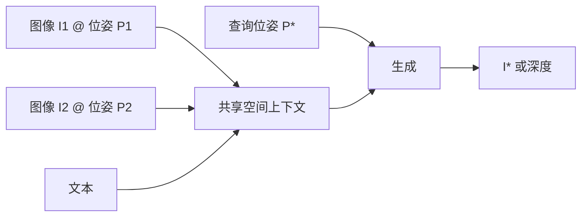

# 共享空间上下文：图像锚定在三维位姿

上下文里的每一张图都钉在三维位置上；模型问的不是「时间上上一帧是什么」，而是「空间里这边已经看见了什么」。

<footer>—— 归纳自 World Labs Atlas「spatial context」叙述</footer>

普通视频模型的上下文是时间序：帧按拍摄或生成的先后排列。Atlas 把每张图像（以及深度图）放在三维位姿上，形成一个共享的空间上下文。参考图不必来自同一条连续镜头，也可以是两张无关的图被摆在空间里的两个位置，模型在其间生成过渡世界。这是 ARDT 相对「图文拼接 VLM」的真正增量：共享的不只是 token 槽位，而是欧氏空间里的观测。本篇只讲锚定；相机如何作为原生输入见 [相机位姿作为原生输入](/llm/atlas-native-camera)。

## 问题

若图像只作为无位姿的 token 进 Transformer，注意力可以学会「这些像素常一起出现」，但无法被查询「把相机放到 $R,t$」。新视合成、多图拼接、在两张参考之间插值出走廊，都需要「看见」与「从哪看见」绑在一起。SfM 与 NeRF 把这件事做成几何管线：先估相机，再优化场。生成模型若把相机丢掉，用户只能用文本形容机位，空间任务就退化成语言游戏。

共享还意味着多张图、多种模态占用同一份条件，而不是每个任务一个编码器互不看见。文本描述风格，图像提供外观，深度提供表面，位姿提供射线——若它们不在同一注意力池里，模型无法用一张图的墙去约束另一张图的墙。

### 锚定不是加一条旁路特征

「把位姿向量 concat 到 CLS」只是弱条件：网络可以忽略它，仍靠时间顺序做事。锚定要求生成第 $k$ 张图时，其投影几何由该图自己的 $P_k$ 决定，并且注意力能按空间关系找到应当一致的其他观测。弱先验是：世界是三维欧氏的，同一表面的两次观测应当能对上。这与 [RTFM](/llm/worldlabs-rtfm) 用带位姿的帧当空间记忆是同一类归纳偏置，Atlas 把它写成预训练 omni 模型的中心机制。

官方示例：把两张无关参考图放进上下文并指定它们在三维里的位置，Atlas 生成平滑过渡（门廊、过道）。这证明上下文索引是空间的——时间上这两张图从未相邻。

## 方法

接口可以抽象为观测集合 $\{(I_j,P_j)\}_j$，外加可选文本与深度。$P_j\in\mathrm{SE}(3)$ 给出相机到世界（或世界到相机）的刚体变换；内参若存在，则射线

$$
\mathbf{r}(u,v)=R^\top K^{-1}(u,v,1)^\top
$$

与图像像素绑定。生成新观测 $(I_\star,P_\star)$ 时，条件是整份空间上下文，而不是「时间上最后一帧」。管理这份上下文成为创意控制：多放真实照片，模型更偏重建；只放一张，模型必须想象背面与场外。博客用逐步加参考图的斯坦福主四（Main Quad）例子说明：看见得越多，想象越少。

同一套上下文也可以服务非视频任务：给定带位姿的图，预测每个输入像素对应的三维点，这是稀疏视重建。空间锚定让「像素属于哪根相机射线」成为原生信息，不必从图像内容里猜外参。

### 与时间上下文的差别

时间上下文里，相邻 token 的默认关系是「下一时刻」。空间上下文里，相邻关系应由 $P_i,P_j$ 的相对位姿诱导：朝向同一房间的两张图即使拍摄间隔一年，也应能互相约束。实现上可以用相对位姿编码、把 $P$ 变成与视觉 token 相加的条件，或构造空间上的检索（类似 RTFM 的 juggling）。Atlas 没有公开注意力是否按空间稀疏。能确定的是：条件里有显式 $P$，任务描述是空间上下文，而不是「视频窗口」。

### 重建与想象的连续谱

同一空间上下文里，观测密度决定模型该有多自由。一张地面照片要出鸟瞰，大部分像素必须想象，花园若在输入里则应被钉住。加第二、第三张真实照片，被钉住的区域扩大，想象退到尚未看见的立面。这不是两个模型切换，而是 $p(I_\star\mid\{(I_j,P_j)\},P_\star)$ 随条件集合变尖。用户若把想象区当成测绘成果，是接口误用；应继续加观测，而不是抱怨模型「乱编」——视少时想象是设计行为。

空间上下文不自动给出物理仿真。钉住的是观测的几何，不是质量与摩擦力。物体如何运动仍要时间维，见 [视频作为带位姿的图像序列](/llm/atlas-video-as-frames)。

## 机制

注意力在带位姿的视觉 token 上运算时，可以学习到：若 $P_i$ 与 $P_\star$ 共享可见重叠，则 $I_i$ 的 patch 对 $I_\star$ 的对应 patch 权重大。这不必手写极线，但位姿必须可被编码，否则网络没有变量去表示重叠。生成时整流流在潜空间里去噪 $I_\star$，每一步都能读这份上下文，于是多视一致是条件问题，而不是事后用 NeRF 再拟合一遍。

共享上下文不是无限的。注意力仍随 token 二次增长；上百张输入图如何截断或分页，博客没有公开。写「空间上下文等于无限记忆」会与 Transformer 的长度墙打架。

两张无关图的插值能成立，是因为空间上下文允许「中间位姿」成为合法查询：模型沿 $P(t)$ 从 $P_1$ 走到 $P_2$，每步生成都应同时像两端。失败则表现为走廊里物体身份切换——空间上下文给了问题形式，没有保证解唯一。视少时想象是功能，不是 bug；用户若要忠实重建，必须加观测。

## 边界与工程取舍

位姿误差会把锚定变成错误射线。真实照片若外参来自粗糙 SLAM，空间上下文会强迫模型对齐到错误的三维，表现为重影或弯曲。博客评测重建时「模型收到图像及其相机位姿」，假定位姿已知；野外没有位姿时，Atlas 是否联合估外参未作为本篇可引用事实。上下文容量也有限：官方称可以用到上百张输入图，但注意力仍二次；如何截断、如何分页，没有公开。

不要把「共享空间上下文」写成已发表的 World Labs 论文模块名去查 arXiv。出处是 2026 年 Atlas 博客。对照：NeRF / 3DGS 把场定义在三维坐标上；Atlas 把观测定义在三维位姿上，场可以仍是隐式的，直到它选择写出深度、点云或 splat。

## 小结

- 空间上下文 = 图像与深度钉在显式三维位姿上，与文本等模态共享同一条件池。
- 查询是「从这个 $P_\star$ 看世界」，不是「按时间播放下一帧」。
- 参考图多少调节重建与想象的比例；无关图可按空间摆放再生成过渡。
- 锚定使稀疏重建的射线成为原生信息，而不是从像素里猜相机。
- 位姿噪声、上下文截断、视少外推仍会造成不一致；空间索引不是物理引擎。
- 出处：World Labs Atlas 博客。对照 RTFM 的 posed frames；无 Atlas arXiv。
