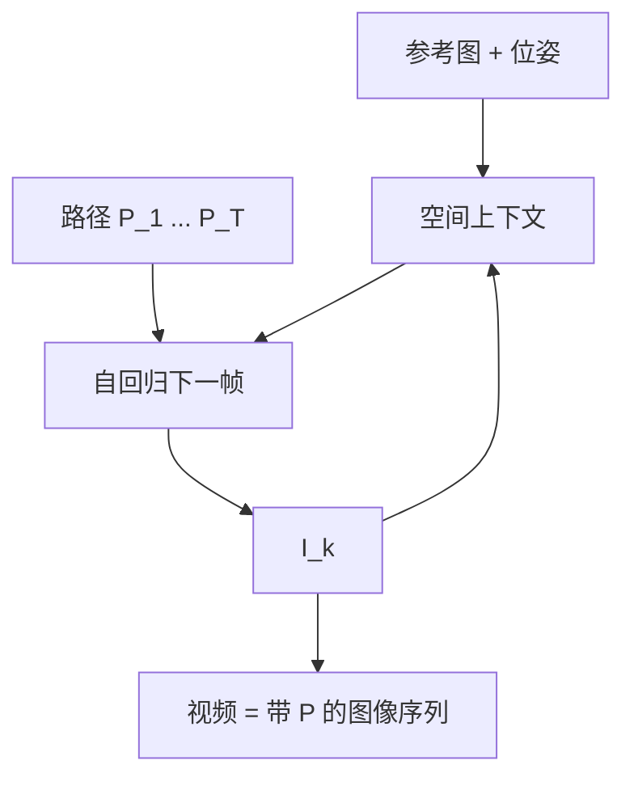

# 视频作为带位姿的图像序列

视频不是另一种需要单独词表的模态；它是按时间排列、每张都钉着相机位姿的图像，空间上下文沿轨迹被查询。

<footer>—— World Labs Atlas：videos are represented as sequences of images，每张图条件于显式相机</footer>

多模态模型常把视频做成第三套编码器：时间补丁、3D 卷积、或沿帧的独立 ViT 再加时间注意力。Atlas 的公开定义更省：视频就是图像序列，每张图像带位姿。于是生成一分钟镜头、在真实视频上做 reframing、从录像重建点云，都是在同一套「带 $P$ 的图」上改序列模板，而不是切换到另一个骨干。本篇讲这个表示选择的后果，以及它与「无位姿的帧堆」差在哪里。

## 问题

若视频是无位姿的 RGB 堆 $I_{1:T}$，模型看见的运动混合了相机运动与场景运动，无法单独控制其中一项。电影运镜、机器人沿轨迹看、子弹时间（时间几乎冻结、相机在空间里绕）要求把 $t$ 与 $P$ 拆开：时间可以停，位姿仍可改。没有每帧 $P$，子弹时间只能靠「转圈」的文本去碰。

另一个问题是长度。一分钟 1440p 若当单一 4D 张量一次扩散，内存与注意力会按 $T\times H\times W$ 爆。自回归按元素（帧或潜帧）推进，KV 可以缓存已经生成的帧，这与 LLM 解码同构。把视频定义为图像序列，是为了让 [ARDT](/llm/atlas-ardt) 的元素级时间轴等于帧，而不是另发明一套视频 token 语法。

### 帧率与位姿必须一起定义时间

只有帧下标 $k=1,\ldots,T$ 时，「相邻」可能是 1/24 秒也可能是 1/3 秒，运动速度不可迁移。位姿序列 $P_k$ 给出空间上的采样，但若缺少时间戳，动态物体的速度仍不确定。Atlas 博客把空间与时间并称（space-time simulation），但视频表示的句子只明确了「图像序列 + 每帧相机」。时间戳是否作为原生标量，没有写成与 $P$ 同级的字段表。能确定的最小结构是：

$$
\text{video}=\bigl\{(I_k,P_k)\bigr\}_{k=1}^{T},
$$

动态要靠相邻 $I_k$ 的变化来学，而不是单独一条物理状态向量。

Qwen-VL 一类 VLM 把视频当视觉 token 进语言模型，目标是理解而不是按任意 $P$ 出新视。Atlas 的序列是生成与重建共用的世界接口。不要把「视频 token」和「带位姿的图像序列」写成同一个设计。

## 方法

生成长视频：少量参考图（博客写一到六张）加上手绘相机路径，沿 $k$ 自回归出 $(I_k,P_k)$ 中的 $I_k$（$P_k$ 由用户指定）。因为 $P_k$ 是原生的，路径可以按导演意图停、绕、升，而不改参考图。同一组参考可以生成许多条不同轨迹，场景应保持一致——这是空间上下文在时间展开上的用法。

消费真实视频时，每帧仍视为带位姿的图（位姿来自标定或多视几何）。于是可以：估深度再融合成点云；冻结时间、在多机位之间插值做 bullet time；给机器人仿真沿新轨迹出 RGB 与深度。这些任务不需要「视频专家头」，只要序列里元素类型是图像或深度，条件里有 $P$。

### 时间冻结与空间继续

Bullet time 把时间导数压低、把 $\partial P/\partial k$ 拉大：几台真实相机给出同一时刻附近的观测，查询却是从未架设过的 $P$。表示成带位姿的图像后，这只是「上下文里若干几乎同时的 $(I_j,P_j)$，查询一个新的 $P_\star$」。若视频只是时间 token，模型容易按时间外推成下一毫秒，而不是按空间绕到侧面。官方示例强调三到五台手机即可 reframing，依据正是多视空间上下文，而不是高帧率。

动态场景里「同一时刻」需要时间对齐。多机位若时间码差一帧，空间上正确的 $P$ 也会对上错误的物体姿态。这是采集问题，模型不能从表示定义里自动消失。

### 潜帧而不是像素帧

1440p 像素不能直接当 Transformer 元素。Rombach 的 LDM 把每帧压成 $z_k$，序列在潜网格上自回归，解码才回到像素。于是「图像序列」在计算图上是 $\{(z_k,P_k)\}$。$P_k$ 仍必须与 $z_k$ 对齐，否则潜空间里的空间上下文是瞎的。潜压缩会丢掉解码器补不回的高频，长镜头的细字、远景栅栏会先糊；这是表示代价，不是位姿没喂进去。

不要把「图像序列」理解成每帧独立扩散再拼接。自回归要求 $I_k$ 看见 $I_{<k}$，否则时间一致性全靠 $P_k$ 的光滑，动态物体会闪。序列定义给出的是接口，不是已经保证了帧间锁相。

## 机制

自回归沿 $k$ 走时，已经生成的 $(I_{<k},P_{<k})$ 进入 KV，成为后续帧的空间记忆。这与 RTFM 的 posed frames 相同家族：记忆的索引可以按位姿取近邻，而不必把 $T$ 分钟全部放进窗口。Atlas 是否在长视频里做了与 RTFM 相同的 context juggling，博客没写；不要默认已实现。能写的机制是：帧是元素，位姿是条件，扩散在帧内去噪。

潜空间（Rombach LDM）让每帧是压缩后的 $z_k$ 而不是原图像素，序列长度按潜网格算而不是按 1440p 像素。整流流再在 $z$ 里积分。于是「视频」在计算图上是潜帧序列 + 位姿序列，解码才变成像素。这解释了为何同一架构既能出短图，也能出长镜头：差在元素个数，不在模态种类。

## 边界与工程取舍

一分钟、1440p 是展示上限量级，不是实时交互规格。帧间闪烁、长程漂移、动态物体的物理错误，都不会因为「视频=图像序列」而消失；序列只提供接口。无位姿的网络视频当训练数据时，必须先估 $P$，估错则空间上下文被污染。纯时间视频模型在「描述性运镜 + 故事」上可能更顺，因为它们优化的就是那种边缘分布；Atlas 的优势在可指定 $P$ 的路径，不在自动剪辑叙事。

不要发明 Atlas 的帧率、是否用 3D VAE、时间注意力窗口。出处：World Labs Atlas 博客关于 multimodal 的那几句，以及可控长视频、reframing 的示例。对照 [视频 token 与时间采样](/llm/video-tokens) 只为说明 VLM 压缩问题，不是 Atlas 用了 Qwen 的 MRoPE。

## 小结

- Atlas 把视频定义为带显式相机位姿的图像序列，而不是单独一套视频模态。
- 生成、reframing、沿轨迹仿真，都是对 $(I_k,P_k)$ 序列换条件与长度。
- 拆开时间与位姿，才能做时间冻结、空间绕行的子弹时间。
- 自回归按帧推进，以便 KV 缓存与可变 $T$；帧内仍是潜空间整流流。
- 长镜头的漂移与动态物理不由这一定义单独解决；一分钟 1440p 是展示而非实时保证。
- 出处：World Labs Atlas 博客。无帧级架构 arXiv。
