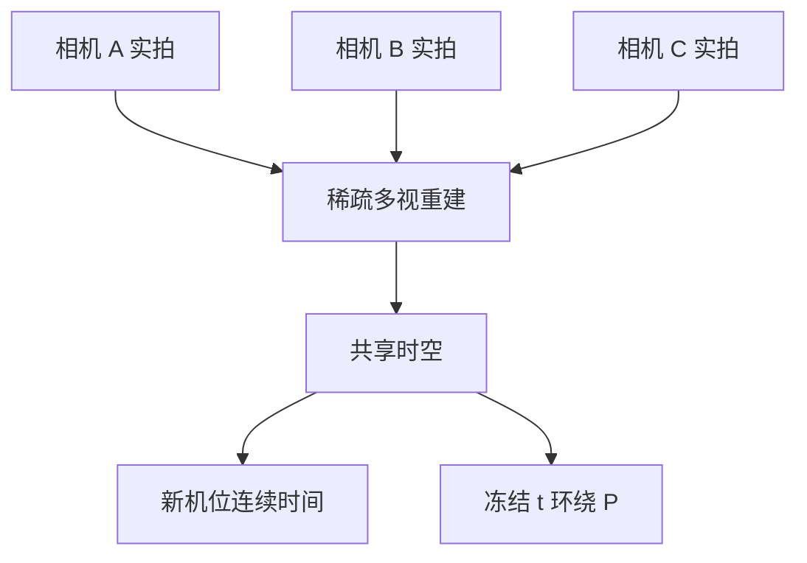

# 多机位 reframing 与子弹时间

三五部普通手机，配上三脚架和背包里能装下的夹具，就可以把一场真实发生的动作改机位、甚至冻住时间；不需要环形相机棚。

<footer>—— 改写自 World Labs Team, Atlas, 2026</footer>

相机可控生成往往从静图出发，沿一条虚拟路径长出世界。Reframing 方向相反：时间轴上已经有真实事件，只是机位不够多。用户想要的是同一场戏里换一个看不见的摄影机——侧看、俯看、甚至环绕的子弹时间。Atlas 把这件事情收在「时空仿真」下：先从三到五路普通摄像机重建场景，再在同一时空里查询新相机。本篇只写「同一场景改机位」，不把从零生成的一分钟镜头算进 reframing，也不把机器人传感器仿真展开。

## 问题

经典子弹时间依赖密集环形阵列、快门同步和后期插值。成本把效果锁在广告与电影工业里。消费级拍摄通常只有两三个固定机位，中间视角没有光线采样。光流或深度扭曲可以在基线很小时糊弄过去，人物一转、遮挡一出现，重影和撕裂就来了。

问题可以写成：给定同一时刻附近的稀疏相机 $\{I_i(t), P_i\}$，求新相机 $P_*$ 上的 $I_*(t)$，并允许把 $t$ 钉死，只动 $P_*$——这就是冻时环绕。约束是事件本身（谁站在哪、手臂抬到哪）应尽量来自观测，而不是再编一场戏。这与单图生成「背面可以猜」不同：猜错人脸或运动相位，在叙事上比猜错一栋房子更致命。

### 改机位不是另拍一条视频

若把每路手机视频分别送进文本视频模型做「换角度」，模型会另生成一段动作，时间线和主体身份都会漂。Reframing 要求动作是同一场：新机位是查询，不是重新采样一条时间。空间上下文里必须同时有多路、同时刻（或准同时刻）的观测，模型才能把「事件」和「观察者」拆开。

官方镜头「并不需要职业摄影师或特种棚」，指捕获端。输出端的新角度仍然是模型生成的像素，不是那一角度上的真实感光。新闻、取证、监控场景里，生成机位不能当证据。VFX 与预演可以，法庭与纪录必须分开说。

## 方法

捕获：三到五台手机或运动相机，固定在三脚架或夹具上，同步拍同一场。Atlas 从这些视图重建场景——几何来自多视，外观与运动来自视频。查询：指定新的 $P_*$，或指定一条只改观察者、少改时间的路径。冻时（bullet time）对应 $t$ 固定、$P$ 沿弧运动；普通 reframing 可以 $t$ 继续走，只是机位换成侧拍或更近的镜头。

实现上仍是带位姿的序列：每一路真实视频是图像元素流，每帧有自己的 $P_i$。新机位作为后续元素的条件被插入。深度可以一并写出，便于检查遮挡。World Labs 强调这些示例是工程师用消费设备拍的，目的是把「多机位工作室」从硬件搬到模型的空间上下文容量上。

### 时间钉死与空间插值

子弹时间把观察者从时间轴上解耦。记真实机位在 $t_0$ 的观测为 $I(P_i,t_0)$，查询是

$$
I(P_*,t_0) \;\sim\; p\bigl(\,\cdot\mid \{I(P_i,t_0)\}_i,\; P_*\bigr),
$$

即固定时刻、只换 $P_*$。若各机未完美同步，实际用的是一个小窗口 $[t_0-\delta,t_0+\delta]$ 里最近的帧，误差表现为「冻住的人」微动或错位。空间上，$P_*$ 若落在真实相机凸包内，更像插值；若落到凸包外（飞到演员背后而上边没有机），又变成有时间锚的稀疏生成。官方没有给出同步容差与滚动快门的处理细节，方法层应把多机时间对齐当成前置条件，而不是假设模型内部有完整的高帧同步器。

## 机制

同一场景改机位，依赖模型把内容因子与相机因子分开。若表示纠缠，改 $P$ 会改动作。空间上下文把各路图像钉在三维位置上，相当于告诉注意力：这些像素是同一世界点的不同投影。查询新 $P_*$ 时，已见投影提供外观，几何提供遮挡顺序。冻时则切断时间维的生成自由度，只沿相机流形采样。

与[稀疏新视角合成](/llm/atlas-sparse-view-recon) 的差别在于时间。静态建筑重建可以东补一块西补一块；动作 reframing 必须在同一 $t$ 上自洽。手臂遮住脸时，新机位看到的应是那一帧的遮挡关系，而不是另一帧的抬手。这要求上下文能索引「时刻」而不只是「地点」。Atlas 把视频当作图像序列，时间通过序列顺序与（可能的）位姿时间戳进入模型；内部是否有显式 $t$ 标记，发布说明未写。能确定的是任务编排：输入是多路真实视频，输出是新观察者。

三机已经能出演示级环绕，不表示任意运动相位都能插。快速挥拍、运动模糊、滚动快门会让同一 $t_0$ 上的多机图像互不一致，模型只能折中。折中看起来像「还能看」，计量上却可能把轨迹插错。

### 为何不是光流扭曲

平面光流假设亮度恒定、遮挡很少。多机位人物场景里，基线大、自遮挡多，光流没有正确的对应。体积方法或溅射可以在静态场上插值，动态场则要 4D 表示或逐帧重建。Atlas 走生成式世界模型：用先验填上光流填不上的洞，同时用真实多机把先验锁在这场戏上。收益是设备极简；代价是「中间机位」含有生成成分，极端 $P_*$ 上身份可能漂。

## 边界与工程取舍

Reframing 不创造新的事件，只改观察者——这是意图，不是保证。主体换脸、衣服纹理循环、冻结时的肢体抖动，都是可见风险。机位数少于三时，立体约束弱，子弹时间更容易退化成「围着一张深度图转」。多于五路当然更好，但官方把叙事放在「背包捕获」；工程上应按场景复杂度加机，而不是把三当魔法数。

同步、标定、色彩一致性仍是捕获端的活。模型不能从三路未标定竖屏视频里变出电影级光轴。发布材料没有谈音频、也没有谈口型随新机位的变化；这条能力是视觉时空，不是虚拟制作全栈。动态范围极大（舞台灯）或几乎无纹理的墙，多视匹配会失败，生成会接管，看起来光滑却无几何依据。

与相机可控长视频的分工：长视频常从静图或少量静帧「长出」尚未发生的运动与空间；reframing 假定运动已经发生，只缺机位。产品里若把生成的动作片段再拿去「换机位」，应先声明时间轴是合成的，避免和真实多机 reframing 混用同一套验收。

版权与肖像：改机位会露出实拍里没有的身体侧面，那些像素是生成的，但仍可能被认成真人。商用前要按生成媒体而不是按「另一个机位的素材带」来授权。早鸟模型的延迟未知，实时导播级 reframing 并未被声称。

## 小结

- Reframing 与子弹时间是同一时空里改观察者：前者时间可走，后者可把 $t$ 钉死只动 $P$。
- Atlas 用三到五路消费级相机重建后再查询新机位，意图是去掉环形棚。
- 新角度是生成像素，即使几何被真实多机锚定；证据场景不适用。
- 与从静图生成长镜头不同，这里的时间轴来自实拍事件。
- 同步、标定、快运动与凸包外机位是主要质量边界。
- 三机是演示起点，不是对所有动作相位的充分采样。
- 出处：World Labs Team，*Atlas: A World Model for Spatial Intelligence*，World Labs Blog，2026。
