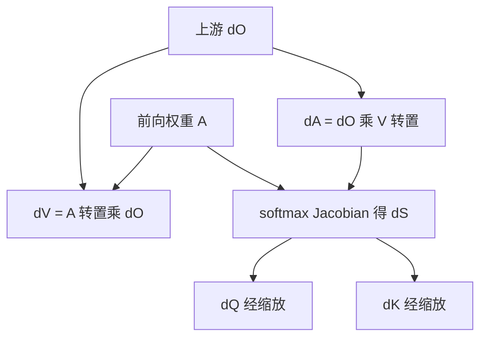

# 注意力的反向传播

缩放点积注意力把打分、归一化与加权收成三次矩阵运算；梯度必须沿同一条路返回，softmax 的 Jacobian 不能当成常数。

<footer>—— 对照 Vaswani et al., Attention Is All You Need, NeurIPS 2017；反向重算见 Dao et al., FlashAttention, NeurIPS 2022</footer>

[上一课](/llm/audio-visual-sync)把音画同步收在多模态生成课末。架构前向已经写完。本课是「训练基础与稳定性」第一课：训练要把标量损失送回查询、键、值与投影，注意力的 Jacobian 必须显式。[SDPA](/llm/sdpa) 的前向、[FlashAttention](/llm/flashattention) 的分块、[因果语言模型](/llm/causal-lm) 的交叉熵，后课都不再从内容寻址讲起。后课默认已经读完本课。

## 问题

主干把注意力写成

$$
S=\frac{QK^\top}{\sqrt{d_k}},\qquad A=\mathrm{softmax}(S),\qquad O=AV.
$$

推理只需要 $O$。训练还要 $\partial\mathcal{L}/\partial Q$、$\partial\mathcal{L}/\partial K$、$\partial\mathcal{L}/\partial V$，再乘进 $W_Q,W_K,W_V$。缺口不是再推一遍点积方差，而是 **softmax 把 $S$ 变成行随机矩阵之后，上游的 $dO$ 如何分配回每一对位置**。若把 $A$ 当常数，等于假装路由不随参数动，残差流上的注意力层几乎学不动。

[FlashAttention](/llm/flashattention) 故意不把 $A$ 落在 HBM 上。反向若仍按朴素图去取 $A$，分块的意义就没了。于是出现第二条约束：数值上必须与物化算法同类，存储上却要能重算 $A$。本课先写物化形式的链式法则；重算只是同一 Jacobian 的实现。

### softmax 行不是独立的坐标

对一行 $s$，令 $p=\mathrm{softmax}(s)$，$g=\partial\mathcal{L}/\partial p$。Jacobian 是 $\mathrm{diag}(p)-pp^\top$，于是

$$
\frac{\partial\mathcal{L}}{\partial s_i}=p_i\Bigl(g_i-\sum_j p_j g_j\Bigr).
$$

贡献被行内均值减过。高权重位置若 $g$ 接近行均值，落到 $s$ 上的梯度接近 0——这就是饱和：分数已经 one-hot，[缩放](/llm/attention-scale-stability) 当初要防的正是这一区。因果掩码在前向把无效位写成大负数，反向这些位的 $p$ 已是 0，梯度也被掐掉。

不要把「注意力权重可视化」当成梯度解释。$A$ 大只说明前向多读了这个值；$dS$ 还取决于 $dO$ 与 $V$ 的相容性。值向量近零的高权重位置，对损失可以几乎无贡献。

## 方法

记 $dO=\partial\mathcal{L}/\partial O$。物化反向三步：

$$
dV=A^\top dO,\qquad dA=dO\,V^\top,
$$

再按上行公式把 $dA$ 收成 $dS$，最后

$$
dQ=\frac{dS\,K}{\sqrt{d_k}},\qquad dK=\frac{dS^\top Q}{\sqrt{d_k}}.
$$

缩放常数与前向同一条；漏掉它，等于把学习率沿头维悄悄乘了 $\sqrt{d_k}$。多头是把头维拆开后各自做上述运算，再拼回 $d_{\mathrm{model}}$。交叉注意力里 $Q$ 与 $K,V$ 来自不同序列，形状不同，链式法则不变。

FlashAttention 的反向保存的是 $Q,K,V$、$O$ 和行统计 $(m,\ell)$，不保存 $A$。需要 $A$ 时按块重算 softmax，再在片上完成与 $dO$ 的乘加。算术多了一次前向量级，HBM 少了一张 $n\times n$ 表。与层间梯度检查点不是同一粒度：这里重算的是核内部的权重，不是整层激活。

## 机制

$dV=A^\top dO$ 是「按权重把输出梯度还原到值」。$dA=dO V^\top$ 是「输出梯度与值的点积，决定权重该增该减」。二者不对称：改 $V$ 不经过 softmax Jacobian，改 $Q,K$ 必须经过。所以值投影的梯度通常比查询、键更「直」，查询键则对饱和极其敏感。

残差把 $O$ 加回流上，故 $dO$ 含有后层直接回传的一项。Pre-LN 下这条公路不经过注意力内部，底层仍能收到梯度；但注意力**内部**的 $Q,K$ 仍只通过 $dS$ 学习。初始化若把点积放进饱和区，公路救的是主干，救不了注意力参数。这就是下一课要把自动微分图和初始化尺度接起来的原因：图保证链式法则不错，尺度保证 Jacobian 不先死。

## 边界

本课不写 [AdamW](/llm/adamw) 如何用这些梯度，也不写混合精度里 $QK^\top$ 的溢出——那是主干已有的数值课与后课稳定性。手写 Jacobian 只为钉住对象：$dQ,dK,dV$ 与 $A$ 的关系。实现几乎总是框架反传或融合核，但融合核必须与上述公式同类，否则「精确注意力」的声称不成立。

线性注意力、核函数注意力改的是前向定义，Jacobian 另写，不能复用 softmax 这一行。GQA / MQA 只是键值在头维共享，链式法则多一次对共享维的求和，不改 softmax 本身。

## 小结

- 注意力反向沿 $O\leftarrow A\leftarrow S\leftarrow Q,K$ 与 $O\leftarrow V$ 两条路走；后者不经过 softmax Jacobian。
- 行内 $dS_i=p_i(g_i-\sum p_j g_j)$：饱和时查询键几乎收不到梯度。
- FlashAttention 用重算代替存 $A$，数学对象仍是同一 Jacobian。
- 残差公路不替代注意力内部的尺度；初始化把点积送进饱和区，公路也救不了 $W_Q,W_K$。
- 后课默认会这条链式法则，不再从 SDPA 前向重推。
- 出处：Vaswani et al., *Attention Is All You Need*, NeurIPS 2017；Dao et al., *FlashAttention*, NeurIPS 2022。
