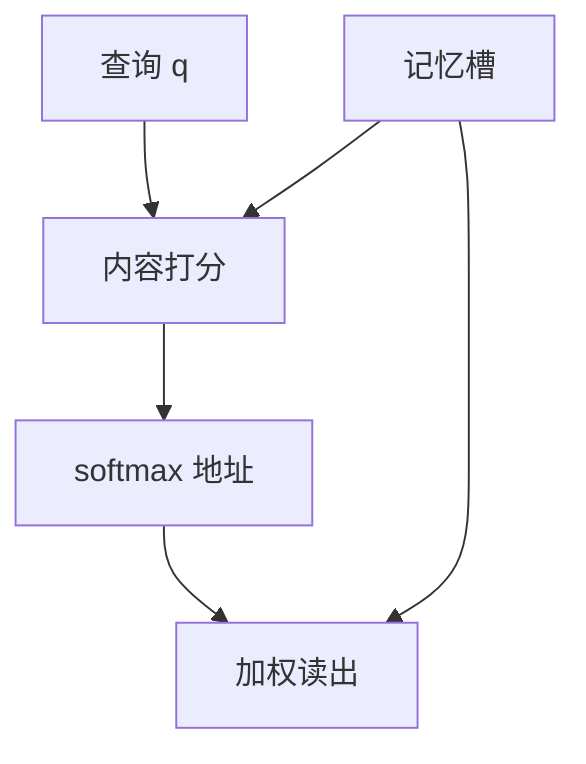

# 注意力作为内容寻址

读取不靠「第几个时间步」这根导线，而靠当前查询与各条记忆在内容上有多匹配；地址是算出来的，不是编好的下标。

<footer>—— 据 Graves, Wayne &amp; Danihelka, Neural Turing Machines；Bahdanau et al., ICLR 2015 整理</footer>

[Bahdanau 加性注意力](/llm/bahdanau-additive-attention)给出 $\alpha_{tj}$ 与 $c_t$。本课不重写 $v^\top\tanh(\cdot)$。缺口是：要把这件事从「翻译对齐」里抽出来，看成一般的记忆读取接口——查询、记忆槽、按内容的权重、加权读出。没有这次抽象，下一课改打分函数会像换了一层 MLP；有了抽象，点积只是换匹配分数。本课仍不引入缩放、多头、自注意力掩码。

## 问题

RNN 的读取是时间导线：要拿 $t-3$ 的信息，除非它还留在状态里，否则没有总线。注意力把编码器各步当成一组**可寻址槽**，槽里装着内容 $h_j$。解码器提供查询 $q_t$（来自 $h_t^{\mathrm{dec}}$）。匹配函数 $s(q,h_j)$ 给出分数，softmax 给出在槽上的分布，读出是期望 $\sum_j\alpha_j h_j$。缺口是承认：地址由内容决定。同一查询下次可以对准不同下标，只要那些槽的内容更像查询。

这与计算机的按地址读不同：RAM 用整数下标；这里下标是软的、由数据决定的。NTM 把读写头也写成类似接口；本课只借「内容寻址」这个词，不引入外存磁带。

### 内容寻址不是键值数据库的精确匹配

槽可以既当「用来匹配的键」又当「用来读出的值」。Bahdanau 里两者都是 $h_j$。后课可以把键和值分成两次线性投影，那是实现细化：匹配走键，读出走值。本课的抽象允许它们暂时同一。精确匹配（只有完全相等才读出）不可微、也不适合连续向量。softmax 是软匹配：相近的槽都分到质量。不要把注意力理解成哈希表命中。

位置仍可以作为内容的一部分——若 $h_j$ 里混有位置信息。当前尚未把位置单独注入。纯内容寻址对置换敏感：打乱槽的次序、若内容不变，权重只是跟着槽走，读出集合相同。这正是最后一课「位置还没进模型」的伏笔。

## 方法

接口四件套：查询 $q$，记忆 $M=\{m_j\}$，打分 $s(q,m_j)$，读出 $\sum_j\mathrm{softmax}(s)_j\,m_j$（或分开的值 $v_j$）。Bahdanau 的 $s$ 是加性网络。权重必须在合法槽上归一；掩码仍写在分数上。可以多次读取（多次查询），每次一个 $c$，不必一次读完所有需要的信息——但本课的 seq2seq 默认每解码步一次。槽的条数等于源长，不是固定记忆库大小。

## 机制

梯度通过 $\alpha$ 流入被匹配上的槽，记忆因而被训练成「可被查询的内容」。查询被训练成「提出对的问题」。这是联合学习，没有单独的地址监督。与 LSTM 门的差别：门不选择过去哪一步，只选择当前细胞的哪些维传递；注意力选择**哪一些过去的槽**进入当前步。两者可叠加：编码器仍是 LSTM，读取另走注意力。

多次查询可以读出多个 $c$，相当于几个读头。seq2seq 默认每解码步一个头。若查询不含足够区分槽的信息，权重会变平，$\alpha$ 接近均匀，读出退化为平均池化——瓶颈以另一种形式回来。诊断时看 $\alpha$ 的熵：长期接近 $\log n$ 说明查询没在寻址。

计算上，每次查询扫描全部槽，复杂度随记忆长度线性。这是内容寻址的默认代价。稀疏、局部窗口是后话。

## 边界

本课不把 $s$ 换成点积，不写 $1/\sqrt{d}$。下一课[从加性注意力到点积](/llm/additive-to-dot-product)只换匹配函数，不换寻址接口。后课默认：注意力是内容寻址的一次读取；对齐是这一接口在翻译上的特例。硬注意力（对槽做离散抽样）不可用本课的反向规则，不在这里展开。

## 小结

- 内容寻址用查询与槽内容的匹配来生成软地址，再加权读出。
- 键与值可以暂时同一；分开投影是后课细化。
- 它选择过去哪一些槽，LSTM 门选择当前哪些维传递。
- 对槽次序的置换，纯内容读出不变——位置尚未作为独立输入。
- 权重过平则退化为平均池化，查询等于没有寻址。
- 出处：Bahdanau et al., ICLR 2015；Graves et al., Neural Turing Machines。
