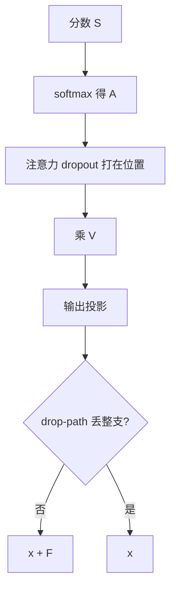

# 注意力 dropout 与 drop-path

对注意力权重做 Bernoulli 噪声，改的是这次读哪些位置；沿深度随机丢掉整条残差分支，改的是这次走多深。

<footer>—— 注意力权重 dropout 见 Vaswani et al., NeurIPS 2017；随机深度见 Huang et al., Deep Networks with Stochastic Depth, ECCV 2016</footer>

[上一课](/llm/dropout-transformer)把残差增量上的 dropout 写清了。缺口是另外两条常被同名的边：对 softmax 权重 $A$ 的 dropout，以及 drop-path（随机深度）：以概率丢掉整个 $F$，让 $x\leftarrow x$。ViT 微调配方里 drop-path 几乎是标配；解码器预训练里注意力 dropout 已少见。本课把三条边分开，避免用一个 `attn_drop=0.1` 同时改路由与深度。

## 问题

对 $A$ 做 dropout：以概率 $p$ 把某些键位置的权重置零，再（或不）重新归一化该行。它在问：模型能否在看不到一部分上下文的情况下仍预测下一个 token。这与残差 dropout 不同——残差 dropout 随机删的是**通道**，注意力 dropout 随机删的是**位置**。长序列上删位置更像遮住一部分上下文，短序列上则容易把仅有的几个高权重位置掐掉，训练信号变噪。

drop-path 来自视觉残差网：第 $\ell$ 层以概率 $p_\ell$ 完全跳过 $F_\ell$，前向就是恒等。Huang 等人证明这是训练极深残差的正则，并在推理时按期望把 $F$ 缩放。Transformer 里它等于随机改变有效深度。Steiner 等人训练 ViT 时把 drop-path 当作比普通 dropout 更有效的杠杆。语言预训练数据充足时，随机变深度往往只伤损失；把视觉配方原样贴到 LLM，是类别错误。

实现里 `nn.MultiheadAttention` 的 dropout 参数通常打在 $A$ 上，模块外再包一层才是残差 dropout。抄参数名不对齐，会把「残差 0.1」做成「路由 0.1」。读代码时跟张量形状：对 $n\times n$ 的是注意力 dropout，对 $n\times d$ 的是残差 dropout。

## 方法

**注意力 dropout。** 在 $A=\mathrm{softmax}(S)$ 之后、乘 $V$ 之前，对 $A$ 做 inverted dropout。因果掩码已经是 0 的位置保持 0。是否对行重新归一化必须固定：重新归一化则剩余位置分到更多质量；不重新归一化则该查询的输出范数随机缩小，等于把值的贡献整体打折。两种都有人用，混用无法复现。训练关、推理关；与 [FlashAttention](/llm/flashattention) 融合时，核必须支持这条边，否则静默退化成只有残差 dropout。

**drop-path / stochastic depth。** 对每个样本、每个残差分支抽 Bernoulli$(1-p_\ell)$。成功则 $x+\mathrm{drop}(F(x))$（此处 drop 常与残差 dropout 分离，只做整支开关），失败则 $x$。$p_\ell$ 常随深度线性增大：浅层公路更稳，深层正则更强。推理乘 $(1-p_\ell)$ 或训练期 already inverted。不要对嵌入层做 drop-path：没有 $F$ 可跳。

两条边的 $p$ 分开扫。需要正则时，视觉经验是 drop-path 优于把残差 dropout 加到 0.3；语言建模应先看验证 CE，不要预支「ViT 如此」。

## 机制

注意力 dropout 的梯度：被置零的键位置 $dV$ 少一项，$dS$ 在这些位置也是 0。模型被迫把信息分散到更多键，减轻对单点的依赖，也减轻极端 one-hot——这与后课用 soft-cap 压 logit 增长是不同机制：一个是训练噪声，一个是硬界。数据已经覆盖多样上下文时，再随机删位置的收益下降。

drop-path 让浅层必须单独可工作（深层随时可能不在），类似残差网里「浅的子网络也要能分类」。对语言模型，浅层单独可工作意味着低层就得预测 token，可能抑制深层专门化。这是预训练少用它的结构原因，不只是「数据够了」。微调分类头、或把 LLM 当编码器抽特征时，drop-path 的逻辑更接近 ViT。

## 边界

LayerDrop（Fan 等）按层丢弃并在推理时选子层，是部署侧的弹性深度，训练目标不同，不要和 drop-path 混名。Stochastic depth 不是梯度检查点：后者为省显存必重算，前者为正则随机跳过。本课也不处理 MoE 的 capacity drop——那是专家槽位不够时丢 token，不是 Bernoulli 正则。

确定性训练课会要求这些 Bernoulli 边使用已种子化的 RNG；此处只要求三条边的掩码可以单独复现，不要共用一个 `dropout_p` 去抽三种噪声。

## 小结

- 注意力 dropout 噪声在键位置；残差 dropout 噪声在通道；drop-path 噪声在深度。
- $A$ 上是否行归一化、Flash 核是否真的 drop，都必须写进配方。
- drop-path 的 $p_\ell$ 常随深度增大；语言预训练默认应怀疑，不要从 ViT 抄。
- 三条边三个旋钮，禁止一个超参名控制全部。
- 出处：Vaswani et al., NeurIPS 2017；Huang et al., ECCV 2016。
