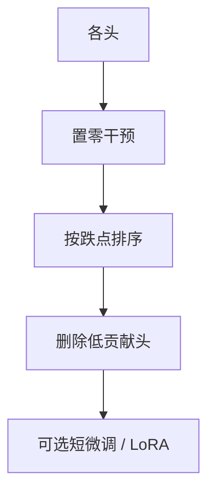

# 注意力头剪枝

推理时关掉一部分头，翻译或编码往往几乎不掉；那是静态冗余，不是 Deja Vu 那种逐步预测。

<footer>—— Michel, Levy, Neubig, Are Sixteen Heads Really Better than One?, NeurIPS 2019；Voita et al., ACL 2019</footer>

[上一课](/llm/deja-vu-sparsity) 每步预测保留哪些头。[头的功能分化](/llm/attention-head-roles) 已经给出静态故事：少数头干活，许多头平坦。本课动手：**一次性删头**，留下的模型仍是标准 MHA，只是头数变少。缺口是重要性怎么估、删完要不要愈合，以及它和 GQA 不是同一件事。后课离开稀疏，进入低秩分解。

## 问题

Michel 等人在翻译模型上逐头置零，发现不少头对 BLEU 几乎无贡献，甚至一层只留一头仍能工作。Voita 等人用门控看到头的专门化与可剪性。LLM 上同样的实验更贵，但逻辑不变：多头提供槽位，槽位填不满。缺口是把「可剪」写成部署动作：删哪些、$d_h$ 是否跟着变、KV 缓存是否按头数下降。

GQA 从设计上共享 K/V，是训练时的形状选择。剪头是训练后删已经学开的头。把剪完的 32 头模型叫「变成 GQA」是错的——GQA 的组结构与随机删头留下的不规则子集不同。

重要性不能只看注意力权重熵。平坦的头可能仍通过值向量做常偏置；应对输出做干预，与专精化分析课同一纪律。

## 方法

校准或验证集上，对每个头做置零（或缩放到 0），看损失 / 下游跌点，贪心删跌点最小的头，或按层保留固定个数。删完可选短微调或 [LoRA](/llm/lora) 愈合；one-shot 在中等比例往往可接受，激进删头需要愈合。实现上从 $W_Q,W_K,W_V,W_O$ 去掉对应列块，KV 缓存宽度下降，这是真加速，不依赖稀疏核。

与 2:4 / Wanda 叠：先定头数再对留下的投影做权重稀疏，校准必须在已剪头的图上做。

## 机制

多头是并列子空间。冗余头的 $W_Q$/$W_K$ 张成的方向与其它头高度相关，删掉后 SDPA 的加权和几乎不变。孤点头（归纳头、位置头）干预跌点大，对应 MoE 课的孤点专家，不可先删。层间不均：底层更偏位置、上层更偏内容，应按层配额而不是全局一个阈值，否则底层被删光。

Decode 收益主要来自 KV 字节与 QKV GEMM 变瘦，不是来自 SDPA 的 $n^2$ 魔术——头数减半，SDPA FLOPs 大致减半，但长上下文仍平方。不要宣称剪头解决长上下文。

## 边界与工程取舍

不要按可视化「好看」删头。不要在 RL 后的推理模型上照搬预训练的头排名——[GRPO](/llm/grpo) 会改写头的用法，须重测。激进剪头伤长链自检，比伤短 PPL 更早。下一课对留下的稠密矩阵做低秩分解，删除的是秩而不是头。

## 小结

- 头剪枝是静态结构化删除，KV 与 QKV 变瘦，有密核加速。
- 用干预跌点排序，不要用注意力图故事。
- 按层配额保护孤点头；与 GQA 设计不是同一形状。
- RL / 指令后必须重测头重要性。
- 出处：Michel et al., NeurIPS 2019；Voita et al., ACL 2019。
