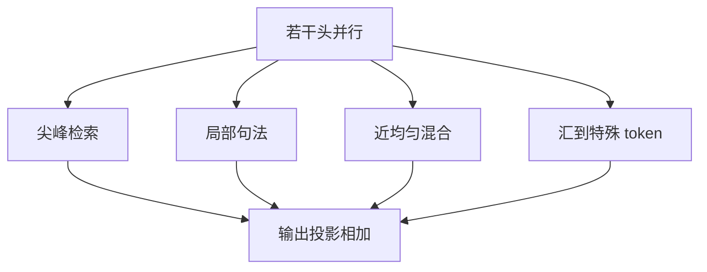

# 注意力头的功能分化

多头不是重复的备份；有的头盯句法边，有的头几乎均匀，关掉一部分往往损失很小。

<footer>—— Voita et al., Analyzing Multi-Head Self-Attention, ACL 2019；Clark et al., What Does BERT Look At?, BlackboxNLP 2019</footer>

[上一课](/llm/attention-length-scaling)让同一套分数在不同长度上峰度可校准。本课问这些头**在校准之后各自干什么**。主干 [多头](/llm/mha) 只给切分，不给语义。[头维对头数](/llm/head-dim-vs-heads) 只给容量分配。解释与剪枝要用的是功能：位置头、句法头、归纳头、几乎死掉的头。后课 Universal Transformer 把「一层」循环起来，默认你接受「头已经分化，深度用来叠功能而不是复制同一头」。

## 问题

可视化权重常让人以为每个头都在做重要对齐。Voita 等人对机器翻译、Clark 等人对 BERT 编码器都看到：少数头承担可命名的关系（相邻、指代、动词宾语），大量头权重平坦或与其它头高度相关。缺口是把这件事写成设计约束——**多头提供的是功能槽位，槽位会被填满、冗余、或闲置**，加头不等于加功能。

[归纳头](/llm/induction-heads) 是解码器里后来被钉死的一种电路。本课不重做那一课的实验，只把「功能分化」接到编码器与解码器共用的多头事实上，并标明可视化权重不等于贡献——[SDPA](/llm/sdpa) 课已经警告过值向量。

前缀掩码、双向编码器里，头还可以分化出「读右侧」与「读左侧」。因果栈没有右侧，分化发生在距离、内容类型与是否拷贝上。

## 方法

分析手段三层，由浅到深。第一，看 $A=\mathrm{softmax}(S)$ 的平均注意力距离、熵、指向特殊 token 的质量（汇）。第二，把单头置零或只留单头，测任务跌点，得到头的边际贡献。第三，构造或引用已知电路（归纳、抑制、上一 token），在残差流里做路径补丁。编码器侧 Clark 的「看什么」属于第一层加语言学探针；Voita 的剪头属于第二层。

训练中途头的功能会迁移，早停的可视化不能当最终电路。比较功能前应固定长度缩放与是否门控，否则汇头与内容头会互相污染。

### 冗余的两种来源

一种是优化：多个头学到几乎同一套路由，剪掉一个另一个顶上。一种是宽度：头维太薄，谁也学不成稳定功能，看起来像噪声头。应对不同——前者可剪，后者应加 $d_k$ 或减 $h$，回到上一课的分配。

## 机制

Softmax 的竞争在头内发生，头间只在输出投影处相加。这允许同时存在尖峰检索头与近均匀混合头。残差流把它们的值加在一起，下游 FFN 再读混合物。功能分化因此是「并行专家式的读」，不是层间的串行流水线——串行发生在层与层之间，那是下一课循环深度要动的轴。

注意力汇可以是一种退化功能：把强制质量扔给 BOS，好让其它头少受行和约束。门控或 sigmoid 会改变这种退化是否还必要。解释头时要声明归一化假设。

「这个头在复制上一 token」是对电路的陈述，需要对值向量与输出投影做因果干预才能坐实。只看权重亮在对角线上，不够。

## 边界

功能标签不可移植到任意检查点：同结构不同数据，头的分工会换。不要在课序里把 BERT 的句法头当成 GPT 的归纳头。剪头是部署优化，不是训练目标；训练时用头级 dropout 可以鼓励分化，也会伤优化。下一课开始把同一组参数沿深度重复使用，分化的槽位会从「第 $\ell$ 层第 $h$ 头」变成「第 $t$ 次循环第 $h$ 头」，索引方式要改。

## 小结

- 多头提供功能槽位；槽位会被填成可命名电路，也会冗余或闲置。
- 分析要分层：权重统计、置零跌点、路径补丁；只看权重会误判。
- 冗余头可剪，噪声头应回头改 $h$ 与 $d_k$，不要混为一谈。
- 功能标签绑定检查点与掩码，不能跨架构复述。
- 出处：Voita et al., ACL 2019；Clark et al., 2019。
