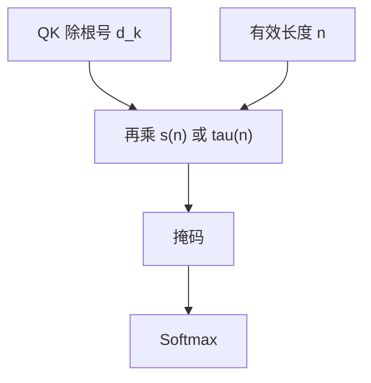

# 注意力长度缩放

softmax 的锐度随键的个数变；只除 $\sqrt{d_k}$ 时，序列一长，有效温度并没有按长度校准。

<footer>—— Chiang &amp; Cholak, Overcoming a Theoretical Limitation of Self-Attention, ICLR 2022；长度外推中的缩放实践亦见 Press et al., Train Short, Test Long, ICLR 2022</footer>

[上一课](/llm/head-dim-vs-heads)钉死了 $d_k$ 进入温度的那一侧。[SDPA](/llm/sdpa) 的另一侧——键的个数 $n$——没有进公式。短训长测时，同一套 logits 面对多得多的竞争者，权重被稀释或异常尖峰。本课补长度相关缩放：在 $\sqrt{d_k}$ 之外乘 $n$ 的函数。后课谈头在做什么，默认你会「长序列先校准温度，再解释头」。

## 问题

softmax 对向量 $z\in\mathbb{R}^{n}$，$n$ 增大时即便 $z$ 的典型幅度不变，最大值被选中的概率结构也会变：更多近乎无关的键分走正质量，或相反，极端值在更大的表里更容易独占。Chiang 与 Cholak 指出，某些形式语言任务需要权重以 $1/n$ 量级平均分配，标准 $1/\sqrt{d_k}$ 做不到与长度无关的均匀。缺口是：**打分尺度应随上下文长度改**，否则层在 2k 上学到的峰度到 32k 上已经不是同一算子。

[Sigmoid 注意力](/llm/sigmoid-attention) 没有行和 1，更必须显式 $1/n$。Softmax 不是必须，但经验上 log-length 或 $\sqrt{n}$ 因子常能稳住外推。ALiBi 用距离偏置外推，不替代本课的全局温度；二者处理的是「谁更近」对「整体有多尖」。

推理时另设采样温度，作用在词表 logits 上，不是注意力内部温度。不要把两条温度收成一个旋钮。

## 方法

把分数写成

$$
S=\frac{QK^\top}{\sqrt{d_k}}\, s(n),
$$

或等价地 $\mathrm{softmax}(S/\tau(n))$。常见 $s(n)$：常数 1（默认 SDPA）；$c/\log n$；$\sqrt{m/n}$ 把训练长度 $m$ 校准到测试长度 $n$；Chiang 式的 $1/n$ 乘在权重侧而非 logits 侧。实现上 $n$ 用有效长度（扣 padding），因果情形下每行的 $n$ 其实是 $i$，严格做法是按行缩放，粗做法用全局 $n$。

训练若始终固定长度，模型会把 $s(n)$ 吃进 $W^Q,W^K$ 的尺度。要让 $s(n)$ 在外推时起作用，训练就应变化长度，或把 $s(n)$ 设计成在训练长度上约等于 1，只在偏离 $m$ 时启动。

### 与位置外推的分工

RoPE 的波长、YaRN 的插值、ALiBi 的斜率，改的是哪些位置相容。长度缩放改的是 softmax 的锐度，即使位置编码已经外推成功，锐度不对仍会读错。先校准温度，再谈位置，是本课的顺序。

## 机制

$\tau$ 变大，分布趋均匀，长上下文的噪声键稀释信号；$\tau$ 变小，分布趋 one-hot，长表上更容易只盯一个键、忽略其余证据。需要多证据融合的层偏好随 $n$ 略增温；需要精确拷贝的头偏好保持尖。按层或按头设 $s(n)$ 表达力更强，但几乎没人在生产里做到这么细，因为 KV 核与检查点都假定统一缩放。

按行用 $i$ 缩放更符合因果：位置 3 只看见 3 个键，位置 3 万看见 3 万个。用全局 $n$ 会让短前缀过尖或过平，属于实现偷懒。

层归一化会部分吸收尺度，但 LN 在注意力之后，进 softmax 的 logits 已经饱和过了。长度缩放必须发生在 softmax 之前。

## 边界

没有一种 $s(n)$ 同时服务复制与平均。盲目 $1/n$ 会把已训好的尖峰头打平。本课不取代相对偏置、RoPE、窗口。评测必须报训练长度与测试长度，否则「长上下文变好」可能只是温度碰巧合适。下一课用可视化与电路解释头，那些图都对温度敏感：换 $s(n)$ 后「这个头在看什么」会变。

## 小结

- $\sqrt{d_k}$ 校准的是头维，不校准键的个数；长序列需要额外的 $s(n)$ 或 $\tau(n)$。
- 训练长度上 $s(n)\approx 1$，偏离时才启动，才谈得上外推。
- 与位置外推分工：一个管锐度，一个管谁相容。
- 按行用因果可见长度比用全局 $n$ 更一致。
- 出处：Chiang & Cholak, ICLR 2022；Press et al., ICLR 2022。
