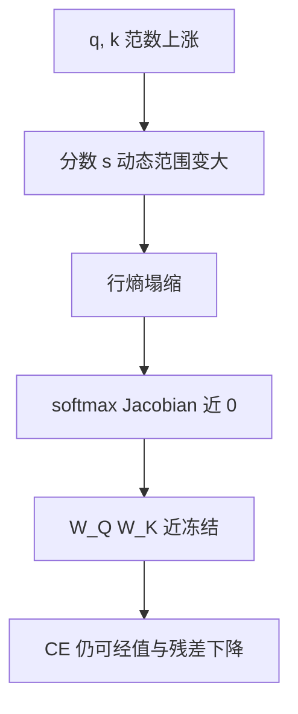

# 注意力 logit 增长

训练进行时查询与键的范数可以一起涨，点积把 softmax 推进饱和；熵塌缩之后，注意力内部的梯度几乎消失，曲线却仍像在降损失。

<footer>—— Zhai et al., Stabilizing Transformer Training by Preventing Attention Entropy Collapse, ICML 2023；尺度杠杆见 Henry et al., Query-Key Normalization, Findings of EMNLP 2020</footer>

[上一课](/llm/loss-curve-phases)要求开始记录注意力 logit 分位数。本课是稳定性单元第一课：解释这个传感器为什么会在幂律段里缓慢、有时突然地变坏。[SDPA](/llm/sdpa) 的 $1/\sqrt{d_k}$ 只对消**维度**带来的方差，不约束训练中 $\|q\|,\|k\|$ 的漂移。Zhai 等人把「注意力熵塌缩」写成可测的训练病理；Henry 等人的 QK-Norm 与主干 [QK-Norm 预训练](/llm/qk-norm-pretrain) 是对策之一。本课先写增长本身，下一课才写 soft-capping。

## 问题

令 $s_{ij}=q_i^\top k_j/\sqrt{d_k}$。若训练把 $\|q\|$ 与 $\|k\|$ 同时放大，即使角度结构不变，$s$ 的动态范围变大，行 softmax 趋向 one-hot，熵 $\,-\sum_j A_{ij}\log A_{ij}$ 趋向 0。[注意力反向](/llm/attention-backward) 已经说明：此时 $dS$ 被 $p_i(g_i-\sum p g)$ 掐掉，$W_Q,W_K$ 几乎不再更新，值通路与残差公路仍能改 $W_V$ 与后续层，所以**训练 CE 还可以降**。日志若只看 CE，会错过「注意力已经冻成硬路由」。

增长来源包括：残差流范数累加（深度缩放只管第 0 step）、FFN 增益、多模态下不同符号的范数竞赛、以及大学习率下 Adam 对稀疏头的过更新。Wortsman 等人用小模型加大学习率即可复现注意力不稳，说明这不是「只有 70B 才有」的现象。

看均值 logit 不够。应看每层、每头的 $s$ 的最大值或 99 分位，以及行熵的分位数。少数头塌缩会先发生，均值仍可看起来健康。

## 方法

传感器建议：

- 对若干层抽样：$\max s$、行熵均值、$\|q\|_2$ 与 $\|k\|_2$ 的中位数。
- 与 [FlashAttention](/llm/flashattention) 兼容的做法是在调试步关掉融合核、或在核里暴露 row-max（许多实现已有，用于稳定 softmax）。
- 阈值没有普适数：BF16 下 $s$ 的 row-max 长期超过几十，就该报警，不必等 Inf。

结构对策（本课只定位，不展开成新架构课）：QK-Norm / 对 $q,k$ 做 RMSNorm；降低该层学习率乘数；深度缩放与 μP 把第一步放对。下一课的 logit soft-cap 是在 $s$ 上加有界非线性，与归一化 $q,k$ 是两道闸。

不要用加大注意力 dropout 当主对策：dropout 在 $A$ 上加噪声，不阻止 $s$ 变大；饱和后 dropout 只是在几乎 one-hot 的行上随机掐掉仅剩的 1，训练更噪。

## 机制

softmax Jacobian 的谱随熵下降而塌。熵一旦接近 0，该头的查询键投影进入「冻结 + 偶尔被极大梯度踢一下」的状态，踢的那一下就是尖峰。值投影仍活着，模型可以把硬路由用得很好——直到路由选错的上下文出现，CE 才突然竖起。这解释了为何尖峰有时出现在数据切换、序列变长、或罕见模式，而不是随机。

与输出层 logit 增长（后课）不同：注意力 $s$ 的增长发生在每一层内部，层数乘头数个独立的饱和点；输出 $\ell$ 只有一张表。只钉 lm_head 的 z-loss，挡不住中间层注意力塌缩。

## 边界

本课不把 QK-Norm 再推一遍公式，主干已有。也不讨论线性注意力：它们没有这张 softmax 表，病理不同。推理温度不作用在训练期的 $s$ 上；不要用解码温度「验证」训练是否塌缩。长上下文下 $s$ 的极大值通常更大（更多键可竞争），序列长度预热课会再碰到这个传感器。

## 小结

- $1/\sqrt{d_k}$ 不管训练中查询键范数；熵塌缩后注意力内部梯度消失，CE 仍可能降。
- 监控每层每头的 row-max 与行熵，不要只看 CE 与均值 logit。
- QK-Norm 与下一课 soft-cap 是两道闸；注意力 dropout 不是主对策。
- 输出 z-loss 不覆盖中间层注意力。
- 出处：Zhai et al., ICML 2023；Henry et al., Findings of EMNLP 2020。
