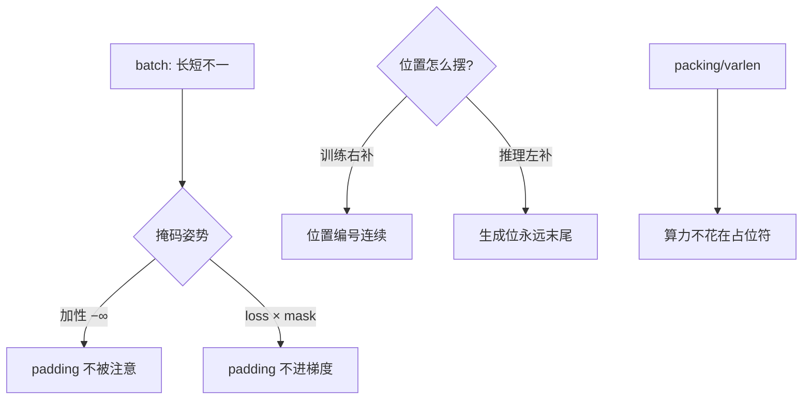
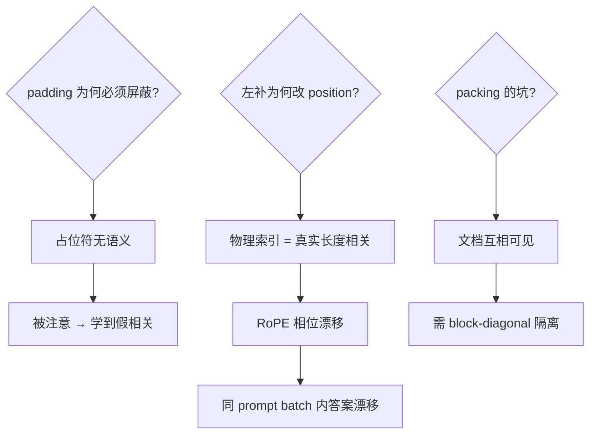

# 注意力掩码与填充

batch 里 8 个序列 7 个是占位符：掩码没做对，占位符就在注意力里说话——一句 padding 的坑，从训练贯到推理。

<footer>—— 据 HuggingFace Transformers 掩码文档；FlashAttention 变长 varlen 接口设计</footer>

[Unicode 分词](/llm/unicode-tokenization)把字节变 token，本课把 token 变 batch：长短不一的序列要拼进同一个矩形张量，缺口是**padding 与注意力掩码**——占位 token 凭什么不许被注意、又凭什么不算损失。这一课的坑贯穿预训、SFT、推理三段。本课不做 FlashAttention 的内核实现。

## 问题

矩形张量的代价：batch 内最长序列 4096、其余 200，padding 占 95% 计算量。三个必须答对的问题：注意力要不要看见 padding（不要）；loss 要不要算 padding 位置（不要）；位置编码要不要给 padding 编号（争议点）。答错任何一条，模型学到「句尾越多 padding 越自信」之类的鬼东西。

术语翻译：padding token = 占位符（ID 常为 0）；attention mask = 加性掩码（allowed 处加 0，禁处加 $-\infty$ 再 softmax）；padding side = 左补还是右补——decoder-only 推理必须左补，否则生成位置被占位符顶乱。

数字实例：batch=8、最长 4096、平均 300。右补 naive 方案算力 ∝ 8×4096²，有效算力仅 8×300²/8×4096² ≈ 0.5%——99.5% 的 FLOPs 花在占位符上。varlen 打包后 ∝ Σ300²，利用率回到 90%+。

## 方法

正确姿势三层。**算对**：attention mask 做成加性偏置进 softmax 前，padding 位 $-\infty$；loss 乘 mask（或标签位填 -100 由交叉熵忽略）；**算快**：packing（把多个短序列拼进一个 4096 窗、配 block-diagonal 掩码互不见）或 FlashAttention varlen（内核按真实长度调度，不 materialize 掩码）；**摆对**：训练右补（位置编号连续），推理左补（新 token 永远在末位）——两者混用是「怎么突然变傻」的经典悬案。

直觉类比：矩形 batch 像一排不同身高的人合影，摄影师（张量）要求大家站一样高——矮的脚下垫箱子（padding）。掩码是「拍照时忽略垫箱」，packing 是「让矮的两人叠罗汉凑一个身高位」，varlen 是「换无级伸缩的照相馆，每人按真实身高占相纸」。

## 机制

因果掩码 × padding 掩码的合取：每个位置 $j$ 能被 $i$ 看见当且仅当 $j\le i$（因果）**且** $j$ 非 padding。实现上两个加性偏置相加进 logits——数学上等价于「可见集合取交」。位置编码的坑更深：右补时位置编号按物理索引走，padding 占了编号但被掩码屏蔽——无害；**推理左补**时若沿用「物理索引」给真实 token 编号，第一个真实 token 的 position id 会随 batch 内长度变化而漂移，RoPE 相位错乱——这是「同一个 prompt batch 内答案不同」的机制。训练时的第二个幽灵：packing 若不做注意力隔离，序列 A 的结尾会注意序列 B 的开头，模型学到「无关联文档的粘合」——预训污染源之一。

常见误区：以为「padding=0 token 无害」——零号 embedding 也是向量，注意它会歪掉整个分布；另一误区是 loss 不乘 mask 却发现「模型爱输出句号」——padding 位的目标标签也被算了损失，模型学会了「凑长度」。

## 边界

工程真相：这三层坑的当代答案是**不拼矩形**——FlashAttention 的 varlen 接口按 cu_seqlens（累积长度）调度，掩码根本不落盘；训练侧 packing + 文档级掩码是预训标配。遗留风险集中在自研 trainer：自己的 attention 实现里 mask 加错维度（[B,1,1,S] vs [B,1,S,S] 是永恒考点）。生成式推理的左补陷阱在 kv-cache 复用（prefix caching）下更绕——缓存的前缀与左补位如何对齐，每个推理框架都有自己的约定。与[注意力下沉](/llm/attention-sink)的呼应：流式推理里首批 token 被强制保留当「注意垃圾桶」，本质是掩码策略在长上下文下的延伸。

直觉类比：矩阵 batch 像拼车算法的固定四座——三个人时剩一个空座（padding），规矩是「空座不许说话（掩码）、不计车费（loss）、不占座位号（位置）」；packing 是把三家三口塞进一辆车但中间立隔音板（block-diagonal），varlen 干脆叫了三辆专车。

## 小结

- 掩码三问：注意不见、loss 不算、位置不编——答错一条就污染训练。
- 左补/右补之争只在推理生成侧致命，RoPE 相位是机制根源。
- 当代正解是 varlen/packing 不拼矩形；自研 attention 必查掩码维度。
- 出处：HuggingFace Transformers 文档；FlashAttention-2 varlen 接口；GPT 系训练实践。
