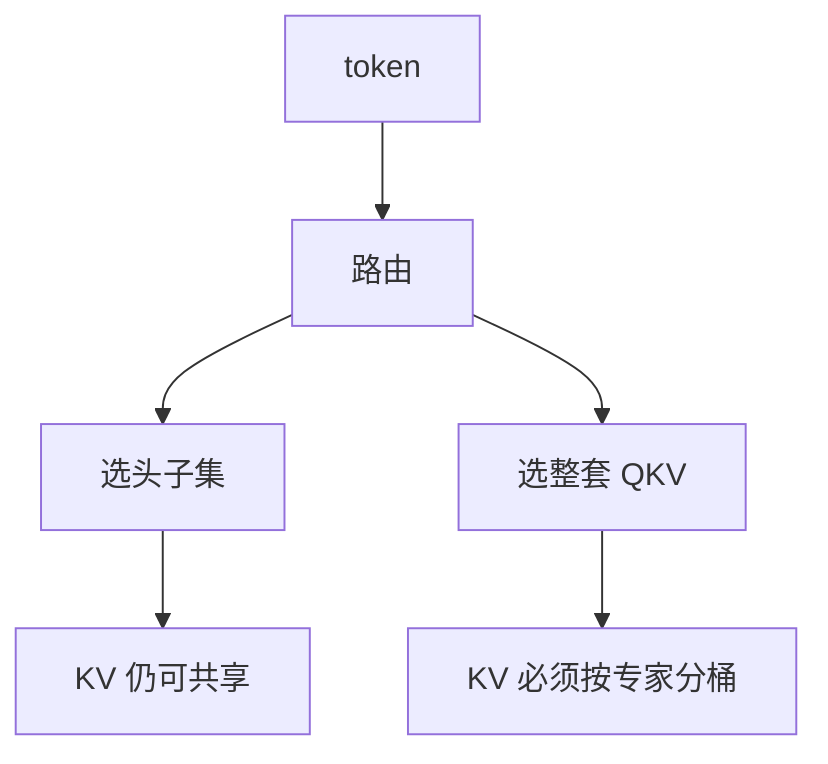

# 注意力 MoE

把稀疏专家从 FFN 挪到注意力的头或投影上，容量加在路由读的路径；KV 与缓存契约立刻变复杂。

<footer>—— Zhang et al., MoA: Mixture of Attention Heads, 2022；Csordás et al., SwitchHead；Switch Transformer 亦实验过注意力专家化</footer>

此前 MoE 默认替换 FFN。[路由抖动](/llm/routing-flapping) 在 FFN 上损失的是一层 MLP。若专家是不同的注意力头集合或不同的 $W^Q,W^K,W^V$，抖动会改变**这一层看见的键值空间**。本课补注意力 MoE。课序最后一课粒度律仍以 FFN 专家为主；本课声明为什么那是默认、注意力专家要另算缓存。不要把本课与 [GQA](/llm/gqa) 或混合 SSM/注意力层比混成同一种稀疏。

## 问题

FFN 专家不改 [SDPA](/llm/sdpa) 的公式，KV 布局仍按层按头。想把参数再加到注意力一侧，自然想到：多名专家各持一套投影或多组头，token 选一套来算注意力。缺口是列出比 FFN MoE **多出来的契约**：选中的专家是否要写自己的 KV；解码时过去 token 走的专家与当前不同，当前查询该读谁的键。

GQA / MQA 是共享 K/V，减少 KV 字节，不是按 token 选专家。Mixture-of-Depths 是跳层。本课特指离散路由进不同注意力参数。三者不要写成一种「稀疏注意力」。Switch、Mixtral 默认注意力稠密，不是疏忽。

[MoE 路由](/llm/moe-routing) 的公式仍适用：门 $xW_r$，top-$k$。变的是专家 $E_i$ 是头投影还是整段注意力块。

## 方法

### 头专家、投影专家与 SwitchHead

两种粒度。头专家：共享 $QKV$ 投影，但 token 只激活子集头——接近按 token 的动态头剪枝，KV 仍可全写或只写激活头。投影专家：整套 $W^{QKV}$ 分专家，token 进入不同点积空间。后者表达力强，KV 不能混用：专家 $i$ 的键与专家 $j$ 的查询不对齐。SwitchHead 一类把较贵的 value / 输出投影做成专家，共享 QK 结构，是中间路线。

解码：若每步路由不同，历史 KV 必须按专家分桶存储，查询只打到当时写过该专家的位置，或强制整段 sticky。小 $n$ 的 decode 几乎付不起按头 All-to-All，服务路径常常把注意力专家复制到本地，稀疏只在训练或 prefill 成立。Soft 混合所有注意力专家等于多套投影再加权，FLOPs 与缓存一起线性涨，万亿服务更不现实。

## 机制

多头已经是静态混合。注意力 MoE 把它改成内容相关的子集。门看的是 $x$，真正的分数看 $q\cdot k$；门选错头，分数再准也没用。FFN MoE 没有这层错位。抖动在这里更贵：FFN 翻盘只换 MLP；注意力翻盘换 KV 写入位置，缓存按最坏 $k$ 备，与 CLA、YOCO 的省缓存目标冲突。

训练稳定性：注意力 logits 本就对尺度敏感，专家间尺度不一会再炸，需要每专家温度或 QK 归一。把 MoE 加在输出投影 $W^O$ 上，KV 仍共享，契约简单，是折中。

编码器、非自回归设定没有 KV 缓存，头级混合更可行。自回归服务是硬边界。

## 边界

自回归服务默认不要注意力投影专家。不要把局部窗、sink、MLA 叫注意力 MoE。不要在尚未稳住 FFN 路由的代码库上再加头级门。下一课粒度律的实证对象是 FFN 专家宽度对数量；套到注意力专家上会错，因为缓存与对齐约束不同。

## 小结

- 注意力 MoE 路由的是投影或头槽，不是 SDPA 里的 token 对。
- 投影专家强制 KV 分桶或 sticky，与自回归缓存冲突。
- 抖动比 FFN MoE 更伤；默认稀疏容量应留在 FFN。
- GQA、跳层、稀疏图案不是本课对象。
- 质量上注意力往往比 FFN 更怕稀疏：一份错的头比一份错的 MLP 更容易毁掉位置信息。
- 出处：Zhang et al., 2022；Csordás et al., SwitchHead；Fedus et al. 对注意力专家的实验。
