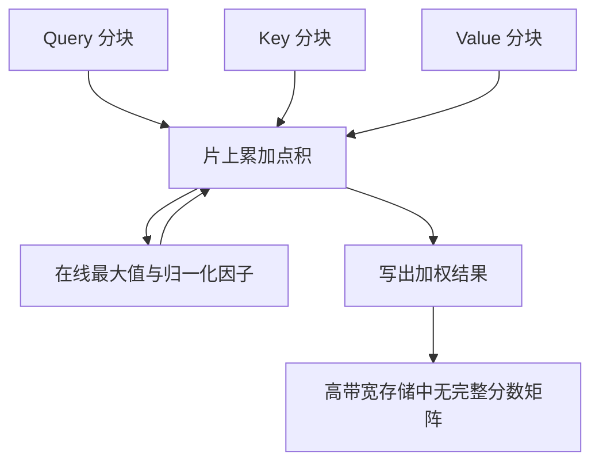

# Softmax 注意力的二次复杂度

自注意力是架构里的瓶颈：它对序列长度是二次的时间与内存复杂度；精确计算仍然可以靠输入输出感知的分块来降低显存墙，但不能把渐近阶改成线性。

<footer>—— Dao et al., FlashAttention, 2022</footer>

缩放点积加 softmax 的定义里，每个查询都要对全部键打分。令长度为 $n$，分数矩阵是 $n\times n$ 的稠密表，随后的加权也要对这张表求和。这就是二次复杂度的来源：不是因为多头，也不是因为残差，而是因为相容性被定义成「所有序对」。Vaswani 等人在 2017 年用全连接换来了恒定跳数的远程依赖；代价在当时的机器翻译长度上可以接受，在今日数千到百万 token 的上下文里则主导显存与前填延迟。本篇只分析这张稠密表的代价结构，以及精确算法能优化到哪一步。稀疏、线性、状态空间是另一组替换方案，这里只作为边界上的对照。

## 问题

一次 SDPA 的主导项有两处矩阵乘：$QK^\top$ 花费 $O(n^2 d_k)$，$AV$ 花费 $O(n^2 d_v)$。若物化分数与权重，还要 $O(n^2)$ 的读写。当 $n\gg d_k$ 时，二次项压过投影的 $O(nd^2)$。多层、多头并不改变阶：头数 $h$ 与 $d_k$ 的乘积通常等于模型宽，总代价仍是

$$
O\bigl(L\, n^{2}\, d_{\mathrm{model}}\bigr)
$$

量级。

更尖锐的是内存墙。现代 GPU 上算术吞吐远高于把 $n\times n$ 张量搬进搬出高带宽存储器的能力。朴素实现先写出 $S$，再 softmax 成 $A$，再乘 $V$，三次大块访问。$n=8\times 10^3$ 时一张 FP16 权重矩阵约 128MB，再乘层数与头数，激活显存会先于算力爆掉。二次复杂度因此首先表现为「存不下、搬不动」，其次才是「算不完」。

### 前填与解码的代价形态不同

训练和推理前填（prefill）对整段提示一次性做自注意力，必须为每个查询看见当前合法的全部键，二次项完整出现。自回归解码每步只有 $1$ 条新查询，对已缓存的 $t$ 个键打分，步代价是 $O(t d)$，生成 $n$ 个词的总和仍是 $O(n^2 d)$。KV 缓存消灭的是重复投影，不是二次求和：第 $n$ 步仍然要对 $n$ 个键做点积。缓存还把二次问题转成容量问题——键值表按 $n$ 线性增长，直到显存放不下。

有人说「解码是线性的」。单步相对当前长度是线性，完整生成相对最终长度仍是二次。长短前缀的服务差异主要来自前填的 $n^2$ 与缓存占用，而不是解码循环突然变成 $O(n)$ 总代价。讨论吞吐时要把「步」和「整段」分开。

## 方法

精确 softmax 注意力可以不物化 $n\times n$ 矩阵。FlashAttention 的做法是把 $Q$ 按行块、$K,V$ 按列块装入片上存储，对每个查询块累加与各键块的点积，用在线 softmax 维护行最大值与归一化因子，块间只传递少量统计量。输出块写回时已经是加权后的值，HBM 上不再落下一张完整 $A$。数学结果与朴素算法相同，复杂度阶仍是 $O(n^2 d)$，但 HBM 访问降到与 $n,d$ 更接近线性的项，受片上块大小约束。

因果掩码与 FlashAttention 兼容：下三角以外的块可以直接跳过，大约减半前填计算。这是常数因子，不是降阶。padding 同理，只能跳过明显空块。只要连通性仍是稠密前缀或稠密全连接，渐近二次不会消失。

### 为何「精确」无法降阶

softmax 的分母依赖整行所有键。任意位置的键都可能成为该行最大值或贡献不可忽略的质量，于是一般情形下必须触及全部 $n$ 个键。除非改变核函数（线性注意力把 $\mathrm{softmax}(q^\top k)$ 换成 $\phi(q)^\top\phi(k)$ 从而先聚合 $\sum \phi(k)v$），或改变连通性（窗口、块稀疏），否则信息论上就需要 $\Theta(n^2)$ 次交互。FlashAttention 优化的是常数与内存层次，承认这一下界。

## 机制

二次项的结构来自行随机矩阵 $A$。$A$ 的每一行是长度为 $n$ 的分布，与 $V$ 相乘是一次全表查询。多头复制了 $h$ 张这样的表，但每张更「窄」，总交互次数仍按 $n^2$ 计。交叉注意力把其中一维换成记忆长度 $m$，代价 $O(nm)$；当 $m\sim n$ 时同样是二次。编码器-解码器架构在源很长、目标尚短时，$nm$ 可能暂时低于目标自注意力的 $n^2$，这只是两个长度的不对称，不是降阶算法。

带宽视角下，解码第 $t$ 步读取 KV 缓存的字节量为

$$
\Theta\bigl(t \cdot h \cdot d_k\bigr).
$$

$t$ 增大后，这一读带宽成为单请求延迟的主项，算力反而空闲。二次代价于是在解码阶段改头换面：从「算 $n^2$ 次乘加」变成「搬 $n$ 段历史」。MQA、GQA、MLA 压缩的是每步要搬的历史宽度，滑动窗口压缩的是历史长度，两条线都在打二次代价的存储形态，而不是改 softmax 定义。

混合专家、更大的前馈层会增加 $O(nd^2)$ 的线性项。当 $n$ 中等、$d$ 很大时，前馈可以重新成为瓶颈，注意力的二次项反而不显眼。二次是长度的函数：上下文从 4k 拉到 128k，注意力会迅速回到主导地位。比较架构开销必须同时报 $n$ 和 $d$。

### 激活重计算与训练显存

训练还要存反向所需的中间量。朴素实现保存 $A$ 会再付一张 $n^2$ 的显存。FlashAttention 的反向重算各块的注意力，用更少的 HBM 换更多算术，符合「算术便宜、搬运贵」。重计算不降低前向 FLOPs 的阶，只改变训练能否在给定显存下跑到该 $n$。梯度检查点叠在层间，是另一层用时间换空间，对象是整层激活，不只是注意力矩阵。

## 边界与工程取舍

接受二次、把实现做到 IO 感知，是目前解码器只模型的默认路径：公式不变，内核换 FlashAttention 及其后续。要在渐近上离开二次，必须放弃稠密 softmax 或放弃全可见集合。窗口注意力把 $n^2$ 换成 $n\times w$；线性注意力把核换成可分解形式；状态空间把交互变成递推。它们各自有逼近误差与训练稳定性代价，不能假装仍是同一条注意力。

服务系统里常把前填与解码拆开调度：前填吃计算、解码吃带宽。批处理多个短请求可以摊掉内核启动，但帮不上单个超长请求的 $n^2$。对超长上下文，先用检索或摘要把有效 $n$ 降下来，往往比在稠密 softmax 内部再抠常数更有效。那是系统层减 $n$，公式层仍然二次。

宣称「线性复杂度注意力」时，应核对其是否仍对全部 token 做 softmax 归一化。若分母仍依赖全序列且核不可分，实现再快也只是常数优化。真正的线性方法会先对键值做与查询无关的聚合，再与查询相乘。

## 小结

- 稠密 softmax 注意力对长度为 $n$ 的序列需要 $\Theta(n^2)$ 次查询-键交互，来自全序对打分这一规定。
- 前填一次性付清二次项；解码逐步付，总和仍二次，KV 缓存只避免重复投影。
- 物化 $n\times n$ 权重会撞上显存与 HBM 带宽；FlashAttention 用分块在线 softmax 保持精确结果并降低搬运。
- IO 优化不改变渐近阶；降阶必须改核函数或改可见集合。
- 解码阶段二次代价常表现为读缓存的带宽，头压缩与缩短历史是两条工程出路。
- 比较是否瓶颈时要同时看序列长度与模型宽度，中等 $n$ 下前馈可能更重。
- 出处：Vaswani et al., *Attention Is All You Need*, NeurIPS 2017；Dao et al., *FlashAttention*, 2022，以及 Dao, *FlashAttention-2*, 2023。
