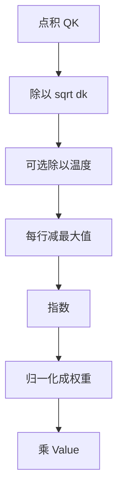

# Attention 中的缩放、温度与数值稳定

当键的维度较大时，点积的量级会膨胀，把 softmax 推入梯度极小的区域；除以维度的平方根，是为了把打分拉回可训练的尺度。

<footer>—— Vaswani et al., Attention Is All You Need, NeurIPS 2017</footer>

缩放点积注意力的公式看起来只多了一个 $\sqrt{d_k}$，工程上却要同时对付三件常被混为一谈的事：训练时如何避免 softmax 饱和，推理时如何用温度改变分布锋利程度，以及半精度下指数与累加如何不溢出、不变成 NaN。Vaswani 等人只明确写了第一件。温度是同一数学对象上的自由参数，数值稳定则是 softmax 实现必须具备的平移不变处理。本篇把尺度问题从 SDPA 的「是什么」里抽出来，专讲「分数送到 softmax 之前发生了什么」。二次复杂度、多头结构在此只作为尺度问题的背景，不展开。

## 问题

softmax 把实数向量变成概率，对输入的仿射尺度极敏感。令 $z$ 为 logits，若把 $z$ 乘以常数 $c>1$，分布更接近 one-hot；乘以 $c<1$，更接近均匀。点积 $q^\top k$ 在分量方差约为 1 时，自身方差约为 $d_k$，等效于把 $c$ 设成 $\sqrt{d_k}$。宽度一加，未缩放的注意力会在训练早期就变成几乎硬选择，梯度 $p_i(1-p_i)$ 接近 0，深层更难把路由学开。

半精度把问题从「梯度太小」变成「中间值太大」。`exp` 在 FP16 大约在输入大于 11 附近溢出到无穷，softmax 的分母变成 NaN。即便有 $\sqrt{d_k}$，长序列上仍可能出现个别极大 logits。稳定实现依赖的不是再除一个常数，而是 softmax 的平移不变性：减去行最大值后再指数。三件事纠缠在同一条数据路径上，调试时必须分开看是饱和、是温度策略，还是浮点溢出。

### 方差计算给出的尺度

设 $q,k$ 分量 i.i.d.、零均值、单位方差，则 $\mathrm{Var}(q^\top k)=d_k$。除以 $\sqrt{d_k}$ 后方差回到 1，典型 logits 落在 softmax 曲线的中段。若投影矩阵的初始化方差不是 $1/d$，上述假设立刻失效：He/Xavier 的具体系数、是否对 $Q,K$ 做归一化，都会平移这个「1」。因此 $\sqrt{d_k}$ 是在一组初始化惯例下的校准，不是与参数无关的定理。

QK-Norm 在部分当代模型里出现，是对同一尺度问题的第二道保险：在点积前把 $q,k$ 拉到固定范数，再点积、再缩放。它不取代 $\sqrt{d_k}$，而是削弱「投影把向量放飞」这条路径。本篇不把它当成主题，只指出：范数控制与除常数是两类杠杆，可以叠用。

## 方法

标准训练前向为

$$
s_{ij}=\frac{q_i^\top k_j}{\sqrt{d_k}},\qquad
\alpha_{ij}=\frac{e^{s_{ij}}}{\sum_{\ell}e^{s_{i\ell}}}.
$$

温度 $\tau>0$ 写在分母上：

$$
\alpha_{ij}=\frac{e^{s_{ij}/\tau}}{\sum_{\ell}e^{s_{i\ell}/\tau}}.
$$

$\tau=1$ 时回到 SDPA 已缩放的分数；$\tau<1$ 更锋利，$\tau>1$ 更平。训练期 $\tau$ 几乎总是 1，缩放已经由 $\sqrt{d_k}$ 承担。推理期语言模型有时对最终词表 softmax 设温度，那是输出层的 $\tau$，与注意力内部的 $\tau$ 不是同一处旋钮。若有人在注意力分数上再除温度，等于把有效缩放改成 $\sqrt{d_k}\,\tau$，需要与检查点训练时的设定一致，否则路由分布整体偏移。

### 稳定 softmax：减最大值

对每一行令 $m_i=\max_j s_{ij}$，计算

$$
\alpha_{ij}=\frac{e^{s_{ij}-m_i}}{\sum_{\ell}e^{s_{i\ell}-m_i}}.
$$

这不改变数学结果，但使指数的最大输入为 0，消除溢出。分母是 log-sum-exp 的指数形式。FlashAttention 在分块时维护各块的行最大值与归一化因子，按块更新，本质是在线算法版的同一恒等式。混合精度里常见做法是：矩阵乘用 FP16/BF16，softmax 提到 FP32 再写回。BF16 的指数范围更宽，溢出少，但精度粗，减最大值仍然值得做。

## 机制

缩放改变的是训练动态。梯度经过 softmax 的雅可比，饱和区几乎切断对 $W^Q,W^K$ 的更新，值侧 $W^V$ 仍可能通过「已经几乎 one-hot 的权重」学习被选中的内容。于是模型会先学会硬选择再难以改路由，表现为注意力图很「自信」但不会随数据调整。合适的尺度让早期权重偏软，路由与内容可以一起动。

温度在推理时移动的是同一雅可比的工作点。低温度放大已有的分数差距，错误的高分会被进一步锁死；高温度把质量分给更多键，生成更散，也更可能读到不相关上下文。注意力温度与词表温度叠加时，前者改内部读取，后者改外部采样，效果不可互换：把词表温度调低无法修复内部已经读错的记忆。

因果掩码使用的大负数必须落在当前精度的安全区。FP16 下若写成 $-1\times 10^{30}$，减最大值之前就可能已经是负无穷，某些核会把整行变成 NaN。实践中用大约 $-10^4$ 到 $-10^5$ 的有限值，再依赖减最大值。稳定性和掩码常数是一套问题。

### 长度增长如何再次破坏尺度

即使 $d_k$ 固定，softmax 分母是 $m$ 项之和。序列变长时，若分数的均值不随 $m$ 下降，平均权重按 $1/m$ 变稀，真正的高峰需要更大的 logit 间隙才能冒出来。这不是 $\sqrt{d_k}$ 设计时针对的效应，却会在长上下文里表现为「注意力被稀释」。ALiBi、注意力汇点、窗口注意力，都是在结构上限制有效 $m$ 或改写分数，从而间接管理尺度。把长上下文失败全部归咎于「没除平方根」是误诊。

## 边界与工程取舍

$\sqrt{d_k}$ 与学习率、初始化、残差缩放耦合。Pre-LN 使深层输入尺度更稳，间接减轻 logits 爆炸；把学习率开得过大，仍会在几步内把 $Q,K$ 打飞。工程上应监控注意力 logits 的均方或最大值，而不是只看损失。溢出表现为 NaN，饱和表现为 logits 极大但损失还在缓慢下降——后者更隐蔽。

不要把输出层温度、分类蒸馏温度、注意力温度用同一个配置项控制。三处 softmax 各有语义。训练中途改 $d_k$（例如改头宽）必须同步改缩放常数，否则等于给旧检查点换了一套温度。从 MHA 改到 GQA 时头宽通常不变，缩放不必动；若同时改 $d_k$，缩放要一起改。

「数值稳定」有时被拿来解释任何注意力改动。线性注意力换核函数、余弦注意力限制范数，确实也在管尺度，但它们改的是相容性定义，不再是 softmax 注意力。本篇的边界停在：仍用 softmax，只调节送进去的仿射尺度与实现精度。

## 小结

- $1/\sqrt{d_k}$ 用来对消点积方差随头宽增长，使训练期 softmax 不至于过早饱和。
- 温度 $\tau$ 与缩放在数学上同类，但习惯上训练靠 $\sqrt{d_k}$、推理才另调 $\tau$；词表温度不是注意力温度。
- 减行最大值是 softmax 的平移不变实现，负责防溢出；它不替代缩放，也不改变理论分布。
- 混合精度下矩阵乘与 softmax 常拆开精度，掩码常数必须是当前格式下的有限大负数。
- 序列变长会通过分母项数再次稀释权重，这超出了 $\sqrt{d_k}$ 的设计目标。
- 初始化、QK-Norm、学习率与缩放是不同杠杆，出问题时应分开做消融而不是只改一个常数。
- 出处：Vaswani et al., *Attention Is All You Need*, NeurIPS 2017；实现层面的分块稳定 softmax 见 Dao, *FlashAttention*, 2022/2023。
