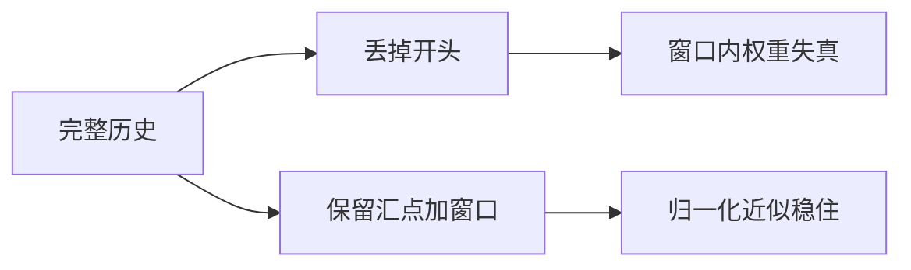

# Attention Sink

大量注意力质量会沉到最初几个标记上；滚动窗口若把它们丢掉，剩下的归一化会失真，流式生成随之崩溃。

<footer>—— Guangxuan Xiao 等, StreamingLLM, 2023</footer>

[滑动窗口](/llm/sliding-window-attention) 在推理时用环形缓冲丢掉旧键，显存才能与生成长度脱钩。Xiao 等人 2023 年的 StreamingLLM 观察到：即便开头几个 token 语义空洞，softmax 仍把可观质量分给它们；这些位置像水槽，稳住后面窗口里的相对权重。切掉水槽后，窗口内 logit 重新归一化，分布变形，困惑度急剧恶化。补救不是恢复全历史，而是把少数汇点键常驻缓存，再拼上最近窗口。本篇只讨论这一现象与推理配方，不把 StreamingLLM 的全部长上下文评测展开——那条产品线见树中的 StreamingLLM 叶子。

## 问题

因果 softmax 在位置 $t$ 对 $j\le t$ 归一化。经验上，许多层、许多头会把相当比例的质量分给 $j=1$ 附近，即使那是 BOS 或无信息前缀。一种解释是：softmax 必须把质量加到 1，当查询与所有内容键都不像时，早期位置因为被最多后续步「看见」、且在残差里扮演稳定偏置，成了默认倾倒处。训练从未要求模型把质量均匀铺开，于是汇点成为通解。

滑窗推理若按时间淘汰最老 KV，会在某个 $t>w$ 把汇点覆盖掉。此后可见集里没有锚，质量被迫在窗口内的内容键上重分配。相对排序可能还在，绝对值与熵变了，层输出偏离训练分布。表现为：短窗口语言模型突然胡言、重复、或对刚刚还正确的约束失效。这与「窗口太小看不见远证据」不同——即使当前句完全在窗口内，只要汇点被切，局部句也可能坏。

## 方法

### 为何首 token 会吸走质量

可视化各层平均注意力，常看到第一列（或前 2–4 列）一条亮带。汇点不必携带语义：随机初始化的 BOS 也行。关键是「位置靠前且始终在可见集里」。多层叠加后，汇点像公共偏置向量，后续层默认可以往那里排空多余质量，使真正的内容键之间保持稀疏竞争。汇点更像归一化的基准电位，而不是记忆槽。往里面写事实不可靠；把它删掉却会改变所有内容键的电位差。所以保留汇点是为了稳住 softmax，不是为了让模型去读文首的故事。

这一现象在完整 KV 的模型上就存在，只是被忽略，因为推理从不删文首。滑窗与流式把它从可视化好奇变成了故障。

### 丢窗为何崩

设训练时可见集是 $\{1,\ldots,t\}$，推理窗口是 $\{t-w+1,\ldots,t\}$。若 $1$ 是汇点，训练分布里总有一项大权重 $p_1$。去掉后，其余权重乘 $1/(1-p_1)$。$p_1$ 若到 0.3–0.5，放大极猛，窗口内本应很小的键被抬成主峰，输出被错误邻居劫持。更糟的是各头 $p_1$ 不同，放大系数不一致，多头组合彻底离开训练流形。

$$
p_j^{\mathrm{win}}=\frac{e^{s_j}}{\sum_{k\in\mathrm{win}}e^{s_k}}\neq p_j^{\mathrm{full}}\quad(j\in\mathrm{win})
$$

即使 $s_j$ 不变，分母变了，$p$ 就变。汇点的作用是让分母里有一项稳定的大贡献，使窗口局部的相对变化不那么剧烈。

### sink + 窗的推理配方

StreamingLLM 的缓存是 $\mathrm{sink}\cup\mathrm{window}$：常驻前 $k$ 个 token 的 KV（$k$ 常取 4 量级），加上最近 $w$ 个。注意力可见集为二者并，仍是 $O(k+w)$，与 $t$ 无关。位置编码按逻辑位置，不要把汇点的下标改成 0 到 $k-1$ 的重排——RoPE 对绝对相位敏感，错位等于另一场分布偏移。训练若已是滑窗且总包含 BOS，汇点问题会轻一些；对全注意力训、滑窗推的模型，这一配方几乎是必需。

$k$ 不是越大越好。汇点只要能当锚，再加文首内容会占用本该给窗口的槽，变成「既不像记忆又占预算」。需要真读文首时，应上全局槽或检索，而不是把 $k$ 加到几百。把 $k$ 从 4 加到 64，延迟几乎按窗口预算涨，却仍读不完整章开头。汇点配方的超参空间很窄：够锚住分母即可。多出来的槽应还给最近窗口，让当前句的键更完整。

## 机制

机制核心是 softmax 的分母。汇点提供近似常数的 $e^{s_{\mathrm{sink}}}$，使

$$
\sum_{j\in\mathrm{win}}e^{s_j}+e^{s_{\mathrm{sink}}}\approx Z_{\mathrm{train}}
$$

在滚动时更接近训练时的配分函数。内容键之间的比值 $e^{s_i}/e^{s_j}$ 不变，整体尺度被锚住。这解释了为何随机、无语义的初始 token 也能当汇点：要的是稳定的大 logit，不是语义。也解释了为何 KV 量化或驱逐算法若误删高注意力的初始槽，会重现同样崩溃——它们删的是锚，不是「不重要的旧记忆」。

与 [Native Sparse Attention](/llm/native-sparse-attention) 不同：NSA 在训练期学习选择哪些块，汇点配方是推理期对已训 softmax 模型的补丁。能改训练就改训练；只能改服务时，sink+window 是低成本补丁。

## 边界与工程取舍

配方不恢复真正的长程记忆。文中第 10000 个 token 的事实仍会滑出窗口，只是模型不会因为丢 BOS 而立刻发疯。产品文案不要写成「无限上下文」。多层、多头的汇点位置可能不同，只保留 token 0 有时不够，需要按统计选前 $k$ 个常驻位置，或对每层单独保留注意力质量最高的初始槽。

与分页 KV、前缀缓存的关系：多请求共享同一系统提示时，提示既是语义前缀也常含汇点。驱逐策略应把「前缀命中」和「汇点不可驱逐」写成同一条规则，避免调度器为了腾块把 BOS 挤掉。另一边界：训练已用滑窗且窗口总含文首时，再叠 StreamingLLM 可能重复保留，浪费槽位；应先画注意力图再决定 $k$。调试「滑窗一开就胡言」时，先做对照：窗口同样大小，但强制保留前四个 KV。若对照立刻恢复，就是汇点，不是窗口不够长。两者处理完全不同。

## 小结

- 许多 softmax 头把质量沉到初始 token，它们是归一化锚，不必有语义。
- 滚动淘汰若切掉锚，窗口内权重被重新放大，即使局部上下文仍在也会崩。
- StreamingLLM 用常驻汇点加最近窗口，缓存仍常数，配分函数近似稳住。
- 位置编码必须保持逻辑下标；汇点不是记忆，不宜靠加大 $k$ 读历史。
- 该配方补的是推理改窗与训练分布的缝，不提供无损长程检索。
- 驱逐、量化、分页调度都要把汇点槽标成不可扔。
- 出处：Xiao et al., *Efficient Streaming Language Models with Attention Sinks*, 2023；对照 Mistral 滑窗, 2023。
